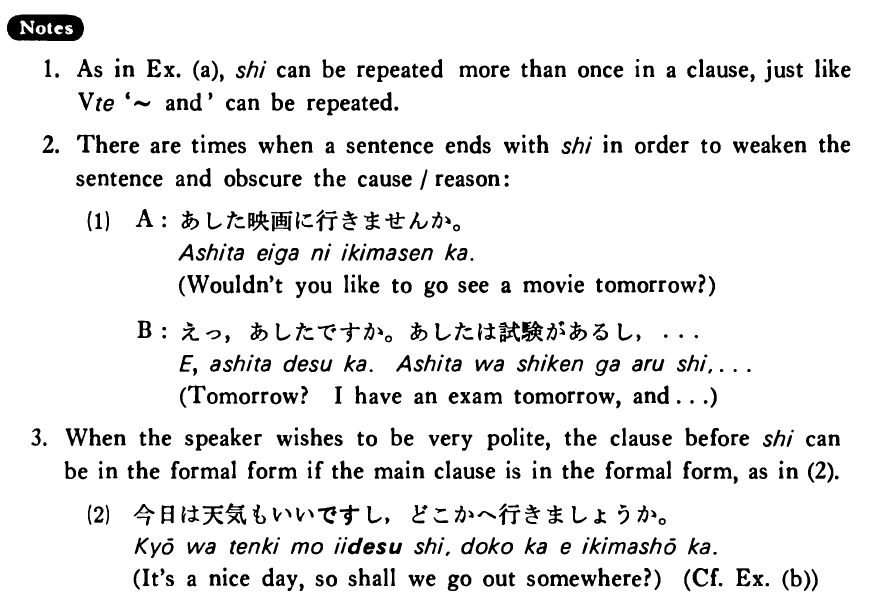

# し

 
 
 
 
 

## Summary

<table><tr>   <td>Summary</td>   <td>A conjunction to indicate ‘and’ in an emphatic way.</td></tr><tr>   <td>English</td>   <td>And what’s more; not only ~ but also ~; so</td></tr><tr>   <td>Part of speech</td>   <td>Conjunction</td></tr><tr>   <td>Related expression</td>   <td>それから</td></tr></table>

## Formation

<table class="table"> <tbody><tr class="tr head"> <td class="td">(i)  {V/Adjective い}</td> <td class="td">し </td> <td class="td">&nbsp;</td> </tr> <tr class="tr"> <td class="td">&nbsp;</td> <td class="td">{話す /話した} し</td> <td class="td">Someone    talks/talked and what’s more</td> </tr> <tr class="tr"> <td class="td">&nbsp;</td> <td class="td">{食べる /食べた} し</td> <td class="td">Someone    eats/ate and what’s more</td> </tr> <tr class="tr"> <td class="td">&nbsp;</td> <td class="td">{高い /高かった} し</td> <td class="td">Something    is/was expensive and what’s more</td> </tr> <tr class="tr head"> <td class="td">(ii)  {Adjective な stem/   N}</td> <td class="td">{だ/だった} し</td> <td class="td">&nbsp;</td> </tr> <tr class="tr"> <td class="td">&nbsp;</td> <td class="td">{静かだ/静かだった} し</td> <td class="td">Something    is/was quiet and what’s more</td> </tr> <tr class="tr"> <td class="td">&nbsp;</td> <td class="td">{先生だ/先生だった} し</td> <td class="td">Someone    is/was a teacher and what’s more</td> </tr></tbody></table>

## Example Sentences

<table><tr>   <td>今日はテニスもしたし、映画も見た・見ました。</td>   <td>I not only played tennis but also saw a movie today.</td></tr><tr>   <td>ここは夏は暑いし、冬は寒い・寒いです。</td>   <td>Here it's hot in the summer, and what's more, it's cold in the winter.</td></tr><tr>   <td>このアパートは奇麗だし、安い・安いです。</td>   <td>This apartment is clean, and what's more, it's inexpensive.</td></tr><tr>   <td>遊びたいんです・だが明日は試験だし遊べない・遊べません。</td>   <td>I would like to play, but there is an exam tomorrow, and I can't fool around.</td></tr><tr>   <td>仕事もあったし、結婚も出来たし、とても嬉しいです。</td>   <td>Not only did I find a job, but I was also able to get married, so I'm very happy.</td></tr><tr>   <td>今日は天気もいいし、どこへ行きましょうか。</td>   <td>It's a nice day, so shall we go out somewhere?</td></tr><tr>   <td>あの人は美人だし、頭もいい。</td>   <td>She's beautiful and what's more she's bright.</td></tr><tr>   <td>切符は買ってあるし、是非見に行きましょう。</td>   <td>I've bought a ticket for you, so let's go see it, by all means.</td></tr></table>

## Explanation

1. As in Example (a), し can be repeated more than once in a clause, just like Verbて '~ and' can be repeated.
  
2. There are times when a sentence ends with し in order to weaken the sentence and obscure the cause / reason:
  <ul>(1) <li>A: あした映画に行きませんか。</li> <li>Wouldn’t you like to go see a movie tomorrow?</li> 

 <li>B: えっ，あしたですか。あしたは試験があるし、…</li> <li>Tomorrow? I have an exam tomorrow, and...</li> </ul>  
3. When the speaker wishes to be very polite, the clause before し can be in the formal form if the main clause is in the formal form, as in (2).
  <ul>(2) <li>今日は天気もいいですし，どこかへ行きましょうか。</li> <li>It’s a nice day, so shall we go out somewhere?</li> </ul>

## Grammar Book Page

