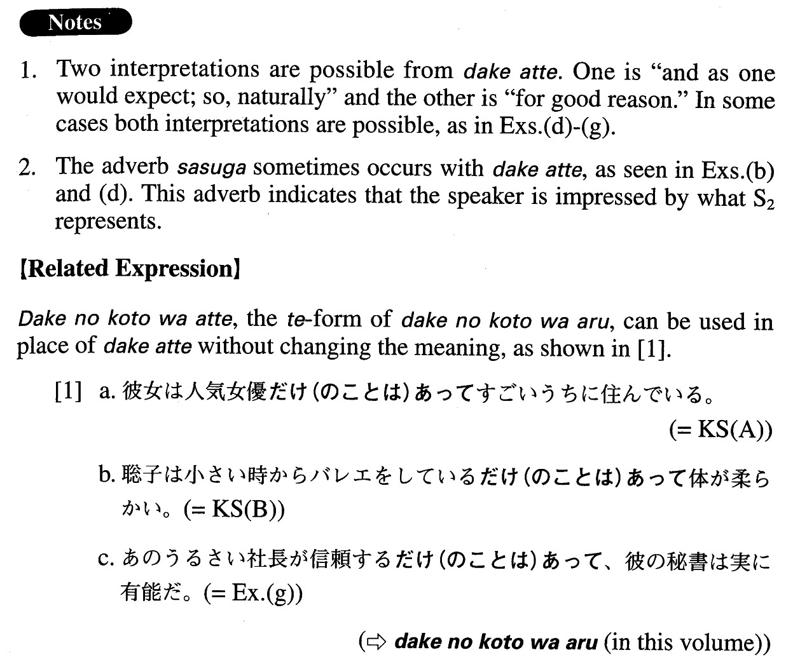

# だけあって

[1. Summary](#summary) 
[2. Formation](#formation) 
[3. Example Sentences](#example-sentences) 
[4. Grammar Book Page](#grammar-book-page) 

## Summary

<table><tr>   <td>Summary</td>   <td>A phrase that means “and as one would expect” or “for good reason”.</td></tr><tr>   <td>Equivalent</td>   <td>And as one would expect; so (naturally); for good reason</td></tr><tr>   <td>Part of speech</td>   <td>Phrase</td></tr><tr>   <td>Related expression</td>   <td>だけのことはあって; だけに</td></tr></table>

## Formation

<table class="table"><tbody><tr class="tr head"><td class="td">(i) Vinformal</td><td class="td">だけあって</td><td class="td"></td></tr><tr class="tr"><td class="td"></td><td class="td">{教えている/教えていた}だけあって</td><td class="td">Someone is/was teaching something, and as one would expect</td></tr><tr class="tr head"><td class="td">(ii) Adjective い informal</td><td class="td">だけあって</td><td class="td"></td></tr><tr class="tr"><td class="td"></td><td class="td">{若い/若かった}だけあって</td><td class="td">Someone is/was young, and as one would expect</td></tr><tr class="tr head"><td class="td">(iii) Adjective な stem {な/だった}</td><td class="td">だけあって</td><td class="td"></td></tr><tr class="tr"><td class="td"></td><td class="td">上手{な/だった}だけあって</td><td class="td">Someone is/was good at something, and as one would expect</td></tr><tr class="tr head"><td class="td">(iv) Noun {Ø/だった}</td><td class="td">だけあって</td><td class="td"></td></tr><tr class="tr"><td class="td"></td><td class="td">先生{Ø/だった}だけあって</td><td class="td">Someone is/was a teacher, and as one would expect</td></tr></tbody></table>

## Example Sentences

<table><tr>   <td>彼女は人気女優だけあってすごいうちに住んでいる。</td>   <td>She is a popular actress and, as one would expect, she lives in a splendid house.</td></tr><tr>   <td>聡子は小さい時からバレエをしているだけあって体が柔らかい。</td>   <td>Satoko has practiced ballet since she was a child, so naturally she is limber.</td></tr><tr>   <td>彼が自慢するだけあって、彼のオフィスからの眺めはちょっとほかでは見られないものだった。</td>   <td>He is proud of his office for good reason: the view is something you could never see from other offices.</td></tr><tr>   <td>日本は火山国だけあって年中地震が絶えない。</td>   <td>Japan is a volcanic country, and, as one would expect, earthquakes occur constantly throughout the year.</td></tr><tr>   <td>この壷はさすが名工の作品だけあって色や形に気品がある。</td>   <td>This pot was made by a master craftsman, so naturally its colours and shape are graceful.</td></tr><tr>   <td>オーストラリア南端の地だけあって八月のメルボルンは実に寒い。</td>   <td>Melbourne, as one would expect from its location in the southern comer of Australia, is really cold in August.</td></tr><tr>   <td>さすが日本一の花火大会と言われるだけあって、規模も芸術性も素晴らしいものだった。</td>   <td>(i) As one would expect from what people call the best fireworks in Japan, the scale and artistry were both amazing. (ii) People call it the best fireworks show in Japan for good reason: Its scale and artistic quality were both excellent.</td></tr><tr>   <td>あのレストランは笠原さんのお薦めだけあって美味しかったです。</td>   <td>(i) Ms. Kasahara recommended that restaurant, and, as one would expect, the food was delicious. (ii) Ms. Kasahara recommended that restaurant for good reason: The food was delicious. [Ms. Kasahara is known as a gourmet.]</td></tr><tr>   <td>この鞄は高いだけあって材料もいいし作りもしっかりしている。</td>   <td>(i) As one would expect from the (high) price of this bag, the material is good and it's also well made. (ii) This bag is expensive for good reason: The material is good and it's well made.</td></tr><tr>   <td>あのうるさい社長が信頼するだけあって、彼の秘書は実に有能だ。</td>   <td>(i) As you can guess from the way that president, who is so critical, relies on his secretary, she is truly capable. (ii) That president, who is so critical, relies on his secretary for good reason: She is truly capable.</td></tr></table>

## Grammar Book Page

