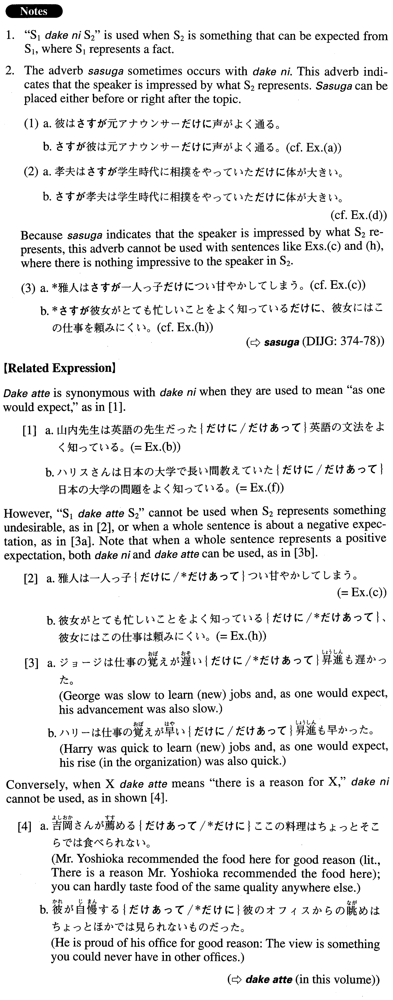

# だけに

[1. Summary](#summary) 
[2. Formation](#formation) 
[3. Example Sentences](#example-sentences) 
[4. Grammar Book Page](#grammar-book-page) 

## Summary

<table><tr>   <td>Summary</td>   <td>A phrase that carries the idea “as one would expect”.</td></tr><tr>   <td>Equivalent</td>   <td>And as one would expect; so (naturally); because</td></tr><tr>   <td>Part of speech</td>   <td>Phrase</td></tr><tr>   <td>Related expression</td>   <td>だけあって</td></tr></table>

## Formation

<table class="table"><tbody><tr class="tr head"><td class="td">(i) Vinformal</td><td class="td">だけに</td><td class="td"></td></tr><tr class="tr"><td class="td"></td><td class="td">{教えている/教えていた}だけに</td><td class="td">Someone is/was teaching and as one would expect</td></tr><tr class="tr head"><td class="td">(ii) Adjective い informal</td><td class="td">だけに</td><td class="td"></td></tr><tr class="tr"><td class="td"></td><td class="td">{若い/若かった}だけに</td><td class="td">Someone is/was young and as one would expect</td></tr><tr class="tr head"><td class="td">(iii) Adjective な stem {な/だった}</td><td class="td">だけに</td><td class="td"></td></tr><tr class="tr"><td class="td"></td><td class="td">上手{な/だった}だけに</td><td class="td">Someone is/was good at something and as one would expect</td></tr><tr class="tr head"><td class="td">(iv) Noun {Ø/だった}</td><td class="td">だけに</td><td class="td"></td></tr><tr class="tr"><td class="td"></td><td class="td">先生{Ø/だった}だけに</td><td class="td">Someone is/was a teacher and as one would expect</td></tr></tbody></table>

## Example Sentences

<table><tr>   <td>ビルは元フットボール選手だけに足が速い。</td>   <td>Bill used be a football player and, as one would expect, he runs fast.</td></tr><tr>   <td>ホワイトさんは長い間日本に住んでいただけに日本のことをよく知っている。</td>   <td>Mr. White lived in Japan for a long time, so naturally he is very familiar with things related to Japan.</td></tr><tr>   <td>彼は元アナウンサーだけに声がよく通る。</td>   <td>He used to be an announcer, so naturally his voice carries well.</td></tr><tr>   <td>山内先生は英語の先生だっただけに英語の文法をよく知っている。</td>   <td>As one would expect from her having been an English teacher, Ms. Yamauchi is very knowledgeable about English grammar.</td></tr><tr>   <td>雅人は一人っ子だけについ甘やかしてしまう。</td>   <td>Masato is our only child and, as you might expect, we tend to spoil him (without meaning to).</td></tr><tr>   <td>孝夫は学生時代に相撲をやっていただけに体が大きい。</td>   <td>Takao was a sumo wrestler when he was a student, so naturally he is big.</td></tr><tr>   <td>チェンさんはアメリカの大学を卒業しただけに英語が上手だ。</td>   <td>Ms. Chen graduated from an American university, so naturally her English is good.</td></tr><tr>   <td>ハリスさんは日本の大学で長い間教えていただけに日本の大学の問題をよく知っている。</td>   <td>Mr. Harris taught at a university in Japan for a long time so, as one would expect, he knows a lot about the problems of Japanese universities.</td></tr><tr>   <td>春樹はジャズが何よりも好きなだけにジャズ・ミュージシャンの名前をよく知っている。</td>   <td>Haruki likes jazz more than anything, so naturally he knows the names of many jazz musicians.</td></tr><tr>   <td>彼女がとても忙しいことをよく知っているだけに、彼女にはこの仕事を頼みにくい。</td>   <td>Because we know she's very busy, it's hard to ask her to do this job.</td></tr></table>

## Grammar Book Page

