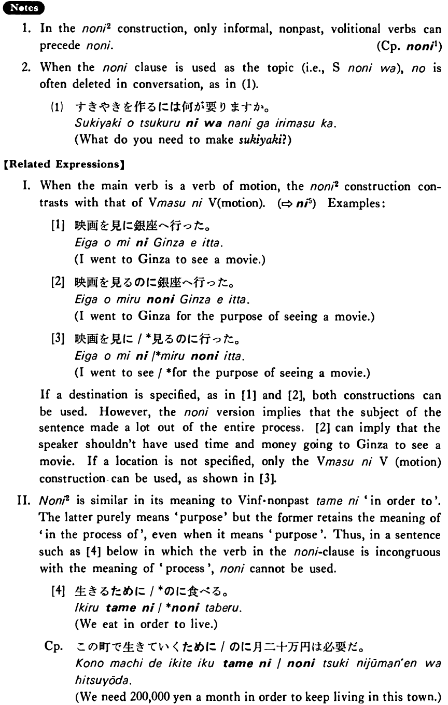

# のに (2)

[1. Summary](#summary) 
[2. Formation](#formation) 
[3. Example Sentences](#example-sentences) 
[4. Explanation](#explanation) 
[5. Grammar Book Page](#grammar-book-page) 

## Summary

<table><tr>   <td>Summary</td>   <td>In the process or for the purpose of doing something expressed in the の nominalised clause.</td></tr><tr>   <td>Equivalent</td>   <td>In the process of doing ~; (in order) to do ~; for the purpose of ~</td></tr><tr>   <td>Part of speech</td>   <td>Conjunction</td></tr><tr>   <td>Related expression</td>   <td>に5; 為(に)</td></tr></table>

## Formation

<table class="table"> <tbody><tr class="tr head"> <td class="td">Vinformal nonpast</td> <td class="td">のに </td> <td class="td">&nbsp;</td> </tr> <tr class="tr"> <td class="td">&nbsp;</td> <td class="td">話すのに </td> <td class="td">In    order to talk</td> </tr> <tr class="tr"> <td class="td">&nbsp;</td> <td class="td">食べるのに </td> <td class="td">In    order to eat</td> </tr></tbody></table>

## Example Sentences

<table><tr>   <td>私は日本語の新聞を読むのに辞書を使う・使います。</td>   <td>I used a dictionary to read Japanese newspapers.</td></tr><tr>   <td>すき焼きを作るのには何が要りますか。</td>   <td>What do you need to make sukiyaki?</td></tr><tr>   <td>このレポートを書くのに一ヶ月かかりました。</td>   <td>It took me a month to write this paper.</td></tr><tr>   <td>会社に行くのにバスと電車を使っている。</td>   <td>I am using the bus and the train to get to my company.</td></tr></table>

## Explanation

1. In the のに2 construction, only informal, nonpast, volitional verbs can precede のに. 
  
(Complementiser phrase: <a href="#㊦ のに (1)">のに1</a>)
  
2. When the のに clause is used as the topic (i.e., Sentenceのには), の is often deleted in conversation, as in (1).
  <ul>(1) <li>すきやきを作るには何が要りますか。</li> <li>What do you need to make sukiyakii</li> </ul>  
【Related Expressions】
  
I. When the main verb is a verb of motion, the のに2 construction contrasts with that of Verbますに Verb(motion). (⇨ <a href="#㊦ に (5)">に5</a>) Examples:
  
[1]
  <ul> <li>映画を見に銀座へ行った。</li> <li>I went to Ginza to see a movie.</li> </ul>  
[2]
  <ul> <li>映画を見るのに銀座へ行った。</li> <li>I went to Ginza for the purpose of seeing a movie.</li> </ul>  
[3]
  <ul> <li>映画を見に/*見るのに行った。</li> <li>I went to see/*for the purpose of seeing a movie.</li> </ul>  
If a destination is specified, as in [1] and [2], both constructions can be used. However, the のに version implies that the subject of the sentence made a lot out of the entire process. [2] can imply that the speaker shouldn't have used time and money going to Ginza to see a movie. If a location is not specified, only the Verbますに Verb(motion) construction can be used, as shown in [3].
  
II. のに2 is similar in its meaning to Verb nonpast為に 'in order to'. The latter purely means 'purpose' but the former retains the meaning of 'in the process of' even when it means 'purpose'. Thus, in a sentence such as [4] below in which the verb in the のに clause is incongruous with the meaning of 'process', のに cannot be used.
  
[4]
  <ul> <li>生きるために/*のに食べる。</li> <li>We eat in order to live.</li> 

 <li>Complementiser phrase: この町で生きていくために/のに月二十万円は必要だ。</li> <li>We need 200,000 yen a month in order to keep living in this town.</li> </ul>

## Grammar Book Page

