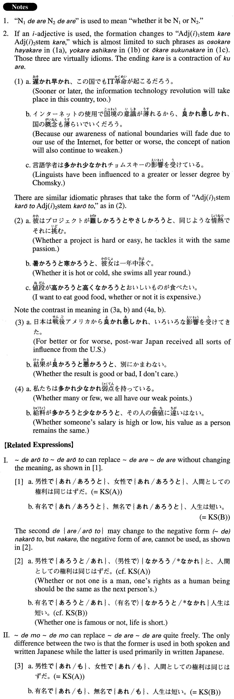

# ～であれ～であれ

[1. Summary](#summary) 
[2. Formation](#formation) 
[3. Example Sentences](#example-sentences) 
[4. Grammar Book Page](#grammar-book-page) 

## Summary

<table><tr>   <td>Summary</td>   <td>A structure that means “no matter which one is the case”</td></tr><tr>   <td>Equivalent</td>   <td>Whether X or Y; be it X or Y; or</td></tr><tr>   <td>Part of speech</td>   <td>Structure (usually used in formal writing and formal speech)</td></tr><tr>   <td>Related expression</td>   <td>であろうと~であろうと; でも~でも; と言わず~と言わず</td></tr></table>

## Formation

<table class="table"><tbody><tr class="tr head"><td class="td">(i) Noun1</td><td class="td">であれ、Noun2であれ</td><td class="td"></td></tr><tr class="tr"><td class="td"></td><td class="td">夏であれ、冬であれ</td><td class="td">Whether it is summer or winter</td></tr><tr class="tr head"><td class="td">(ii) Adjective な1 stem</td><td class="td">であれ、Adjective な2 stemであれ</td><td class="td"></td></tr><tr class="tr"><td class="td"></td><td class="td">便利であれ、不便であれ</td><td class="td">Whether something is convenient or inconvenient</td></tr></tbody></table>

## Example Sentences

<table><tr>   <td>男性であれ、女性であれ、人間としての権利は同じはずだ。</td>   <td>Whether one is a man or a woman, one's rights as a human being should be the same.</td></tr><tr>   <td>有名であれ、無名であれ、人生は短い。</td>   <td>No matter if one is famous or nameless, life is short.</td></tr><tr>   <td>ここは春であれ秋であれ美しいから観光に向いている。</td>   <td>Whether spring or fall, this place is beautiful, so it is a good sightseeing spot.</td></tr><tr>   <td>イスラエル人であれ、パレスチナ人であれ、平和を望んでいることでは同じはずだ。</td>   <td>Whether an Israeli or a Palestinian, their hope for peace should be the same.</td></tr><tr>   <td>彼は和食であれ、洋食であれ、何でも食べてしまう。</td>   <td>He eats anything, Japanese- or Western-style food.</td></tr><tr>   <td>あの学者は哲学であれ、言語学であれ、人類学であれ、同じように精通している。</td>   <td>That scholar is well-versed in a number of subjects, whether it be philosophy, linguistics or anthropology.</td></tr><tr>   <td>平日であれ、週末であれ、健太は仕事に追われている。</td>   <td>Whether weekday or weekend, Kenta is always pressed by work.</td></tr><tr>   <td>写真であれ、コンピュータグラフィックスであれ、求められたイメージを表現するのは大変難しい。</td>   <td>Whether in photography or in computer graphics, it is hard to produce an image as requested.</td></tr><tr>   <td>場所が便利であれ、不便であれ、マイホームが持ちたい。</td>   <td>Whether the location is convenient or inconvenient, I'd like to have my own house.</td></tr></table>

## Grammar Book Page

