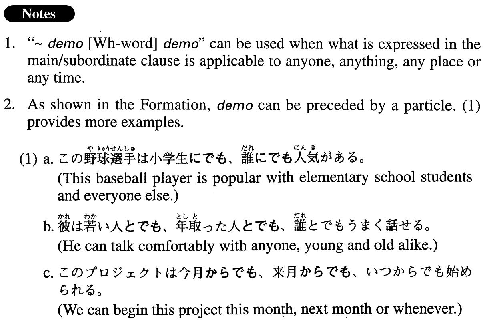

# ～でも[Wh. word]でも

[1. Summary](#summary) 
[2. Formation](#formation) 
[3. Example Sentences](#example-sentences) 
 

## Summary

<table><tr>   <td>Summary</td>   <td>A structure indicating that what is expressed in the main/subordinate clause is applicable to anyone, anything, any place or any time.</td></tr><tr>   <td>English</td>   <td>~ whatever; ~ whoever; ~ whenever; ~ whichever</td></tr><tr>   <td>Part of speech</td>   <td>Structure</td></tr></table>

## Formation

<table class="table"><tbody><tr class="tr head"><td class="td">Noun (particle) </td><td class="td">でも, (Noun (particle) でも,) でも、Wh-word (particle) でも</td><td class="td"></td></tr><tr class="tr"><td class="td"></td><td class="td">小学生(に) でも、誰(に) でも</td><td class="td">(to) an elementary pupil or (to) anybody</td></tr><tr class="tr"><td class="td"></td><td class="td">アフリカ(から) でも、どこ(から) でも</td><td class="td">(from) Africa or (from) anywhere</td></tr><tr class="tr"><td class="td"></td><td class="td">寿司でも、何でも</td><td class="td">Sushi or whatever</td></tr><tr class="tr"><td class="td"></td><td class="td">明日でも、いつでも</td><td class="td">Tomorrow or whenever</td></tr></tbody></table>

## Example Sentences

<table><tr>   <td>そんなことは子供でも誰でも知っているよ。</td>   <td>That sort of thing is known even to a child or to anybody.</td></tr><tr>   <td>私って漫画でも何でも読み出すと止まらないタイプなの。</td>   <td>I'm the type of person who cannot stop reading manga or whatever once I start.</td></tr><tr>   <td>Tシャツの大きさはMでもLでも、どちらでもかまいません。</td>   <td>It doesn't matter to me whether (the size of) the T-shirt is M or L (literally: or whichever).</td></tr><tr>   <td>欧米では、バスでも地下鉄でも、車椅子でどこへでも行ける。どうしても助けが必要な時は、誰かに頼めばたとえ日本人にでも誰にでも手を貸してくれる。</td>   <td>In Europe and America you can go anywhere in a wheelchair by bus or by subway. When you find you need help, just ask anyone. People there will lend a hand to anyone who asks, Japanese or otherwise.</td></tr><tr>   <td>最近のパーティーは留学生でも日本人でも誰でも参加自由で、来る人は飲み物、音楽、自分の作った料理を持ってくるというようにしています.</td>   <td>At our recent parties we've made it so all students, whether Japanese or from abroad, can freely participate and ask everyone to bring drinks, music or food they've made.</td></tr><tr>   <td>A:すみませんが、来週、検査の結果が出たら、もう一度来ていただけますか。B:分かりました。来週でもいつでも伺います。</td>   <td>A: Can you come back next week when we get the result of the examination? B: Yes, I can come next week or whenever.</td></tr></table>

## Grammar Book Page

