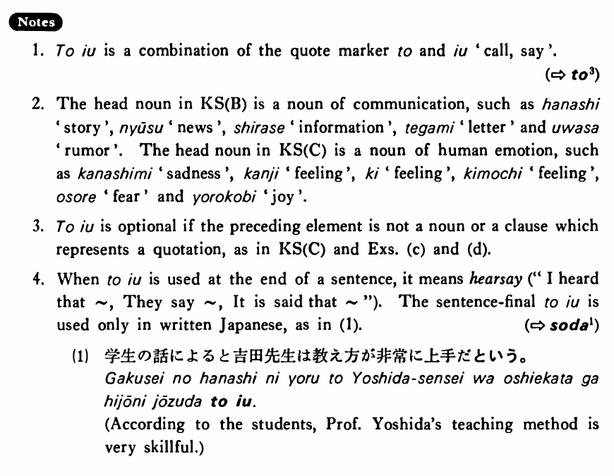

# という

[1. Summary](#summary) 
[2. Example Sentences](#example-sentences) 
[3. Explanation](#explanation) 
 

## Summary

<table><tr>   <td>Summary</td>   <td>A phrase marking information which identifies or explains the noun following the phrase.</td></tr><tr>   <td>English</td>   <td>Called; that says ~; that</td></tr><tr>   <td>Part of speech</td>   <td>Phrase</td></tr></table>

## Example Sentences

<table><tr>   <td>「雪国」という小説を読んだ・読みました。</td>   <td>I read a novel called Snow Country.</td></tr><tr>   <td>山田さんが入院したという知らせを聞いた・聞きました。</td>   <td>I heard the news that Mr. Yamada has been hospitalised.</td></tr><tr>   <td>もっと頑張らなくては（ならない）という気持ちがある・あります。</td>   <td>I have the feeling that I have to keep hanging in there.</td></tr><tr>   <td>「七人の侍」という映画を見たことがありますか。</td>   <td>Have you ever seen the film called Seven Samurai?</td></tr><tr>   <td>ジューンが日本へ行くという話は本当ですか。</td>   <td>Is the story that June is going to Japan true?</td></tr><tr>   <td>その人に会いたくないという気持ちはよく分かります。</td>   <td>I am well aware of your feeling that you don't want to see him.</td></tr><tr>   <td>友達が今日来るということをすっかり忘れていた。</td>   <td>I completely forgot the fact that my friend is coming today.</td></tr></table>

## Explanation

1. という is a combination of the quote marker と and いう 'call, say'.
  
(⇨ <a href="#㊦ と (3)">と3</a>)
  
2. The head noun in Key Sentence (B) is a noun of communication, such as 話 'story', ニュース 'news', 知らせ 'information', 手紙 'letter' and 噂 'rumor'. The head noun in Key Sentence (C) is a noun of human emotion, such as 悲しみ 'sadness', 感じ 'feeling', 気 'feeling', 気持ち 'feeling', 恐れ 'fear' and 喜ぶ 'joy'.
  
3. という is optional if the preceding element is not a noun or a clause which represents a quotation, as in Key Sentence (C) and Examples (c) and (d).
  
4. When という is used at the end of a sentence, it means hearsay ("I heard that ~, They say ~, It is said that ~"). The sentence final という is used only in written Japanese, as in (1).
  
(⇨ <a href="#㊦ そうだ (1)">そうだ1</a>)
  <ul>(1) <li>学生の話によると吉田先生は教え方が非常に上手だという。</li> <li>According to the students, Professor Yoshida's teaching method is very skillful.</li> </ul>

## Grammar Book Page

