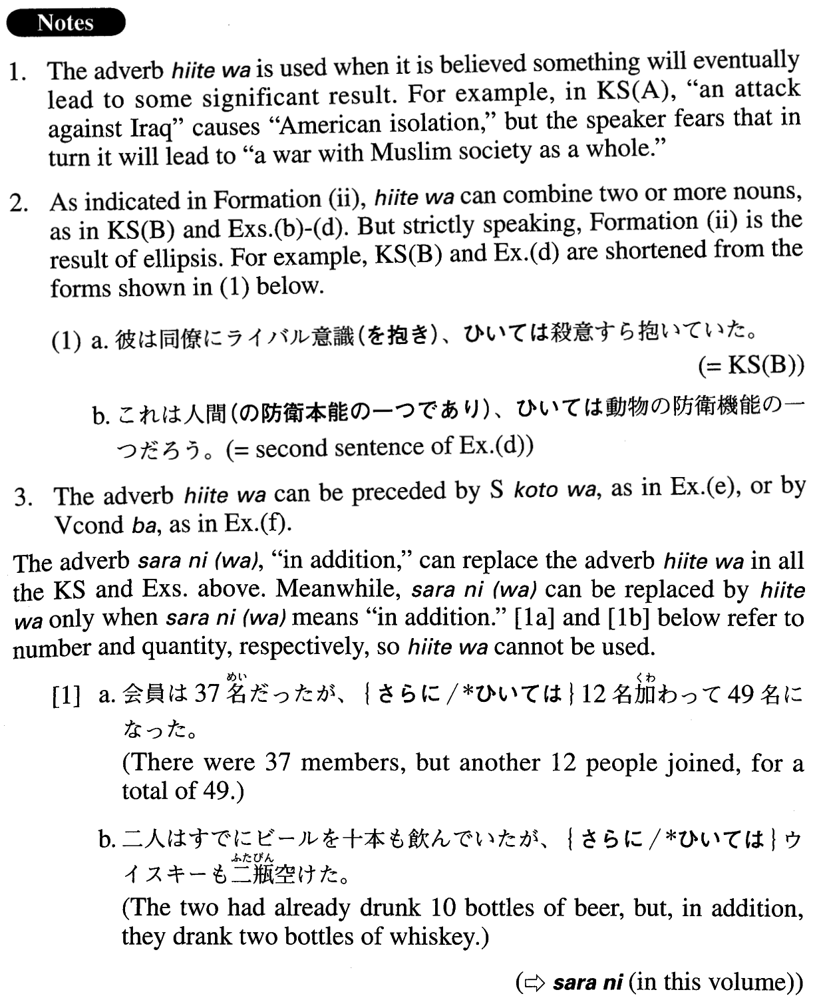

# ひいては

[1. Summary](#summary) 
[2. Formation](#formation) 
[3. Example Sentences](#example-sentences) 
[4. Grammar Book Page](#grammar-book-page) 

## Summary

<table><tr>   <td>Summary</td>   <td>An adverb indicating that something is perceived to eventually lead to a significant result.</td></tr><tr>   <td>English</td>   <td>Eventually (lead to) ~; even</td></tr><tr>   <td>Part of speech</td>   <td>Adverb</td></tr><tr>   <td>Related expression</td>   <td>更に(は)</td></tr></table>

## Formation

<table class="table"><tbody><tr class="tr head"><td class="td">(i) ~ Vます</td><td class="td">ひいてはSentence。</td><td class="td"></td></tr><tr class="tr"><td class="td"></td><td class="td">(see key sentence A)</td><td class="td"></td></tr><tr class="tr head"><td class="td">(ii) Noun1、</td><td class="td">ひいてはNoun2</td><td class="td"></td></tr><tr class="tr"><td class="td"></td><td class="td">(see key sentence B)</td><td class="td"></td></tr></tbody></table>

## Example Sentences

<table><tr>   <td>イラクへの攻撃はアメリカの孤立を招き、ひいてはイスラム社会全体との戦争に発展していく恐れがある。</td>   <td>There is fear that an attack against Iraq will bring about American isolation, and eventually will lead to a war with Muslim society as a whole.</td></tr><tr>   <td>彼は同僚にライバル意識、ひいては殺意すら抱いていた。</td>   <td>He regarded his colleague as a rival, even to the point of considering murder.</td></tr><tr>   <td>東京の産業構造を適切に転換していくことが、東京の産業を活性化させ、ひいては日本の経済力の強化につながっていく。</td>   <td>Addressing the appropriate restructuring of Tokyo's industrial structure will revitalize Tokyo's industry and eventually lead to the strengthening of the Japanese economy.</td></tr><tr>   <td>「誰もが自分自身の能力を最大限に活かして、自ら積極的に新しいことにチャレンジして、よりよく生きていく」という考えを、日本国内、ひいては世界に波及させたいと思っています。</td>   <td>Life will improve when everyone uses their abilities to the greatest extent and actively takes on new challenges. I would like this idea to spread within Japan, and, eventually, in the world.</td></tr><tr>   <td>世間では、企業経営から、教育、ひいては犯罪まで、話題はインターネットが独占しているという感じです。</td>   <td>Throughout society, in business management and education, and even crime, it seems like the Internet is the dominant topic of discussion.</td></tr><tr>   <td>道を歩いていて、奇妙な姿の人が向こうから歩いてくると、不安な気持ちになる。これは人間、ひいては動物の防衛機能の一つだろう。</td>   <td>If a person with a strange figure walks towards you on the street, you might start to feel uneasy. This is a human defence mechanism, and is used even by animals.</td></tr><tr>   <td>栄養価が高い旬のものをおいしく食べることは、ひいては病気を予防する。</td>   <td>Food eaten in season is richer in nutrition, and thus can help prevent disease.</td></tr><tr>   <td>マスメディアが個人の名誉やプライバシーを不当に侵害する状況が続けば、ひいては報道に対して権力が介入する口実を与えることになる。</td>   <td>If the media continues to violate people's reputations and privacy unjustly, some day it could provide an excuse for the government to intervene.</td></tr></table>

## Grammar Book Page

