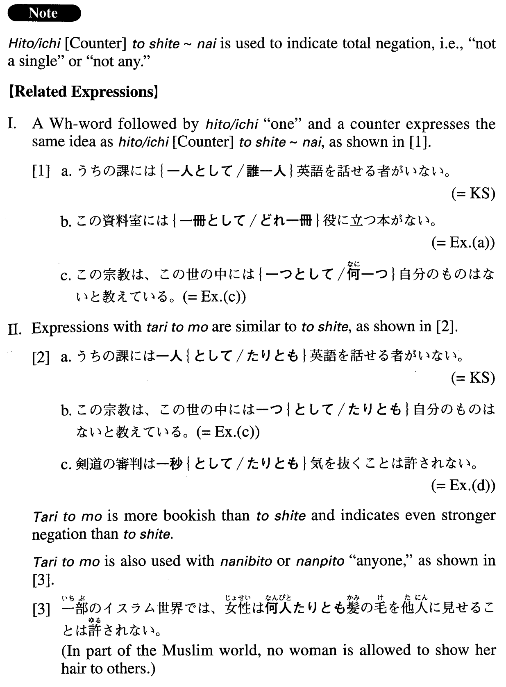

# 一[Counter]として～ない

[1. Summary](#summary) 
[2. Formation](#formation) 
[3. Example Sentences](#example-sentences) 
[4. Grammar Book Page](#grammar-book-page) 

## Summary

<table><tr>   <td>Summary</td>   <td>A structure that means “not a single one\".</td></tr><tr>   <td>English</td>   <td>Not a single ~; not even one; not any ~</td></tr><tr>   <td>Part of speech</td>   <td>Structure (usually used in formal writing and formal speech)</td></tr><tr>   <td>Related expression</td>   <td>{Interrogative word] ひと/いち [counter]~ない; ひと/いち [counter] たりとも~ない</td></tr></table>

## Formation

<table class="table"><tbody><tr class="tr head"><td class="td">一[Counter]</td><td class="td">として～ない</td><td class="td"></td></tr><tr class="tr"><td class="td"></td><td class="td">一つとして使えない</td><td class="td">Not a single one can be used</td></tr></tbody></table>

## Example Sentences

<table><tr>   <td>うちの課には一人として英語を話せる者がいない。</td>   <td>Not a single person in my section can speak English.</td></tr><tr>   <td>この資料室には一冊として役に立つ本がない。</td>   <td>There's not a single useful book in this library.</td></tr><tr>   <td>私が困っていた時、一人として私を助けてくれる者がいなかった。</td>   <td>Not a single person helped me when I was having trouble.</td></tr><tr>   <td>この宗教は、この世の中には一つとして自分のものはないと教えている。</td>   <td>This religion teaches that nothing in this world belongs to you.</td></tr><tr>   <td>剣道の審判は一秒として気を抜くことは許されない。</td>   <td>A kendo (Japanese fencing) judge will not be forgiven for losing his concentration for even a second.</td></tr><tr>   <td>単身赴任中、一日として家族のことを思わない日はなかった。</td>   <td>While I was assigned to another city (literally: When I lived on my own away from my family for business), there was not a single day I didn't think of my family.</td></tr><tr>   <td>彼女の演奏は一音としておろそかに弾かれることはなく、どの曲も聴く者に深い感銘を与えないではおかない。</td>   <td>In her performances, she never plays a single note carelessly, and no matter what the piece, her audience can't help being deeply impressed.</td></tr></table>

## Grammar Book Page

