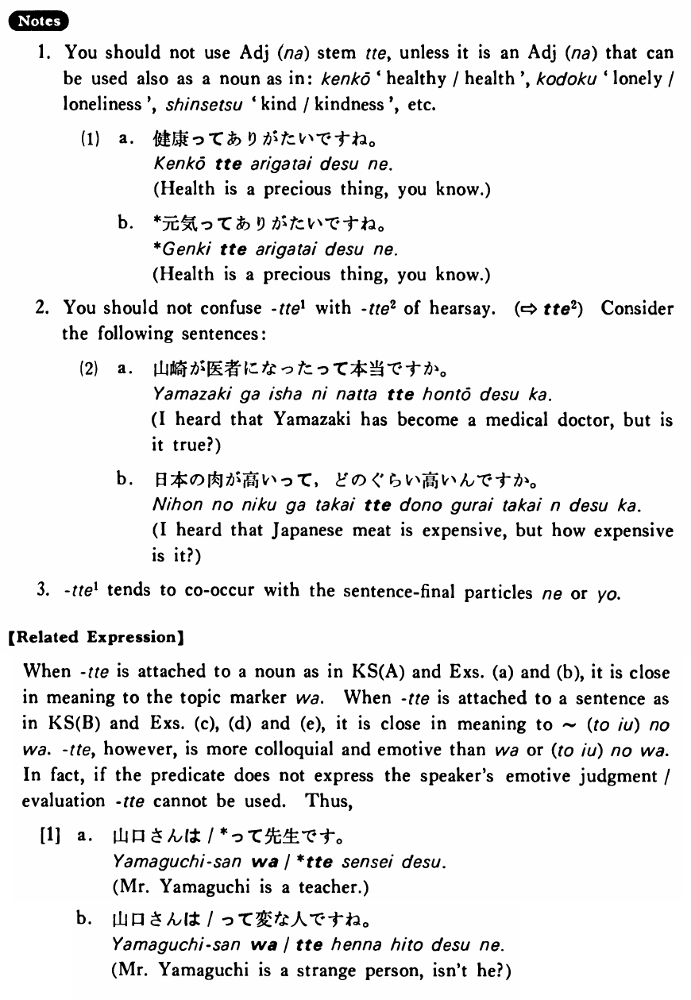

# って (1)

[1. Summary](#summary) 
[2. Formation](#formation) 
[3. Example Sentences](#example-sentences) 
[4. Explanation](#explanation) 
[5. Grammar Book Page](#grammar-book-page) 

## Summary

<table><tr>   <td>Summary</td>   <td>A colloquial topic-introducer.</td></tr><tr>   <td>Equivalent</td>   <td>Speaking of ~</td></tr><tr>   <td>Part of speech</td>   <td>Particle</td></tr><tr>   <td>Related expression</td>   <td>(の) は; と言えば (ったら)</td></tr></table>

## Formation

<table class="table"> <tbody><tr class="tr head"> <td class="td">Noun</td> <td class="td">って </td> <td class="td">&nbsp;</td> </tr> <tr class="tr"> <td class="td">&nbsp;</td> <td class="td">先生って </td> <td class="td">Speaking of the teacher</td> </tr> <tr class="tr head"> <td class="td">{V/Adjective い} informal    nonpast</td> <td class="td">って </td> <td class="td">&nbsp;</td> </tr> <tr class="tr"> <td class="td">&nbsp;</td> <td class="td">話すって </td> <td class="td">To talk (topic) </td> </tr> <tr class="tr"> <td class="td">&nbsp;</td> <td class="td">高いって </td> <td class="td">To be expensive (topic) </td> </tr></tbody></table>

## Example Sentences

<table><tr>   <td>アメリカ人ってフットボールが好きだ・好きですね。</td>   <td>Speaking of Americans, they love football, don't they?</td></tr><tr>   <td>漢字を覚えるって大変だ・大変ですね。</td>   <td>To memorize kanji, it's terribly hard, isn't it?</td></tr><tr>   <td>漢字って面白いですよ。</td>   <td>Speaking of kanji, they are interesting, I tell you.</td></tr><tr>   <td>日本人ってよく写真を撮りますね。</td>   <td>Speaking of Japanese people, they love taking pictures, don't they?</td></tr><tr>   <td>外国で暮らすって難しいね。</td>   <td>Living in a foreign country is hard, isn't it?</td></tr><tr>   <td>木が多いっていいものだね。</td>   <td>It's good to have many trees, isn't it?</td></tr><tr>   <td>家が広いっていいですね。</td>   <td>It's good to have a spacious house, isn't it?</td></tr></table>

## Explanation

1. You should not use Adjective な stem って unless it is an Adjective な that can be used also as a noun as in: 健康 'healthy/heal', 孤独 'lonely/loneliness', 親切 'kind/kindness', etc.
  <ul>(1) <li>a. 健康ってありがたいですね。</li> <li>Health is a precious thing, you know.</li> 

 <li>b. *元気ってありがたいですね。</li> <li>Health is a precious thing, you know.</li> </ul>  
2. You should not confuse って1 with って2 of hearsay. (⇨ <a href="#㊦ って (2)">って2</a>) Consider the following sentences:
  <ul>(2) <li>a. 山崎が医者になったって本当ですか。</li> <li>I heard that Yamazaki has become a medical doctor, but is it true?</li> 

 <li>b. 日本の肉が高いって、どのぐらい高いんですか。</li> <li>I heard that Japanese meat is expensive, but how expensive is it?</li> </ul>  
3. って1 tends to co-occur witn the sentence-final particles ね or よ.
  
【Related Expression】
  
When って is attached to a noun as in Key Sentence (A) and Examples (a) and (b), it is close in meaning to the topic marker は. When って is attached to a sentence as in Key Sentence (B) and Examples (c), (d) and (e), it is close in meaning to  (という)のは. って, however, is more colloquial and emotive than は or (という)のは. In fact, if the predicate does not express the speaker's emotive judgment/evaluation って cannot be used. Thus,
  
[1]
  <ul> <li>a. 山口さんは/*って先生です。</li> <li>Mr. Yamaguchi is a teacher.</li> 

 <li>b. 山口さんは/って変な人ですね。</li> <li>Mr. Yamaguchi is a strange person, isn't he?</li> </ul>

## Grammar Book Page

