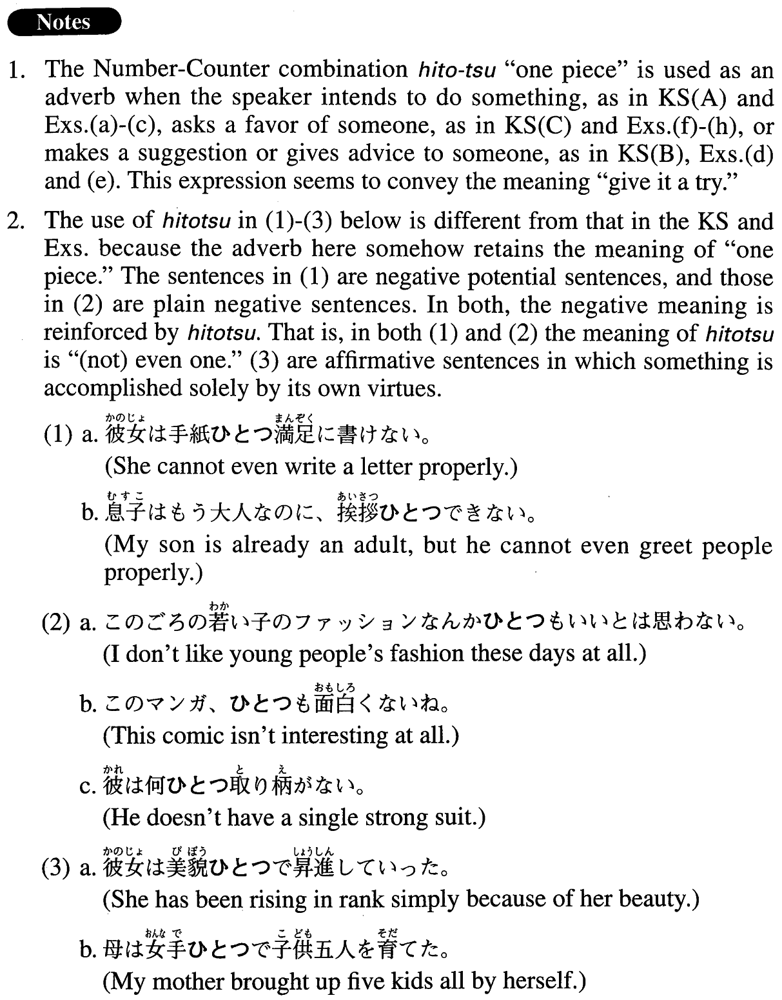

# ひとつ

 
 
 
 

## Summary

<table><tr>   <td>Summary</td>   <td>An adverb used when the speaker intends to do something, or asks someone a favour, or makes a suggestion or gives advice to someone.</td></tr><tr>   <td>English</td>   <td>Give something a try</td></tr><tr>   <td>Part of speech</td>   <td>Adverb (usually used in conversation)</td></tr></table>

## Formation

<table class="table"><tbody><tr class="tr head"><td class="td">(i) ひとつ</td><td class="td">Vてみよう。</td><td class="td"></td></tr><tr class="tr"><td class="td"></td><td class="td">ひとつジョギングをしてみよう。</td><td class="td">I will give jogging a try</td></tr><tr class="tr head"><td class="td">(ii) ひとつNounでも</td><td class="td">{Vては/Vinformal pastら}どうですか。</td><td class="td"></td></tr><tr class="tr"><td class="td"></td><td class="td">ひとつ散歩でも{しては/したら}どうですか。</td><td class="td">How about taking a walk or something?</td></tr><tr class="tr head"><td class="td">(iii) ひとつVます</td><td class="td">ませんか。</td><td class="td"></td></tr><tr class="tr"><td class="td"></td><td class="td">ひとつ話し合いませんか。</td><td class="td">How about discussing it?</td></tr><tr class="tr head"><td class="td">(iv) ひとつ</td><td class="td">Vて下さい</td><td class="td"></td></tr><tr class="tr"><td class="td"></td><td class="td">ひとつ会いに来て下さい</td><td class="td">Please come see me</td></tr></tbody></table>

## Example Sentences

<table><tr>   <td>ひとつ日本の小説の英訳をやってみょう。</td>   <td>I will try to translate a Japanese novel into English.</td></tr><tr>   <td>ひとつゴルフでもやったらどうですか。</td>   <td>How about giving golf a try?</td></tr><tr>   <td>ひとつ相談にのって下さい。</td>   <td>Please give me your advice.</td></tr><tr>   <td>ひとつインターネットでもやってみよう。</td>   <td>I will try the Internet or something.</td></tr><tr>   <td>ひとつ東大を受けてみたいと思います。</td>   <td>I'd like to give the entrance exam for the University of Tokyo a try.</td></tr><tr>   <td>「Shallweダンス？」という面白い映画を見たので、ひとつ社交ダンスでもやってみようかという気になった。</td>   <td>Now that I've seen the (interesting) movie Shall We Dance?, I want to give social dancing a try.</td></tr><tr>   <td>ひとつ映画でも見に行きませんか。</td>   <td>Why don't we go see a movie?</td></tr><tr>   <td>ひとつ株でもやってみませんか。</td>   <td>Don't you want to try stocks?</td></tr><tr>   <td>A：君の言うことなど聞きたくないよ。　B：まあ、そう言わないで、ひとつ聞いて下さいよ。</td>   <td>A: I don't want to listen to what you have to say. B: Don't say that. Just give me a chance (lit, please try to listen).</td></tr><tr>   <td>そこのところを、ひとつよろしくお願いいたします。</td>   <td>I'm well aware of the difficulty, but I would appreciate anything you can do to help me.</td></tr><tr>   <td>じゃあ、この仕事をひとつやってもらいましょうか。</td>   <td>So, can I ask for your help with this work?</td></tr></table>

## Grammar Book Page

