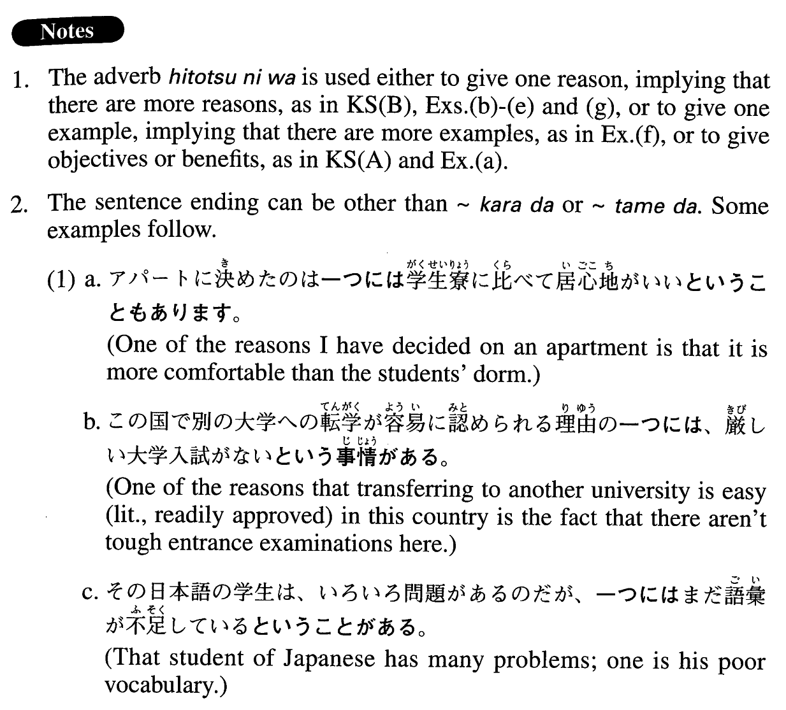

# 一つには

[1. Summary](#summary) 
[2. Formation](#formation) 
[3. Example Sentences](#example-sentences) 
[4. Grammar Book Page](#grammar-book-page) 

## Summary

<table><tr>   <td>Summary</td>   <td>An adverb meaning “partly” in a context where someone gives one or two objectives, benefits, examples or reasons for something.</td></tr><tr>   <td>Equivalent</td>   <td>Partly; for one thing</td></tr><tr>   <td>Part of speech</td>   <td>Adverb</td></tr></table>

## Formation

<table class="table"><tbody><tr class="tr head"><td class="td">(i) 一つには</td><td class="td">(もう) 一つには～</td><td class="td"></td></tr><tr class="tr"><td class="td"></td><td class="td">一つには自分のため、もう一つには家族のため</td><td class="td">Partly for oneself and partly for one’s family</td></tr><tr class="tr head"><td class="td">(ii) {V/Adjectiveい}informal</td><td class="td">{の/理由}は一つには～{から/ため}だ</td><td class="td"></td></tr><tr class="tr"><td class="td"></td><td class="td">食べない{の/理由}は一つにはまずい{から/ため}だ</td><td class="td">One reason why someone doesn’t eat something is because it doesn’t taste good</td></tr><tr class="tr"><td class="td"></td><td class="td">食べなかった{の/理由}は一つにはまずかった{から/ため}だ</td><td class="td">One reason why someone didn’t eat something was because it didn’t taste good</td></tr><tr class="tr"><td class="td"></td><td class="td">美味しい{の/理由}は一つには素材がいい{から/ため}だ</td><td class="td">One reason why something is delicious is because the ingredients are good</td></tr><tr class="tr"><td class="td"></td><td class="td">美味しかった{の/理由}は一つには素材がよかった{から/ため}だ</td><td class="td">One reason why something was delicious was because the ingredients were good</td></tr><tr class="tr head"><td class="td">(iii) Adjective な stem {な/だった}</td><td class="td">{の/理由}は一つには～{から/ため}だ</td><td class="td"></td></tr><tr class="tr"><td class="td"></td><td class="td">数学が得意な{の/理由}は一つには好き{だから/なため}だ</td><td class="td">One reason why he excels in math is because he likes it</td></tr><tr class="tr"><td class="td"></td><td class="td">数学が得意だった{の/理由}は一つには好きだった{から/ため}だ</td><td class="td">One reason why he excelled in math was because he liked it</td></tr><tr class="tr head"><td class="td">(iv) Noun{なの/である理由}</td><td class="td">は一つには～{から/ため}だ</td><td class="td"></td></tr><tr class="tr"><td class="td"></td><td class="td">失敗{なの/である理由}は一つには計画不足{だから/のため}だ</td><td class="td">One reason for the failure is lack of planning</td></tr><tr class="tr head"><td class="td">(v) Nounだった{の/理由}</td><td class="td">は一つには～{から/ため}だ</td><td class="td"></td></tr><tr class="tr"><td class="td"></td><td class="td">失敗だった{の/理由}は一つには計画不足だった{から/ため}だ</td><td class="td">One reason for the failure was lack of planning</td></tr></tbody></table>

## Example Sentences

<table><tr>   <td>大学教育の目的は、一つには幅広い教養と専門的な知識・能力を授けること、一つには社会に貢献する指導者を育成することだ。</td>   <td>The objective of college education is partly to provide broad schooling and professional knowledge and ability, and partly to train and produce leaders who will contribute to society.</td></tr><tr>   <td>彼が外国語を好んで勉強しているのは、一つには、異文化学習が好きだからだ。</td>   <td>One reason he likes studying foreign languages is because he likes to learn about different cultures.</td></tr><tr>   <td>彼がよく家族と旅行に出かけるのは、一つには自分のため、一つには家族のためだ。</td>   <td>He travels so frequently with his family, partly for himself and partly for his family.</td></tr><tr>   <td>日本人が大人まで漫画を読んでいるのは、一つには、大人が十分味わえるような漫画があるからだ。</td>   <td>The reason even Japanese adults read comics is because there are comics that adults can fully enjoy.</td></tr><tr>   <td>彼がその子を好きな理由はいろいろとあるが、一つには彼女の話し方がいつも生き生きとしているためだ。</td>   <td>He likes that girl for many reasons, but partly because her talk is always lively.</td></tr><tr>   <td>私がアメリカに来た理由は、一つには、そこに学問の自由があると思ったからだ。</td>   <td>One reason I came to the U.S. was because I thought there was academic freedom here.</td></tr><tr>   <td>政治家が嫌われる理由は、一つには、選挙の時には魅力的な公約を言うのに、当選するとそれを実行しないからだ。</td>   <td>Part of the reason politicians are disliked is because they make attractive promises when campaigning but don't put them into practice once they are elected.</td></tr><tr>   <td>日本に来た外国人が体験するカルチャーショックには色々あると思うが、一つには、日本人が彼らをガイジン、つまりソトの人と呼ぶということがある。</td>   <td>Foreigners experience a variety of culture shocks when they come to Japan, one of which is being called gaijin, or “outside people,” by the Japanese.</td></tr><tr>   <td>「十年日記」をやってみたいとよく思うが、まだ始めていない。それは一つには、前の年の方がいい年だったらいやだからだ。</td>   <td>I've often thought of keeping a &ldquo;10-year diary,” but I've never gotten around to doing it. That's partly because I wouldn't like it if the previous year was better.</td></tr></table>

## Grammar Book Page

