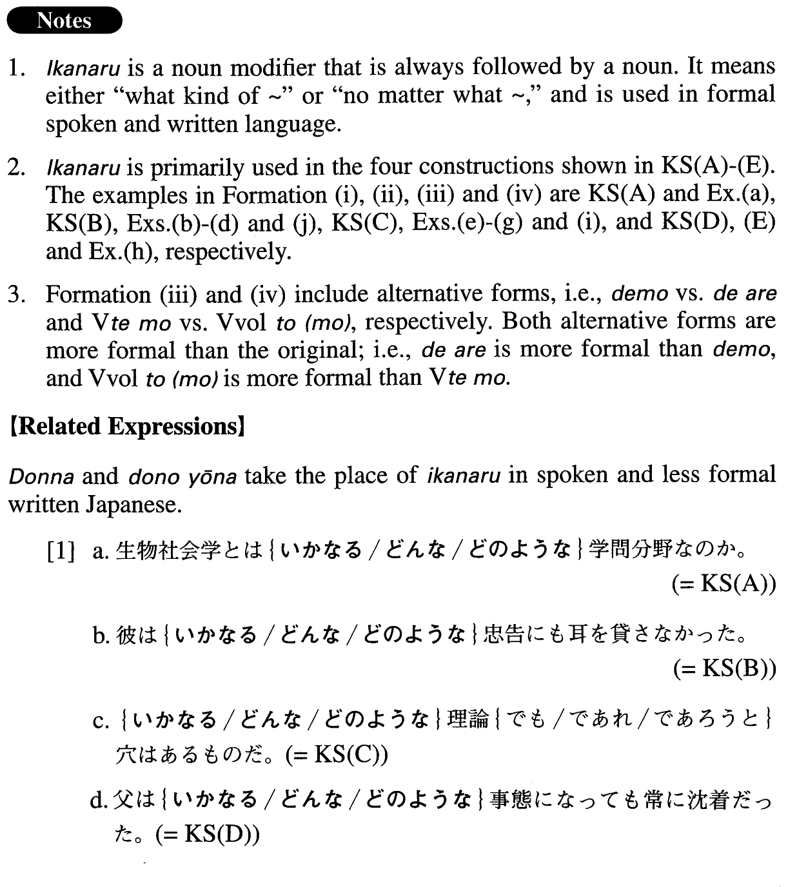

# いかなる

 
 
 
 

## Summary

<table><tr>   <td>Summary</td>   <td>A noun modifier that means either “what kind of” or “no matter what”.</td></tr><tr>   <td>English</td>   <td>What kind of ~; no matter what ~; whatever; any kind of</td></tr><tr>   <td>Part of speech</td>   <td>Noun Modifier (usually used in formal writing and formal speech)</td></tr><tr>   <td>Related expression</td>   <td>どんな; どのような</td></tr></table>

## Formation

<table class="table"><tbody><tr class="tr head"><td class="td">(i) いかなる</td><td class="td">Noun (particle)～か</td><td class="td"></td></tr><tr class="tr"><td class="td"></td><td class="td">いかなる政策を選ぶべきか</td><td class="td">What kind of policy should we choose?</td></tr><tr class="tr"><td class="td"></td><td class="td">いかなる政策(なの)か</td><td class="td">What kind of policy is that?</td></tr><tr class="tr head"><td class="td">(ii) いかなる</td><td class="td">Noun (particle)も</td><td class="td"></td></tr><tr class="tr"><td class="td"></td><td class="td">いかなる図書館にも</td><td class="td">At any kind of library</td></tr><tr class="tr"><td class="td"></td><td class="td">いかなる図書館も</td><td class="td">Any library</td></tr><tr class="tr head"><td class="td">(iii) いかなる</td><td class="td">Noun{でも/であれ/であろうと(も)}</td><td class="td"></td></tr><tr class="tr"><td class="td"></td><td class="td">いかなる人{でも/であれ/であろうと(も)}</td><td class="td">No matter what kind of person (someone may be) </td></tr><tr class="tr head"><td class="td">(iv) いかなる</td><td class="td">Noun+Particle {Vても/Vvolitionalと(も)}</td><td class="td"></td></tr><tr class="tr"><td class="td"></td><td class="td">いかなる大学で{教えても/教えようと(も)}</td><td class="td">At whatever college someone may teach</td></tr></tbody></table>

## Example Sentences

<table><tr>   <td>生物社会学とはいかなる学問分野（なの）か。</td>   <td>What kind of academic field is bio-sociology?</td></tr><tr>   <td>彼はいかなる忠告（に）も耳を貸さなかった。</td>   <td>He didn't lend an ear to any kind of advice.</td></tr><tr>   <td>いかなる理論｛でも/であれ/であろうと（も）｝穴はあるものだ。</td>   <td>No matter what the theory is, it will have holes in it.</td></tr><tr>   <td>父はいかなる事態になっても常に沈着だった。</td>   <td>My father was always calm no matter what situation he found himself in.</td></tr><tr>   <td>重要なことは、いかなる結果が出ようと（も）自分で決めたい。</td>   <td>I would like to make my own decisions about important matters, no matter what happens as a result.</td></tr><tr>   <td>日本語運用能力はいかなる基準で測るべきか。</td>   <td>By what kind of standards should we assess proficiency in Japanese?</td></tr><tr>   <td>厳しい父はいかなる口実も許してくれなかった。</td>   <td>My strict father never allowed me to make any kind of excuse.</td></tr><tr>   <td>いかなる文化にも宗教は存在する。</td>   <td>There is religion in any culture.</td></tr><tr>   <td>あの男はいかなる失敗にも負けず、不死鳥のように蘇る。</td>   <td>No matter what the failure, he is undefeated, rising like a phoenix.</td></tr><tr>   <td>いかなる外国語学習でもその国の文化が好きになってくるものだ。</td>   <td>When learning any foreign language, one will begin to like the country's culture.</td></tr><tr>   <td>スポーツはいかなるスポーツであれ、肉体だけではなく精神をも鍛えてくれる。</td>   <td>Sports, no matter what kind, train not only your body but also your spirit.</td></tr><tr>   <td>いかなるアイディアでも、みんなで討議する価値がある。</td>   <td>No matter what the idea is, it is worth discussing together.</td></tr><tr>   <td>いかなる社会を見ても女性の地位は徐々に向上している。</td>   <td>No matter what society one observes, the status of women is gradually improving.</td></tr><tr>   <td>私の研究がいかなる賞を得ようとも、その賞は私個人のものではなく、プロジェクトチームのものだ。</td>   <td>No matter what prize my research may win, it is not mine alone; it belongs to my project team.</td></tr><tr>   <td>オリンピック・エリアにおいては、いかなる種類のデモも、いかなる種類の政治的、宗教的もしくは人種的な宣伝活動も認められない。</td>   <td>In Olympic areas, no kind of demonstration nor any political, religious or racially-biased propaganda activities are allowed.</td></tr></table>

## Grammar Book Page

