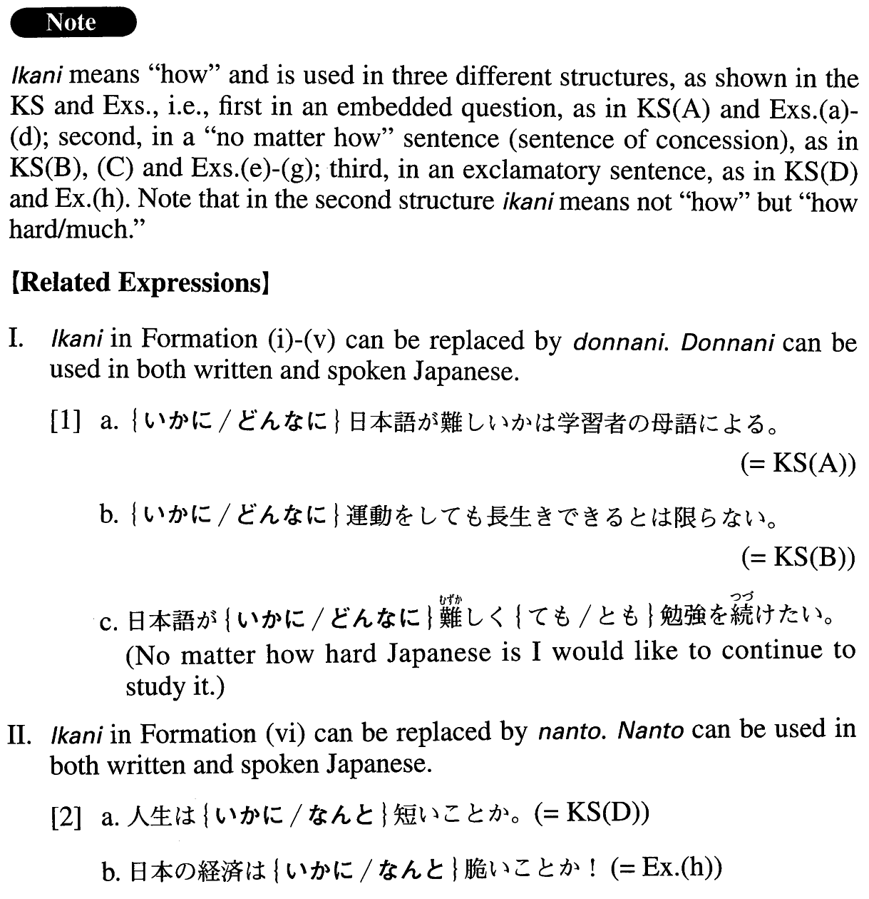

# いかに

[1. Summary](#summary) 
[2. Formation](#formation) 
[3. Example Sentences](#example-sentences) 
[4. Grammar Book Page](#grammar-book-page) 

## Summary

<table><tr>   <td>Summary</td>   <td>An adverb meaning “how”.</td></tr><tr>   <td>English</td>   <td>How; how much; how hard</td></tr><tr>   <td>Part of speech</td>   <td>Adverb (usually used in formal writing and formal speech)</td></tr><tr>   <td>Related expression</td>   <td>どんなに; なんと</td></tr></table>

## Formation

<table class="table"><tbody><tr class="tr head"><td class="td">(i) いかに</td><td class="td">{V/Adjective い}informalか</td><td class="td"></td></tr><tr class="tr"><td class="td"></td><td class="td">いかに{生きる/生きた}か</td><td class="td">How someone lives/lived</td></tr><tr class="tr"><td class="td"></td><td class="td">いかに{美しい/美しかった}か</td><td class="td">How beautiful someone/something is/was</td></tr><tr class="tr head"><td class="td">(ii) いかに</td><td class="td">{Adjectiveなstem/Noun}{∅/だった}か</td><td class="td"></td></tr><tr class="tr"><td class="td"></td><td class="td">いかに有名{∅/だった}か</td><td class="td">How famous someone/something is/was</td></tr><tr class="tr"><td class="td"></td><td class="td">いかに天才{∅/だった}か</td><td class="td">How much a genius someone is/was</td></tr><tr class="tr head"><td class="td">(iii) いかに</td><td class="td">{Vても/Vvolitionalと(も}}</td><td class="td"></td></tr><tr class="tr"><td class="td"></td><td class="td">いかに勉強{しても/ しようと(も}}</td><td class="td">No matter how hard someone studies something</td></tr><tr class="tr head"><td class="td">(iv) いかに</td><td class="td">Adjectiveいstemく{ても/とも}</td><td class="td"></td></tr><tr class="tr"><td class="td"></td><td class="td">いかに美味しく{ても/とも}</td><td class="td">No matter how delicious something is</td></tr><tr class="tr head"><td class="td">(v) いかに</td><td class="td">{Adjectiveなstem/Noun}でも</td><td class="td"></td></tr><tr class="tr"><td class="td"></td><td class="td">いかに元気でも</td><td class="td">No matter how healthy someone is</td></tr><tr class="tr"><td class="td"></td><td class="td">いかに天才でも</td><td class="td">No matter how much of a genius someone is</td></tr><tr class="tr head"><td class="td">(vi) いかに</td><td class="td">Adjectiveいinformalことか。</td><td class="td"></td></tr><tr class="tr"><td class="td"></td><td class="td">いかに{面白い/面白かった}ことか。</td><td class="td">How interesting something is/was!</td></tr><tr class="tr head"><td class="td">(vii) いかに</td><td class="td">{Adjectiveなstem/Noun}{である/であった/だった}ことか。</td><td class="td"></td></tr><tr class="tr"><td class="td"></td><td class="td">いかにきれい{である/であった/だった}ことか。</td><td class="td">How pretty someone is/was!</td></tr><tr class="tr"><td class="td"></td><td class="td">いかに天才{である/であった/だった}ことか。</td><td class="td">What a genius someone is/was!</td></tr></tbody></table>

## Example Sentences

<table><tr>   <td>いかに日本語が難しいかは学習者の母語による。</td>   <td>How difficult Japanese is (for someone) depends on the learner's mother tongue.</td></tr><tr>   <td>いかに運動しても長生きできるとは限らない。</td>   <td>No matter how hard one exercises, it doesn't guarantee a long life.</td></tr><tr>   <td>いかに一生懸命働こうとも一戸建ての家は買えない。</td>   <td>No matter how hard I work I cannot buy a single house.</td></tr><tr>   <td>人生はいかに短いことか。</td>   <td>How short life is!</td></tr><tr>   <td>いかに死ぬかはいかに生きるかと同じように大事だ。</td>   <td>How one dies is as important as how one lives.</td></tr><tr>   <td>ヒトゲノムの解読が病気の根本的な治療にいかに必要かが分かってきた。</td>   <td>We began to understand how important decoding the human genome is for the basic treatment of illness.</td></tr><tr>   <td>クローン人間がいかに創られるのかは私には理解できないが、その倫理性についての論争には強い興味を覚える。</td>   <td>I cannot comprehend how human clones are created, but I have a strong interest in the debate over the ethics of cloning.</td></tr><tr>   <td>食べた物がいかにおいしかったかを言葉で適確に説明することは至難のわざだ。</td>   <td>It is extremely difficult for one to describe in words how delicious the food he/she ate was.</td></tr><tr>   <td>いかに努力しても自分の才能のない領域だったら限界があるだろう。</td>   <td>No matter how much effort you make, you will face limits when you deal with areas beyond your own talent.</td></tr><tr>   <td>いかに環境問題の重要性を強調しようとも強調しすぎることはない。</td>   <td>No matter how much you emphasize the importance of environmental issues you can never emphasize it too much.</td></tr><tr>   <td>いかに天才でも、運が悪ければいい仕事はできない。</td>   <td>No matter how much of a genius you may be, if you have bad luck, you won't be able to accomplish much.</td></tr><tr>   <td>日本の経済はいかに脆いことか！</td>   <td>How fragile the Japanese economy is!</td></tr></table>

## Grammar Book Page

