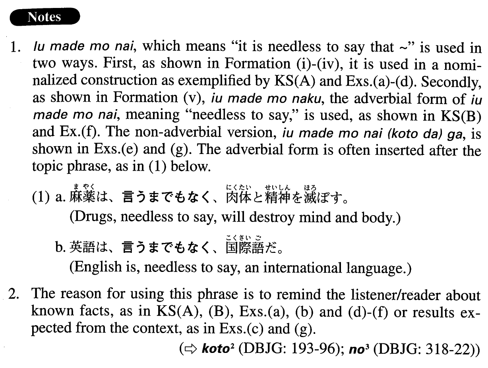

# 言うまでもない

 
 
 
 

## Summary

<table><tr>   <td>Summary</td>   <td>A phrase indicating that what the speaker/writer expresses is generally known but that he/she presents it as a reminder.</td></tr><tr>   <td>English</td>   <td>It is needless to say that ~; needless to say; it goes without saying</td></tr><tr>   <td>Part of speech</td>   <td>Phrase</td></tr></table>

## Formation

<table class="table"><tbody><tr class="tr head"><td class="td">(i) {V/Adjectiveい} informal+Nominalは</td><td class="td">言うまでもない。</td><td class="td"></td></tr><tr class="tr"><td class="td"></td><td class="td">{買う/買った}{の/こと}は言うまでもない。</td><td class="td">Needless to say, someone will buy/bought something</td></tr><tr class="tr"><td class="td"></td><td class="td">つまらない{の/こと}は言うまでもない。</td><td class="td">It goes without saying that something is boring</td></tr><tr class="tr"><td class="td"></td><td class="td">つまらなかった{の/こと}は言うまでもない。</td><td class="td">It goes without saying that something was boring</td></tr><tr class="tr head"><td class="td">(ii) Adjective な stem{な/である/だった/であった}</td><td class="td">+Nominalは言うまでもない。</td><td class="td"></td></tr><tr class="tr"><td class="td"></td><td class="td">立派{な/である/だった/であった}{の/こと}は言うまでもない。</td><td class="td">It goes without saying that something is/was magnificent</td></tr><tr class="tr head"><td class="td">(iii) Noun{な/である/だった/であった}</td><td class="td">のは言うまでもない。</td><td class="td"></td></tr><tr class="tr"><td class="td"></td><td class="td">教授{な/である/だった/であった}のは言うまでもない。</td><td class="td">It goes without saying that someone is/was a professor</td></tr><tr class="tr head"><td class="td">(iv) Noun{である/だった}</td><td class="td">ことは言うまでもない。</td><td class="td"></td></tr><tr class="tr"><td class="td"></td><td class="td">天才{である/だった}ことは言うまでもない。</td><td class="td">Needless ot say, he is/was a genius</td></tr><tr class="tr head"><td class="td">(v) 言うまで</td><td class="td">{なく/ない(ことだ)が}、Sentence。</td><td class="td"></td></tr><tr class="tr"><td class="td"></td><td class="td">言うまで{なく/ない(ことだ)が}、日本は島国だ。</td><td class="td">Needless to say, Japan is an island country</td></tr></tbody></table>

## Example Sentences

<table><tr>   <td>寿司が日本の代表的な料理であることは言うまでもない。</td>   <td>It goes without saying that sushi is representative of Japanese cuisine.</td></tr><tr>   <td>言うまでもなく、日本の社会は世界一の高齢化社会になっている。</td>   <td>That Japan has become the most rapidly aging society in the world goes without saying.</td></tr><tr>   <td>少子化が日本の社会を変えていくことは言うまでもない。</td>   <td>It goes without saying that the shrinking population of children will change Japanese society.</td></tr><tr>   <td>「アジアの人々は貧しい」「貧しいのは可哀想」「開発援助しなくては」という固定観念が有害なのは言うまでありません。</td>   <td>The set of fixed ideas that \"Asians are poor,” \"Being poor is pitiable,” and \"We should provide development assistance,” is, needless to say, harmful.</td></tr><tr>   <td>二人はパーティーで会って、すぐ意気投合しました。そのあと毎日のようにデートをしたのは言うまでもありません。</td>   <td>The two met at a party, and right away they hit it off. I hardly need to mention that after that they went out on a date almost every day.</td></tr><tr>   <td>オープンネットワークコンピューティング環境では、日々増大するネットワークデータをいかに敏速にかつ効率よくバックアップするかが重要であることは言うまでもありません。</td>   <td>Needless to say, in an open network computing environment, it is important how quickly and effectively you back up the continually expanding network data.</td></tr><tr>   <td>言うまでもありませんが、大学の成績の優秀な学生が社会で成功するとは限りません。</td>   <td>Needless to say, students whose grades in college were superb do not always succeed in society.</td></tr><tr>   <td>いまさら言うまでもなく、地球の温暖化は生態系に悪影響をもたらしている。</td>   <td>It's obvious now, but global warming is having an adverse effect on the ecosystem.</td></tr><tr>   <td>菜穂子はとびきりの美人でもなかったが、誰とでもにこやかに話し、いつも溌溂としていた。言うまでもないことだが、彼女の周りには人が自然に集まり、職場のみんなにも好かれていた。</td>   <td>Nahoko was not especially beautiful, but she had a smile for everybody and was always cheerful. Needless to say, people spontaneously gathered around her, and everybody at her office loved her.</td></tr></table>

## Grammar Book Page

