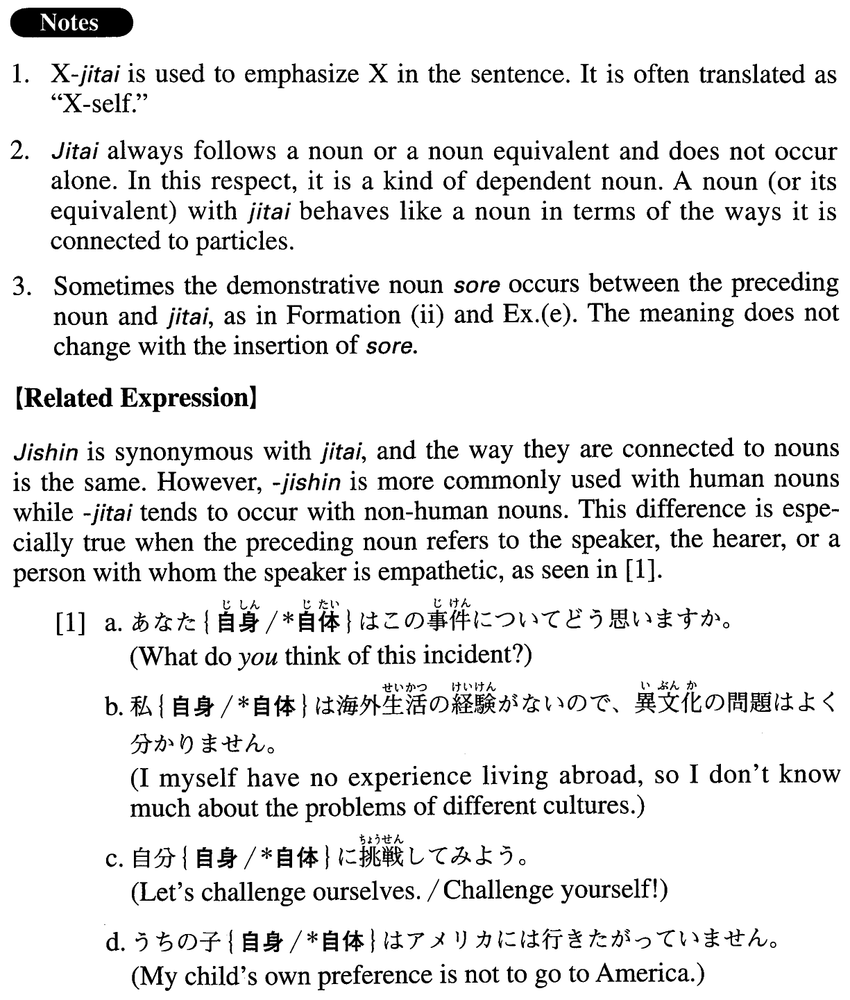

# 自体

[1. Summary](#summary) 
[2. Formation](#formation) 
[3. Example Sentences](#example-sentences) 
 

## Summary

<table><tr>   <td>Summary</td>   <td>A dependent noun that is used to emphasize the referent of the preceding noun.</td></tr><tr>   <td>English</td>   <td>Oneself; in and of itself; the very</td></tr><tr>   <td>Part of speech</td>   <td>Noun</td></tr><tr>   <td>Related expression</td>   <td>自身; そのもの</td></tr></table>

## Formation

<table class="table"><tbody><tr class="tr head"><td class="td">(i) NounPhrase</td><td class="td">自体</td><td class="td"></td></tr><tr class="tr"><td class="td"></td><td class="td">技術自体</td><td class="td">Technology itself</td></tr><tr class="tr"><td class="td"></td><td class="td">日本に行くこと自体</td><td class="td">The act of going to Japan (in and of) itself</td></tr><tr class="tr head"><td class="td">(ii) NounPhraseそれ</td><td class="td">自体</td><td class="td"></td></tr><tr class="tr"><td class="td"></td><td class="td">素材それ自体</td><td class="td">The materials themselves</td></tr></tbody></table>

## Example Sentences

<table><tr>   <td>インターネット自体は情報の通路であって、内容は持たない。</td>   <td>The Internet is a path for information and does not contain any content itself.</td></tr><tr>   <td>私にとってはこの試合に出られること自体が光栄なことです。</td>   <td>For me, being able to participate in this match in and of itself is an honour.</td></tr><tr>   <td>ケータイ自体には問題はない。問題は使う人のマナーや気配りだ。</td>   <td>There is no problem with cell phones in and of themselves. The problems exist in the manners and considerateness of the users.</td></tr><tr>   <td>いまの仕事自体には満足していますが、職場の人間関係がうまくいかず悩んでいます。</td>   <td>I'm satisfied with the job itself, but what troubles me is that I cannot maintain good relationships with the people at my workplace.</td></tr><tr>   <td>音声データ自体に異常があるので、どのプレーヤーで再生してもノイズが入ってしまう。</td>   <td>The sound data itself contains some defects, so no matter what player you use to play it back, you'll get noise.</td></tr><tr>   <td>世の中が大きく変わった今、この組織の存在自体が疑われている。</td>   <td>The world has changed greatly, and the very existence of this organization is now in doubt.</td></tr><tr>   <td>この広告は、販売より広告それ自体が目的だ。</td>   <td>The goal of this advertisement is the advertisement (of the product) itself rather than sales.</td></tr><tr>   <td>裁判所はこれらのファイル交換ソフト自体の違法性は認められないという判決を下した。</td>   <td>The court ruled that these file-exchange software programs in and of themselves are not illegal.</td></tr><tr>   <td>そういうところから金を借りること自体が間違っている。</td>   <td>The very act of borrowing money from that kind of place is wrong.</td></tr><tr>   <td>問題は個々の差別表現自体ではなく、そういう表現が出てくる背景なのだ。</td>   <td>The problem is not the individual discriminatory expressions themselves, but the context from which they arise.</td></tr><tr>   <td>音楽のデジタル化やインターネット配信が音楽業界の主流になってきたが、私はそのこと自体は悪いことではないと思う。問題は、それによって不正コピーや大量配布がしやすくなったことだ。</td>   <td>Music digitization and distribution via the Internet has become mainstream in the music industry, but I don't think that (literally: that fact itself) is a bad thing. The problem is that it has become easier to make illegal copies and mass-distribute them.</td></tr></table>

## Grammar Book Page

