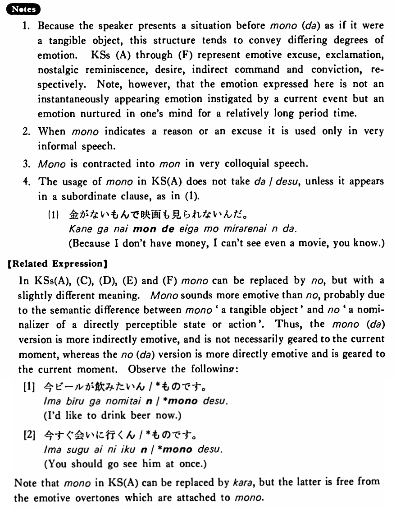

# もの（だ）

[1. Summary](#summary) 
[2. Formation](#formation) 
[3. Example Sentences](#example-sentences) 
[4. Explanation](#explanation) 
 

## Summary

<table><tr>   <td>Summary</td>   <td>The speaker presents some situation as if it were a tangible object.</td></tr><tr>   <td>English</td>   <td>Because; how could ~!; used to; should like to; should</td></tr><tr>   <td>Part of speech</td>   <td>Noun</td></tr><tr>   <td>Related expression</td>   <td>から; のだ</td></tr></table>

## Formation

<table class="table"> <tbody><tr class="tr head"> <td class="td">(i)  {Vinformal/Vますたい}</td> <td class="td">ものだ </td> <td class="td">&nbsp;</td> </tr> <tr class="tr"> <td class="td">&nbsp;</td> <td class="td">話すものだ </td> <td class="td">Someone    should talk</td> </tr> <tr class="tr"> <td class="td">&nbsp;</td> <td class="td">話したものだ </td> <td class="td">Someone    used to talk</td> </tr> <tr class="tr"> <td class="td">&nbsp;</td> <td class="td">話したいものだ </td> <td class="td">Someone    would like to talk</td> </tr> <tr class="tr head"> <td class="td">(ii)  {Adjective い/な} informal</td> <td class="td">ものだ </td> <td class="td">&nbsp;</td> </tr> <tr class="tr"> <td class="td">&nbsp;</td> <td class="td">高いもの </td> <td class="td">‘cause    something is expensive</td> </tr> <tr class="tr"> <td class="td">&nbsp;</td> <td class="td">高かったもの </td> <td class="td">‘cause    something was expensive</td> </tr> <tr class="tr"> <td class="td">&nbsp;</td> <td class="td">高かったものだ </td> <td class="td">Something    used to be expensive</td> </tr> <tr class="tr"> <td class="td">&nbsp;</td> <td class="td">静かだもの </td> <td class="td">‘cause    something is quiet</td> </tr> <tr class="tr"> <td class="td">&nbsp;</td> <td class="td">静かだったもの </td> <td class="td">‘cause    something was quiet</td> </tr> <tr class="tr"> <td class="td">&nbsp;</td> <td class="td">静かだったものだ </td> <td class="td">Something    used to be quiet</td> </tr></tbody></table>

## Example Sentences

<table><tr>   <td>A:どうして行かないの？  B:だって、忙しいもの。</td>   <td>A: How come you don't go there?&emsp;&emsp;B: 'Cause I'm busy.</td></tr><tr>   <td>よくあんな男とデート出来るものだ・です！</td>   <td>How could you date that kind of guy!</td></tr><tr>   <td>昔はよく映画を見たものだ・です。</td>   <td>I used to see movies a lot.</td></tr><tr>   <td>こんないいうちに一度住んでみたいものだ・です。</td>   <td>I'd like to live in such a nice house.</td></tr><tr>   <td>朝人に会ったら「おはよう」と言うものだ・です。</td>   <td>You should say “Good morning” when you see people in the morning.</td></tr><tr>   <td>年を取ると昔のことを話したがるものだ・です。</td>   <td>When one gets old, he wants to talk about his/her past.</td></tr><tr>   <td>A:どうして食べないの？  B:だって、不味いもの。</td>   <td>A: Why don't you eat it?&emsp;&emsp;B: 'Cause it doesn't taste good.</td></tr><tr>   <td>A:どうしてその本、読まないんだい？  B:だって、よく分からないんだもの。</td>   <td>A: Why don't you read that book?&emsp;&emsp;B: 'Cause I don't understand it well.</td></tr><tr>   <td>よくそんな馬鹿なことをしたものだ！</td>   <td>How could you do such a foolish thing!</td></tr><tr>   <td>月日の立つのは早いものだ。</td>   <td>The passing of days and months is so quick!</td></tr><tr>   <td>昔はこの川にも魚がいたものだ。</td>   <td>There used to be fish in this river, too.</td></tr><tr>   <td>一度是非一緒にテニスをしたいものですね。</td>   <td>Id like to play tennis with you once.</td></tr><tr>   <td>人の家に行く時はお土産を持って行くものです。</td>   <td>When you visit someone, you should take a gift with you.</td></tr><tr>   <td>好きな仕事をしていると病気にならないものだ。</td>   <td>When you are doing work you love, you don’t become ill.</td></tr></table>

## Explanation

1. Because the speaker presents a situation before もの(だ) as if it were a tangible object, this structure tends to convey differing degrees of emotion. Key Sentences (A) through (F) represent emotive excuse, exclamation, nostalgic reminiscence, desire, indirect command and conviction, respectively. Note, however, that the emotion expressed here is not an instantaneously appearing emotion instigated by a current event but an emotion nurtured in one's mind for a relatively long period time.
  
2. When もの indicates a reason or an excuse it is used only in very informal speech.
  
3. もの is contracted into もん in very colloquial speech.
  
4. The usage of もの in Key Sentence (A) does not take だ/です, unless it appears in a subordinate clause, as in (1).
  <ul>(1) <li>金がないもんで映画も見られないんだ。</li> <li>Because I don't have money, I can't see even a movie, you know</li> </ul>  
【Related Expression】
  
In Key Sentences (A), (C), (D), (E) and (F) もの can be replaced by の, but with a slightly different meaning. もの sounds more emotive than の, probably due to the semantic difference between もの 'a tangible object' and の 'a nominalizer of a directly perceptible state or action'. Thus, the もの(だ) version is more indirectly emotive, and is not necessarily geared to the current moment, whereas the の(だ) version is more directly emotive and is geared to the current moment. Observe the following:
  
[1]
  <ul> <li>今ビールが飲みたいん/*ものです。</li> <li>I'd like to drink beer now.</li> </ul>  
[2]
  <ul> <li>今すぐ会いに行くん/*ものです。</li> <li>You should go see him at once.</li> </ul>  
Note that もの in Key Sentence (A) can be replaced by から, but the latter is free from the emotive overtones which are attached to もの.

## Grammar Book Page

