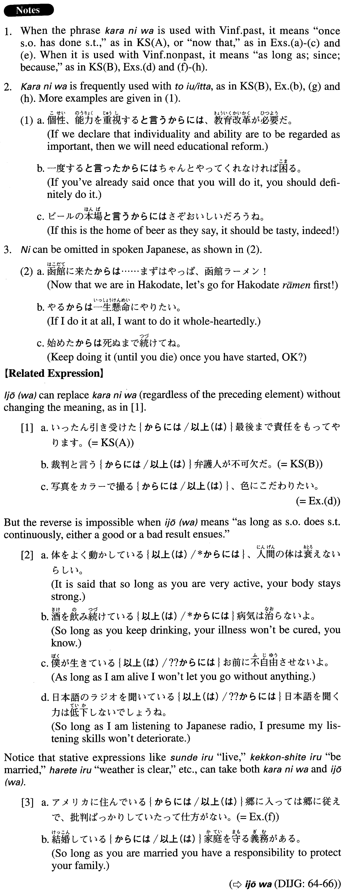

# からには

[1. Summary](#summary) 
[2. Formation](#formation) 
[3. Example Sentences](#example-sentences) 
 

## Summary

<table><tr>   <td>Summary</td>   <td>A subordinate conjunction meaning “now that,” “once someone does / has done something” or “so long as”.</td></tr><tr>   <td>English</td>   <td>Once; now that ~; as long as ~; so long as ~; if</td></tr><tr>   <td>Part of speech</td>   <td>Conjunction</td></tr><tr>   <td>Related expression</td>   <td>以上(は)</td></tr></table>

## Formation

<table class="table"><tbody><tr class="tr head"><td class="td">(i) Vinformal</td><td class="td">からには</td><td class="td"></td></tr><tr class="tr"><td class="td"></td><td class="td">行くからには</td><td class="td">So long as someone goes there</td></tr><tr class="tr"><td class="td"></td><td class="td">行ったからには</td><td class="td">Once someone has gone there</td></tr><tr class="tr head"><td class="td">(ii) Quoteと言う</td><td class="td">からには</td><td class="td"></td></tr><tr class="tr"><td class="td"></td><td class="td">戦争と言うからには</td><td class="td">As long as one calls it a war</td></tr><tr class="tr"><td class="td"></td><td class="td">見たと言うからには</td><td class="td">As long as someone said he saw it</td></tr></tbody></table>

## Example Sentences

<table><tr>   <td>いったん引き受けたからには最後まで責任をもってやります。</td>   <td>Once I take on (the job), I will fulfill my responsibility and complete it.</td></tr><tr>   <td>裁判と言うからには弁護人が不可欠だ。</td>   <td>Since it is a trial, a defence attorney will be indispensable.</td></tr><tr>   <td>生まれてきたからには長生きしたい。</td>   <td>So long as I'm here (literally: Since I was born), I'd like to live a long time.</td></tr><tr>   <td>行くって言ったからにはちゃんと行かなきゃ駄目だよ。</td>   <td>Now that you've said you're going there, you have to go, OK?</td></tr><tr>   <td>ネット上で文章を書いたからには、必ずそれを読む人が存在するのです。</td>   <td>Once you write a passage on the Internet, there are definitely people who will read it.</td></tr><tr>   <td>写真をカラーで撮るからには、色にこだわりたい。</td>   <td>As long as I am taking pictures with colour film, I want to be very particular about the colour.</td></tr><tr>   <td>マラソンに出るからには、絶対に勝ちたい。</td>   <td>Now that I am taking part in the marathon, I absolutely want to win.</td></tr><tr>   <td>アメリカに住んでいるからには郷に入っては郷に従えで、批判ばっかりしていたって仕方がない。</td>   <td>As long as you are living in the U.S., do as the Americans do; it won't help if you just complain.</td></tr><tr>   <td>「ブレーンストーミング」と言うからには、発言に制限を設けてはならない。</td>   <td>Since you are calling it brainstorming, you shouldn't restrict statements people make.</td></tr><tr>   <td>世界一周と言うからには、軽度の基準点であるグリニッジ天文台から出発しおうと決め込んだ。</td>   <td>Because I was going to travel around the world, I decided to start my trip from London's Greenwich Observatory, which is the base point of longitude.</td></tr></table>

## Grammar Book Page

