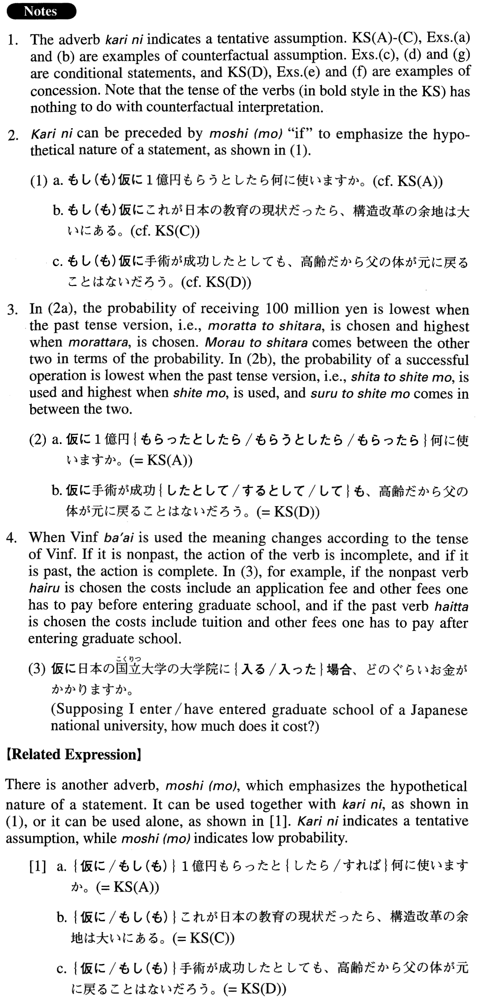

# 仮に

[1. Summary](#summary) 
[2. Formation](#formation) 
[3. Example Sentences](#example-sentences) 
[4. Grammar Book Page](#grammar-book-page) 

## Summary

<table><tr>   <td>Summary</td>   <td>An adverb that indicates the speaker’s/writer’s tentative supposition.</td></tr><tr>   <td>English</td>   <td>Supposing that; suppose; providing that; (even) if</td></tr><tr>   <td>Part of speech</td>   <td>Adverb</td></tr><tr>   <td>Related expression</td>   <td>もし(も)</td></tr></table>

## Formation

<table class="table"><tbody><tr class="tr head"><td class="td">(i) 仮に</td><td class="td">Sinformalと{したら/すれば}</td><td class="td"></td></tr><tr class="tr"><td class="td"></td><td class="td">仮に{話す/話した}と{したら/すれば}</td><td class="td">Supposing (that)/if someone talks/talked</td></tr><tr class="tr"><td class="td"></td><td class="td">仮に{高い/高かった}と{したら/すれば}</td><td class="td">Supposingg (that)/if something is/were expensive</td></tr><tr class="tr"><td class="td"></td><td class="td">仮にきれい{だ/だった}と{したら/すれば}</td><td class="td">Supposing (that)/if something/someone is/were beautiful</td></tr><tr class="tr"><td class="td"></td><td class="td">仮に先生{だ/だった}と{したら/すれば}</td><td class="td">Supposing (that)/if someone is/were a teacher</td></tr><tr class="tr head"><td class="td">(ii) 仮に</td><td class="td">Sinformal場合</td><td class="td"></td></tr><tr class="tr"><td class="td"></td><td class="td">仮に{話す/話した}場合</td><td class="td">Supposing (that)/if someone talks/talked</td></tr><tr class="tr"><td class="td"></td><td class="td">仮に{高い/高かった}場合</td><td class="td">Supposing (that)/if something is/were expensive</td></tr><tr class="tr"><td class="td"></td><td class="td">仮にきれい{だ/だった}場合</td><td class="td">Supposing (that) if something/someone is/were beautiful</td></tr><tr class="tr"><td class="td"></td><td class="td">仮に先生{だ/だった}場合</td><td class="td">Supposing that/if someone is/were a teacher</td></tr><tr class="tr head"><td class="td">(iii) 仮に</td><td class="td">Sinformalとして</td><td class="td"></td></tr><tr class="tr"><td class="td"></td><td class="td">仮に{話す/話した}として</td><td class="td">Supposing (that) someone talked</td></tr><tr class="tr"><td class="td"></td><td class="td">仮に{高い/高かった}として</td><td class="td">Supposing (that) something were expensive</td></tr><tr class="tr"><td class="td"></td><td class="td">仮にきれい{だ/だった}として</td><td class="td">Supposing (that) something/someone were beautiful</td></tr><tr class="tr"><td class="td"></td><td class="td">仮に先生{だ/だった}として</td><td class="td">Supposing (that) someone were a teacher</td></tr><tr class="tr head"><td class="td">(iv) 仮に</td><td class="td">Sinformal past ら</td><td class="td"></td></tr><tr class="tr"><td class="td"></td><td class="td">仮に話したら</td><td class="td">Supposing (that)/if someone talks/talked</td></tr><tr class="tr"><td class="td"></td><td class="td">仮に高かったら</td><td class="td">Supposing (that)/if something is/were expensive</td></tr><tr class="tr"><td class="td"></td><td class="td">仮にきれいだったら</td><td class="td">Supposing (that)/if something/someone is/were beautiful</td></tr><tr class="tr"><td class="td"></td><td class="td">仮に先生だったら</td><td class="td">Supposing (that)/if someone is/were a teacher</td></tr><tr class="tr head"><td class="td">(v) 仮に～</td><td class="td">{Vて/Adjective いstemくて}も</td><td class="td"></td></tr><tr class="tr"><td class="td"></td><td class="td">{Adjective な stem/ Noun}でも</td><td class="td"></td></tr><tr class="tr"><td class="td"></td><td class="td">仮に話しても</td><td class="td">Even is someone talks/talked</td></tr><tr class="tr"><td class="td"></td><td class="td">仮に高くても</td><td class="td">Even if something is/were expensive</td></tr><tr class="tr"><td class="td"></td><td class="td">仮にきれいでも</td><td class="td">Even if someone/something is/were beautiful</td></tr><tr class="tr"><td class="td"></td><td class="td">仮に先生でも</td><td class="td">Even if someone is/were a teacher</td></tr><tr class="tr head"><td class="td">(vi) 仮に</td><td class="td">Sinformalとしても</td><td class="td"></td></tr><tr class="tr"><td class="td"></td><td class="td">仮に{話す/話した}としても</td><td class="td">Even if someone talks/talked</td></tr><tr class="tr"><td class="td"></td><td class="td">仮に{高い/高かった}としても</td><td class="td">Even if something were expensvie</td></tr><tr class="tr"><td class="td"></td><td class="td">仮にきれい{だ/だった}としても</td><td class="td">Even if someone/something were beautiful</td></tr><tr class="tr"><td class="td"></td><td class="td">仮に先生{だ/だった}としても</td><td class="td">Even if someone were a teacher</td></tr></tbody></table>

## Example Sentences

<table><tr>   <td>仮に一億円｛もらう/もらった｝と｛したら/すれば｝何に使いますか。</td>   <td>Supposing you received 100 million yen, what would you use it for?</td></tr><tr>   <td>仮に月収が30万円｛ある/あった｝として、どのようなアパートを借りることができるだろうか。</td>   <td>Supposing that I had an income of 300,000 yen, I wonder what kind of an apartment I could rent.</td></tr><tr>   <td>仮にこれが日本の教育の現状だったら、構造改革の余地は大いにある。</td>   <td>If this were the current state of Japanese educational affairs, a lot would have to be restructured.</td></tr><tr>   <td>仮に手術が成功｛する/した｝としても、高齢だから父の体が元に戻ることはないだろう。</td>   <td>Even if the operation is successful, my father, who is quite old, will probably not regain his original health.</td></tr><tr>   <td>仮にあなたがベンチャー企業の経営権を持っていたら、どのようなアプローチを取りますか。</td>   <td>Supposing that you managed a business venture, what sort of approach would you take?</td></tr><tr>   <td>よくある質問ですが、仮にあなたが今小さい島で一人で暮らすとして、一冊だけ本を持って行けるとしたら、どの本を持って行きますか。</td>   <td>This is a common question, but supposing that you were going to live alone on a small island and were allowed to bring only one book, what would it be (literally: which book would you take there)?</td></tr><tr>   <td>仮に今の調子で老齢化が進むとすれば、21世紀後半には日本の人口の5割以上が６５歳以上になる可能性がある。</td>   <td>If Japan ages at the current rate, in the latter half of the 21st century more than half of the Japanese population will be 65 or older.</td></tr><tr>   <td>仮に日本に一年ぐらい行って日本語を勉強すれば、君たちの日本語はすごく上達するよ。</td>   <td>If you go to Japan to study Japanese for about a year, your Japanese will make an impressive progress.</td></tr><tr>   <td>信号を待っている時、仮に前の車が青になったのに進まなかったとしても、クラクションは鳴らさない方がよいでしょう。</td>   <td>When you are waiting for the light, even if the car in front of you doesn't move ahead when it turns green, it's better not to honk.</td></tr><tr>   <td>仮に話を経済学の「理論」に限定するとしても、今日までのあらゆる経済学理論が結局においてはすべてゲーム理論だと言っていいだろう。</td>   <td>Even if we limit the discussion to economic theory, I can safely say that all economic theories are, in the end, game theory.</td></tr><tr>   <td>仮に仲介者を通して売る場合、利益が少なくなるのは当然だ。</td>   <td>If you sell it through a go-between, your profit, of course, will become smaller.</td></tr></table>

## Grammar Book Page

