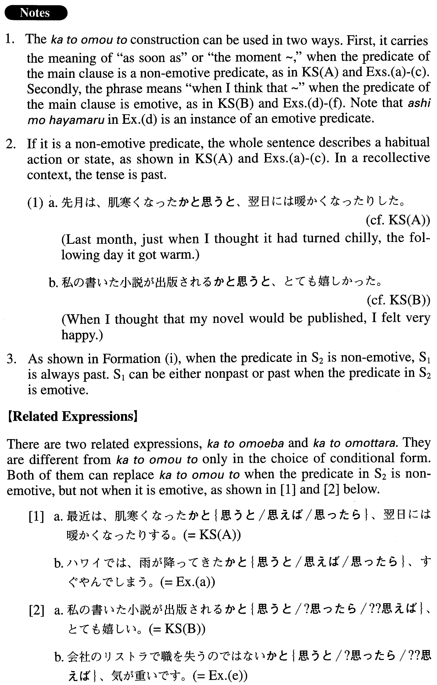

# かと思うと

[1. Summary](#summary) 
[2. Formation](#formation) 
[3. Example Sentences](#example-sentences) 
[4. Grammar Book Page](#grammar-book-page) 

## Summary

<table><tr>   <td>Summary</td>   <td>A phrase indicating that an action or state in the dependent clause occurs very closely with another action or state in the clause, or causes another action or state in the main clause.</td></tr><tr>   <td>English</td>   <td>As soon as (one notices that) ~; soon after; when one thinks/feels that ~</td></tr><tr>   <td>Part of speech</td>   <td>Phrase</td></tr><tr>   <td>Related expression</td>   <td>かと思えば; かと思ったら</td></tr></table>

## Formation

<table class="table"><tbody><tr class="tr head"><td class="td">(i) Sentence1 informal past</td><td class="td">かと思うと、Sentence2</td><td class="td">Where the predicate in Sentence2 is non-emotive; the subjects in Sentence1 and Sentence2 are the same</td></tr><tr class="tr"><td class="td"></td><td class="td">食べたかと思うと、家を出た</td><td class="td">As soon as someone has eaten, he left home</td></tr><tr class="tr head"><td class="td">(ii) Sentence1 informal</td><td class="td">かと思うと、Sentence2。</td><td class="td">Where the predicate in Sentence2 is emotive</td></tr><tr class="tr"><td class="td"></td><td class="td">日本へ行けるかと思うと嬉しい。</td><td class="td">When I think that I can go to Japan, I am happy</td></tr><tr class="tr"><td class="td"></td><td class="td">馬鹿にされたかと思うと悔しいい。</td><td class="td">When I think that I was despised, I feel distressed</td></tr></tbody></table>

## Example Sentences

<table><tr>   <td>最近は、肌寒くなったかと思うと、翌日には暖かくなったりする。</td>   <td>These days, just when you think it's gotten chilly, the next day it turns warm again.</td></tr><tr>   <td>私の書いた小説が出版されるかと思うと、とても嬉しい。</td>   <td>When I think that the novel I wrote will be published, I feel very happy.</td></tr><tr>   <td>ハワイでは、雨が降ってきたかと思うと、すぐやんでしまう。</td>   <td>In Hawaii, as soon as it begins to rain, it stops right away.</td></tr><tr>   <td>花火は、あがったかと思うとすぐ消えてしまうからいいのだ。</td>   <td>I like fireworks because they disappear as soon as they go up.</td></tr><tr>   <td>うちの小学生の子供は、テレビを見終わったかと思うと、コンピュータゲームをやり始める。</td>   <td>Our elementary school child starts to play computer games soon after he finishes watching TV.</td></tr><tr>   <td>妻がおいしい夕食を作ってくれているかと思うと、家に帰る足も速まる。</td>   <td>When I think about my wife preparing a delicious dinner for me, I naturally start walking home faster.</td></tr><tr>   <td>会社のリストラで職を失うのではないかと思うと、気が重いです。</td>   <td>When I think about how I might be laid off because of restructuring at my company, I feel depressed.</td></tr><tr>   <td>子供たちも大学を出て一人立ちしたので、もう学費もかからないかと思うと、ほっとします。</td>   <td>When I think about how we no longer need to pay educational expenses because our children have graduated from college and are now on their own, I feel so relieved.</td></tr></table>

## Grammar Book Page

