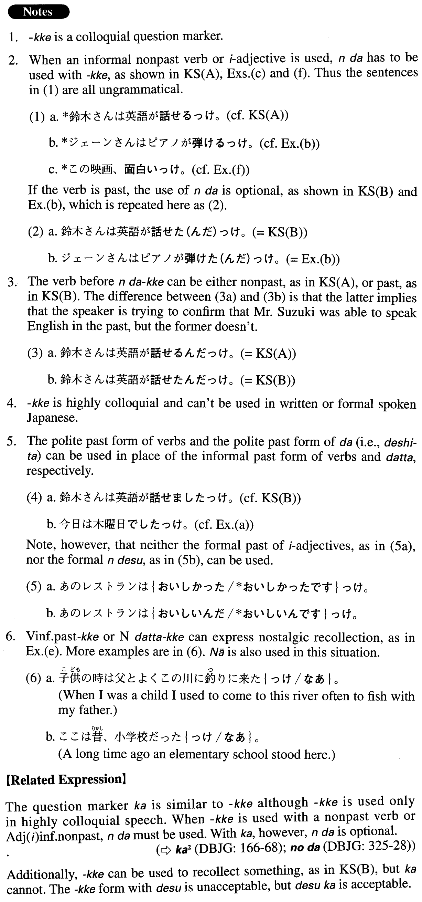

# っけ

 
 
 
 

## Summary

<table><tr>   <td>Summary</td>   <td>A colloquial sentence final particle marking a question.</td></tr><tr>   <td>Part of speech</td>   <td>Particle (usually used in conversation)</td></tr><tr>   <td>Related expression</td>   <td>か</td></tr></table>

## Formation

<table class="table"><tbody><tr class="tr head"><td class="td">(i) {V/Adjective い}informal  nonpast</td><td class="td">んだっけ</td><td class="td"></td></tr><tr class="tr"><td class="td"></td><td class="td">{話す/美味しい}んだっけ</td><td class="td">Does someone talk?/Is something delicious?</td></tr><tr class="tr head"><td class="td">(ii) {V/Adjective い}informal past</td><td class="td">(んだ) っけ</td><td class="td"></td></tr><tr class="tr"><td class="td"></td><td class="td">{話した/美味しかった}(んだ) っけ</td><td class="td">Did someone talk?/Was something delicious?</td></tr><tr class="tr head"><td class="td">(iii) {Adjective なstem/Noun/Wh-word}</td><td class="td">(なん)だっけ</td><td class="td"></td></tr><tr class="tr"><td class="td"></td><td class="td">{元気/学生}(なん)だっけ</td><td class="td">Is someone healthy/a student?</td></tr><tr class="tr"><td class="td"></td><td class="td">{なん/誰/どこ/いつ}(なん)だっけ</td><td class="td">What/who/where/when is it?</td></tr><tr class="tr head"><td class="td">(iv) {Adjectiveなstem/Noun/Wh-word}</td><td class="td">だった(んだ) っけ</td><td class="td"></td></tr><tr class="tr"><td class="td"></td><td class="td">{元気/学生}だった(んだ) っけ</td><td class="td">Was/is someone healthy/a student?</td></tr><tr class="tr"><td class="td"></td><td class="td">{なん/誰/どこ/いつ}だった(んだ) っけ</td><td class="td">What/who/where/when was/is it?</td></tr></tbody></table>

## Example Sentences

<table><tr>   <td>鈴木さんは英語が話せるんだっけ。</td>   <td>Can you speak English, Mr. Suzuki? / Can Mr. Suzuki speak English?</td></tr><tr>   <td>鈴木さんは英語が話せた（んだ）っけ。</td>   <td>Can you speak English, Mr. Suzuki? / Can Mr. Suzuki speak English?</td></tr><tr>   <td>今日は木曜日だ(った)っけ。</td>   <td>Is today Thursday?</td></tr><tr>   <td>ジェーンさんはピアノが弾けた（んだ）っけ。</td>   <td>Can you play the piano, Jane? / Can Jane play the piano?</td></tr><tr>   <td>パーティーは何時に始まるんだっけ。</td>   <td>When does the party start?</td></tr><tr>   <td>スミスさんはワシントン大学の学生だったっけ。</td>   <td>Are (Were) you a University of Washington student, Ms. Smith? / Is (Was) Ms. Smith a University of Washington student?</td></tr><tr>   <td>僕が子供の頃はこの辺は林だったっけ。</td>   <td>When I was a kid this area used to be a forest.</td></tr><tr>   <td>この映画、面白いんだっけ。</td>   <td>Is this movie interesting?</td></tr><tr>   <td>あの人って、正直なんだっけ。</td>   <td>Is he an honest person?</td></tr></table>

## Grammar Book Page

