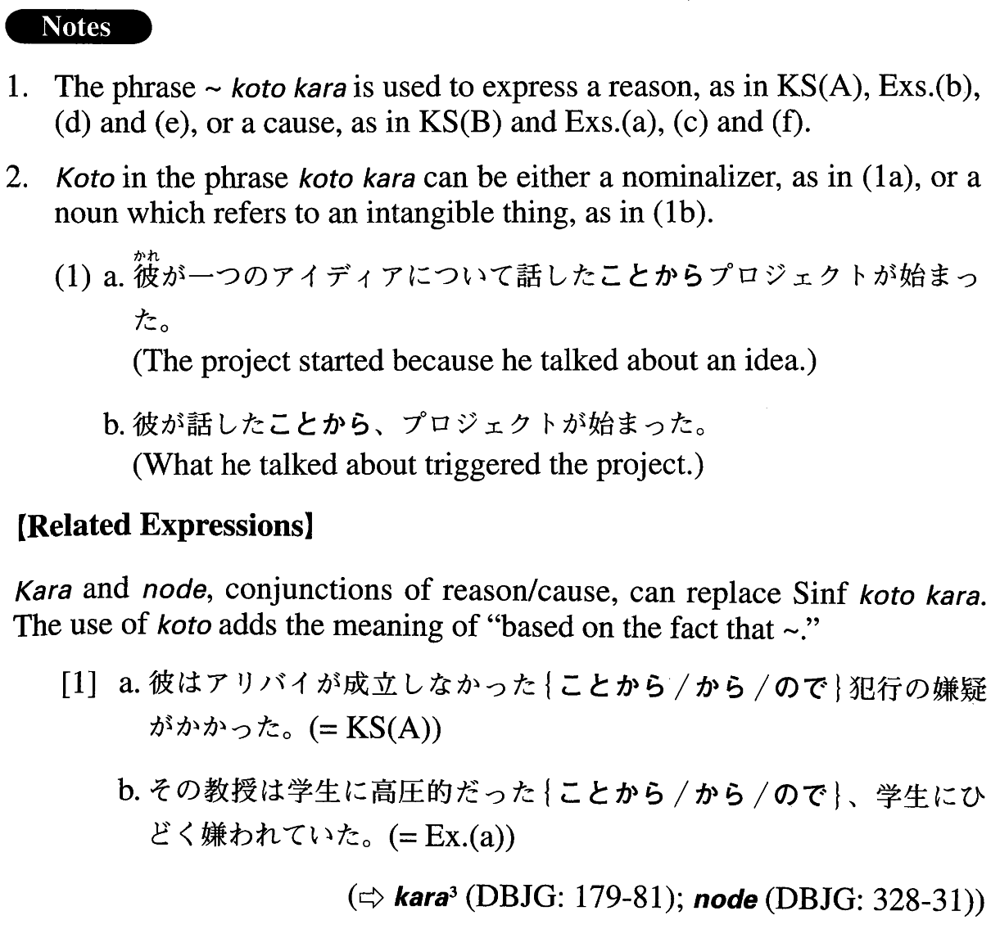

# ことから

 
 
 
 

## Summary

<table><tr>   <td>Summary</td>   <td>A phrase that expresses a reason or a cause.</td></tr><tr>   <td>English</td>   <td>Because; due to; from the fact that ~; cause; trigger</td></tr><tr>   <td>Part of speech</td>   <td>Phrase (usually used in formal writing and formal speech)</td></tr><tr>   <td>Related expression</td>   <td>から; ので; ところから</td></tr></table>

## Formation

<table class="table"><tbody><tr class="tr head"><td class="td">(i) {V/Adjectiveい}informal</td><td class="td">ことから</td><td class="td"></td></tr><tr class="tr"><td class="td"></td><td class="td">{話す/話した}ことから</td><td class="td">Because someone talks/talked about something; because of (literally: from) something which someone talks/talked about</td></tr><tr class="tr"><td class="td"></td><td class="td">{つまらない/つまらなかった}ことから</td><td class="td">Because of something trivial; because something is/was boring</td></tr><tr class="tr head"><td class="td">(ii) Adjective な stem</td><td class="td">{な/である/だった}ことから</td><td class="td"></td></tr><tr class="tr"><td class="td"></td><td class="td">不便{な/である/だった}ことから</td><td class="td">Because something is/was inconvenient</td></tr><tr class="tr head"><td class="td">(iii) Noun</td><td class="td">{である/だった/であった}ことから</td><td class="td"></td></tr><tr class="tr"><td class="td"></td><td class="td">学生{である/だった/であった}ことから</td><td class="td">Because someone is/was a student</td></tr></tbody></table>

## Example Sentences

<table><tr>   <td>彼はアリバイが成立しなかったことから犯行の嫌疑がかかった。</td>   <td>Because (literally: from the fact that) he couldn't establish an alibi, he was suspected of a criminal act.</td></tr><tr>   <td>妙なことから二人の関係は悪化した。</td>   <td>The relationship between the two people deteriorated due to strange circumstances.</td></tr><tr>   <td>その教授は学生に高圧的だったことから、学生にひどく嫌われていた。</td>   <td>The professor was so overbearing towards his students that he was thoroughly hated by them.</td></tr><tr>   <td>今年は大学創立から250年に当たることから、盛大な記念祝典が開かれた。</td>   <td>Because it is the 250th year since the founding of the college, there was a magnificent anniversary ceremony this year.</td></tr><tr>   <td>私が余計なことを言ったことから議論が紛糾した。</td>   <td>The discussion became complicated because I said something uncalled for.</td></tr><tr>   <td>魚を水槽内で飼って行う研究は、長期的な観察が可能であることから、汎用性のあるデータが取得しやすい。</td>   <td>Keeping fish in a tank for research allows us to obtain data for general use because long-term observation is possible.</td></tr><tr>   <td>首相は不用意な言動が多かったことから、不信任案が議会で可決された。</td>   <td>Because the prime minister was often careless in his statements and behaviour, a no-confidence motion was passed in Parliament.</td></tr><tr>   <td>本当にささいなことから会談は中止になってしまった。</td>   <td>Because of a really trivial matter the conference broke up.</td></tr></table>

## Grammar Book Page

