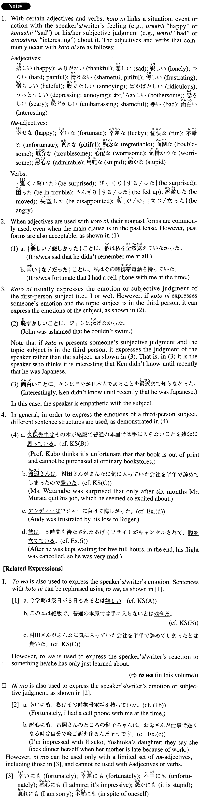

# ことに

[1. Summary](#summary) 
[2. Formation](#formation) 
[3. Example Sentences](#example-sentences) 
 

## Summary

<table><tr>   <td>Summary</td>   <td>A phrase that expresses the speaker’s/ writer’s emotion or subjective judgment.</td></tr><tr>   <td>English</td>   <td>It is ~ that; I am ~ that; we are ~ that; to my/our ~; ~ly</td></tr><tr>   <td>Part of speech</td>   <td>Phrase</td></tr><tr>   <td>Related expression</td>   <td>とは; にも; かな</td></tr></table>

## Formation

<table class="table"><tbody><tr class="tr head"><td class="td">(i) Adjectiveいinformal</td><td class="td">ことに</td><td class="td"></td></tr><tr class="tr"><td class="td"></td><td class="td">{悲しい/悲しかった}ことに</td><td class="td">It is/was sad that; sadly</td></tr><tr class="tr head"><td class="td">(ii) Adjective な stem</td><td class="td">{な/だった}ことに</td><td class="td"></td></tr><tr class="tr"><td class="td"></td><td class="td">幸い{な/だった}ことに</td><td class="td">It is/was fortunate that; fortunately</td></tr><tr class="tr head"><td class="td">(iii) Vinformal</td><td class="td">ことに</td><td class="td"></td></tr><tr class="tr"><td class="td"></td><td class="td">腹の{立つ/立った}ことに</td><td class="td">I am/was mad that</td></tr></tbody></table>

## Example Sentences

<table><tr>   <td>嬉しいことに、今学期は祭日が3日もある。</td>   <td>I'm glad that there are (as many as) three holidays this term.</td></tr><tr>   <td>残念なことに、この本は絶版で、普通の本屋では手に入らない。</td>   <td>To my regret, this book is out of print and cannot be purchased at ordinary bookstores.</td></tr><tr>   <td>驚いたことに、村田さんはあんなに気に入っていた会社を半年で辞めてしまった。</td>   <td>I was surprised that Mr. Murata quit his job after six months- he seemed so excited about his work.</td></tr><tr>   <td>恥ずかしいことに、私は英文学専攻でありながら英語が話せない。</td>   <td>It's embarrassing, but I can't speak English despite the fact that I'm an English literature major.</td></tr><tr>   <td>面白いことに、ハワイの日系人の方が日本人より日本の古い伝統をよく守っているという。</td>   <td>Interestingly, they say that Japanese-Americans in Hawaii maintain old Japanese traditions better than (Japanese) people in Japan.</td></tr><tr>   <td>悪いことに、オーディションの前の日に風邪を引いてしまった。</td>   <td>Unfortunately, I caught a cold the day before my audition.</td></tr><tr>   <td>悔しいことに、私はロジャーに負けた。</td>   <td>I was frustrated by my loss to Roger.</td></tr><tr>   <td>吉岡さんのところの悦子ちゃんは、感心なことに、お母さんが仕事で遅くなる時は自分で晩ご飯を作るんだそうです。</td>   <td>I'm so impressed with Etsuko, Yoshioka's daughter; they say she fixes dinner herself when her mother is late because of work.</td></tr><tr>   <td>浄水器は濾過の過程で塩素をすべて取り去ってしまうため、濾過した瞬間から水は腐敗の危険にさらされる。さらに心配なことに、濾過材に残った水から大量に細菌が繁殖するといった問題が報道された。</td>   <td>Because water purifiers remove all the chlorine in the purification process, from the moment it's been purified, there's a risk the water will get contaminated (literally: rot). What's even more worrisome, bacteria can multiply in the water left in the (purification) fixtures, according to media reports.</td></tr><tr>   <td>厄介なことに、この種の詐欺は被害者が世間体のために警察に届けを出さないことが多く、これが犯人検挙を難しくしている。</td>   <td>The trouble is, this kind of fraud is seldom reported to the police because the victims want to save face, which makes it hard to arrest the culprits.</td></tr><tr>   <td>困ったことに、日本のDVDはアメリカのプレーヤーで見られないのです。</td>   <td>The problem is that Japanese DVDs cannot be viewed on American (DVD) players.</td></tr><tr>   <td>腹の立つことに、私のフライトは5時間も待たされたあげく、キャンセルされた。</td>   <td>It was maddening: After I was kept waiting for my flight for five full hours, in the end it was cancelled.</td></tr></table>

## Grammar Book Page

