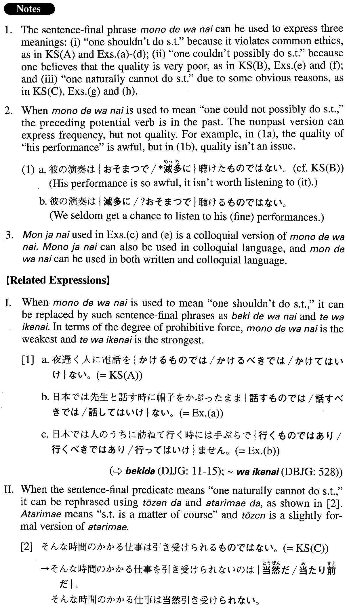

# ものではない

[1. Summary](#summary) 
[2. Formation](#formation) 
[3. Example Sentences](#example-sentences) 
 

## Summary

<table><tr>   <td>Summary</td>   <td>A sentence-final phrase indicating that one shouldn’t do something, one could not possibly do something, or one naturally cannot do something.</td></tr><tr>   <td>English</td>   <td>Shouldn’t; not possibly; naturally cannot; cannot bear</td></tr><tr>   <td>Part of speech</td>   <td>Phrase</td></tr><tr>   <td>Related expression</td>   <td>べきではない; てはいけない; 当然だ; 当たり前だ</td></tr></table>

## Formation

<table class="table"><tbody><tr class="tr head"><td class="td">(i) Vinformal nonpast</td><td class="td">ものではない</td><td class="td"></td></tr><tr class="tr"><td class="td"></td><td class="td">食べるものではない</td><td class="td">One shouldn’t eat something</td></tr><tr class="tr head"><td class="td">(ii) Vpotential informal past</td><td class="td">ものではない</td><td class="td"></td></tr><tr class="tr"><td class="td"></td><td class="td">食べられたものではない</td><td class="td">One could not possibly eat something</td></tr><tr class="tr head"><td class="td">(iii) Vpotential informal nonpast</td><td class="td">ものではない</td><td class="td"></td></tr><tr class="tr"><td class="td"></td><td class="td">食べられるものではない</td><td class="td">One naturally cannot eat something</td></tr></tbody></table>

## Example Sentences

<table><tr>   <td>夜遅く人に電話をかけるものではない。</td>   <td>You shouldn't call people late at night.</td></tr><tr>   <td>彼の演奏は聴けたものではない。</td>   <td>We cannot bear listening to his performance (literally: His performance isn't something we could possibly listen to).</td></tr><tr>   <td>そんな時間のかかる仕事は引き受けられるものではない。</td>   <td>That kind of time-consuming work isn't something I can accept.</td></tr><tr>   <td>日本では先生と話す時に帽子をかぶったまま話すものではない。</td>   <td>In Japan, one shouldn't wear a hat while speaking to one's teacher.</td></tr><tr>   <td>日本では人のうちに訪ねて行く時には手ぶらで行くものではありません。</td>   <td>In Japan, you shouldn't visit someone's house without bringing something with you.</td></tr><tr>   <td>未成年者は酒を飲むもんじゃない。</td>   <td>Minors shouldn't drink.</td></tr><tr>   <td>女性に年齢を聞くものではない。</td>   <td>You shouldn't ask a woman her age.</td></tr><tr>   <td>こんなつまらない小説、読めたもんじゃない。</td>   <td>I could not possibly read such a boring novel!</td></tr><tr>   <td>私のかいた絵なんか、あなたに見せられたものではありません。</td>   <td>There's no way I could possibly show you the paintings I've done.</td></tr><tr>   <td>辞書などはそう簡単に書けるものではない。</td>   <td>It is natural that dictionaries can't be written so easily.</td></tr><tr>   <td>現在の補助金の額で十分な研究ができるものではない。</td>   <td>We cannot possibly do thorough research with the current amount of research funds.</td></tr></table>

## Grammar Book Page

