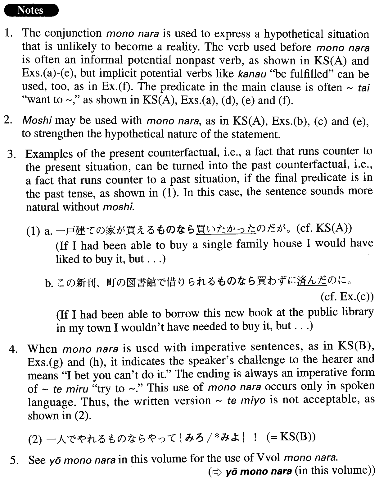

# ものなら

[1. Summary](#summary) 
[2. Formation](#formation) 
[3. Example Sentences](#example-sentences) 
[4. Grammar Book Page](#grammar-book-page) 

## Summary

<table><tr>   <td>Summary</td>   <td>A conjunction indicating that the preceding clause presents a hypothetical situation that is unlikely to become a reality.</td></tr><tr>   <td>Equivalent</td>   <td>If; if ~ at all</td></tr><tr>   <td>Part of speech</td>   <td>Conjunction</td></tr></table>

## Formation

<table class="table"><tbody><tr class="tr head"><td class="td">Vpotential informal nonpast</td><td class="td">ものなら</td><td class="td"></td></tr><tr class="tr"><td class="td"></td><td class="td">行けるものなら</td><td class="td">If I can/could go there</td></tr><tr class="tr"><td class="td"></td><td class="td">読めるものなら</td><td class="td">If I can/could read it</td></tr></tbody></table>

## Example Sentences

<table><tr>   <td>（もし）一戸建ての家が買えるものなら買いたい。</td>   <td>If I could buy a single family house, I would like to.</td></tr><tr>   <td>一人でやれるものならやってみろ！</td>   <td>If (you think) you can do it by yourself, go ahead and do it!</td></tr><tr>   <td>近い将来における日本語の存在意義など、書けるものなら書いてみたい。</td>   <td>If I could, I would like to write about the raison d'etre of Japanese language in the near future.</td></tr><tr>   <td>喫煙所の中でタバコを吸っている人たちを外から見ればまるで動物園…。もしやめられるものならやめてみようかなあと思い始めたこの頃です。</td>   <td>When I look at people smoking in smoking areas, I feel like I am at the zoo. Lately, I have begun to think that, if I could, I would try quitting.</td></tr><tr>   <td>この新刊、もし町の図書館で借りられるものなら買わずに済むのに、まだ入っていないようだ。</td>   <td>I wouldn't need to buy this new book if I could borrow it at the public library in my town, but it looks like it isn't available there yet.</td></tr><tr>   <td>南極旅行は、気持ち的には、借金してでも行けるものなら行きたいんだが。</td>   <td>I feel like I'd like to travel to the South Pole, even if I had to borrow money to do it.</td></tr><tr>   <td>もしできるものなら、もう一度生まれ変わりたい。</td>   <td>If I could, I would like to be born again.</td></tr><tr>   <td>西行じゃないけれど、願いがかなうものなら、満開の桜の下で春に死にたい。</td>   <td>I am no Saigyo, but if wishes came true, I would wish to die in spring, under cherry trees in full bloom.) [Saigyo (1118-1190) is a famous waka poet and Buddhist priest who expressed in his poetry his desire to die under blooming cherry trees.]</td></tr><tr>   <td>この曲がやさしいって言うんですか？何も分かっていないからそんなことを言うんですよ。弾けるものなら弾いてみなさい。</td>   <td>Are you saying this piece is easy? You're saying that because you don't know anything about it. Go ahead and play it if you think you can!</td></tr><tr>   <td>訴えるなんて言ってもちっとも怖くなんかありませんよ。訴えられるものなら訴えてごらんなさい。</td>   <td>Even if you tell me that you're going to sue me, I'm not afraid at all. Sue me if you can!</td></tr><tr>   <td>カリスマのある哲学者が大学に来て講演をしようものなら、1万人を越える聴衆が集まる。</td>   <td>If a charismatic philosopher did come to the university to give a lecture, more than 10,000 people would gather to listen to him.</td></tr></table>

## Grammar Book Page

