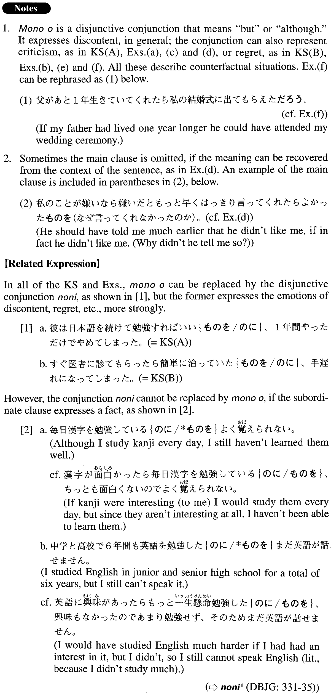

# ものを

[1. Summary](#summary) 
[2. Formation](#formation) 
[3. Example Sentences](#example-sentences) 
[4. Grammar Book Page](#grammar-book-page) 

## Summary

<table><tr>   <td>Summary</td>   <td>A disjunctive coordinate conjunction expressing the meaning of “although” with the speaker’s strong feeling of discontent</td></tr><tr>   <td>Equivalent</td>   <td>Although; but</td></tr><tr>   <td>Part of speech</td>   <td>Conjunction</td></tr><tr>   <td>Related expression</td>   <td>のに</td></tr></table>

## Formation

<table class="table"><tbody><tr class="tr head"><td class="td">(i) Vconditionalば{Adjectiveい/Vpotential}informal</td><td class="td">ものを</td><td class="td"></td></tr><tr class="tr head"><td class="td">VconditionalばAdjectiveな stem</td><td class="td">{な/だった}ものを</td><td class="td"></td></tr><tr class="tr"><td class="td"></td><td class="td">行けば{いい/よかった}ものを</td><td class="td">Someone should go/should have gone there but</td></tr><tr class="tr"><td class="td"></td><td class="td">注意すれば{安全な/安全だった}ものを</td><td class="td">Someone would be/would have been safe if he were/had been attentive</td></tr><tr class="tr"><td class="td"></td><td class="td">勉強すれば{行ける/行けた}ものを</td><td class="td">Someone could go/could have gone there, if he/she    studied/had studied</td></tr><tr class="tr head"><td class="td">(ii) Vinformal pastら～</td><td class="td">Vinformalものを</td><td class="td"></td></tr><tr class="tr"><td class="td"></td><td class="td">あったら{食べる/食べた}ものを</td><td class="td">Someone would/could have eaten something if it were/had been there</td></tr><tr class="tr head"><td class="td">(iii) Vinformal pastら~</td><td class="td">{いい/よかった}ものを</td><td class="td"></td></tr><tr class="tr"><td class="td"></td><td class="td">行ったら{いい/よかった}ものを</td><td class="td">It would be/would have been good if someone went/had gone there</td></tr></tbody></table>

## Example Sentences

<table><tr>   <td>彼は日本語を続けて勉強すればいいものを、1年間やっただけでやめてしまった。</td>   <td>Although he should have continued studying Japanese, he quit after only one year.</td></tr><tr>   <td>すぐ医者に診てもらったら簡単に治っていたものを、手遅れになってしまった。</td>   <td>Had I gone to the doctor right away, I would have gotten better easily, but I acted too late.</td></tr><tr>   <td>ゴルフかなんかして少しリラックスすればいいものを、父は週末でも会社の仕事を家でやっている。</td>   <td>My father should play golf or something and relax a little bit, but he brings work home from the office even on weekends.</td></tr><tr>   <td>あのくだらない小説はちょっと読んだだけでやめればよかったものを、なんと最後まで読んでしまった。全くの時間の浪費だった。</td>   <td>I should have stopped reading that cheap novel after a few pages, but believe it or not, I read it to the very end. It was an utter waste of time.</td></tr><tr>   <td>居留守を使えばいいものを、彼女は気が弱いのでそうもできず、いやいや人に会うことになってしまうのだ。</td>   <td>She doesn't have to answer the door, but she doesn't have the nerve to resist and ends up talking to people even though she doesn't want to.</td></tr><tr>   <td>私のことが嫌いなら嫌いだともっと早くはっきり言ってくれたらよかったものを。</td>   <td>He should have told me much earlier that he didn't like me (literally: if in fact he didn't like me).</td></tr><tr>   <td>時間があったらいろいろな外国旅行ができたものを、いつも忙しく働いてきたので、外国はどこにも行っていない。</td>   <td>Had I the time, I could have made trips to various foreign countries, but because I've been so busy working I have never been overseas.</td></tr><tr>   <td>父があと1年生きていてくれたら私の結婚式に出てもらえたものを、私がぐずぐずしていたばかりに、父に私の晴れ姿を見てもらえず、とても残念です。</td>   <td>Had my father lived one year longer, he could have attended my wedding ceremony, but just because I was indecisive for so long, I couldn't give him the chance to see me in my wedding dress. I feel so sorry!</td></tr></table>

## Grammar Book Page

