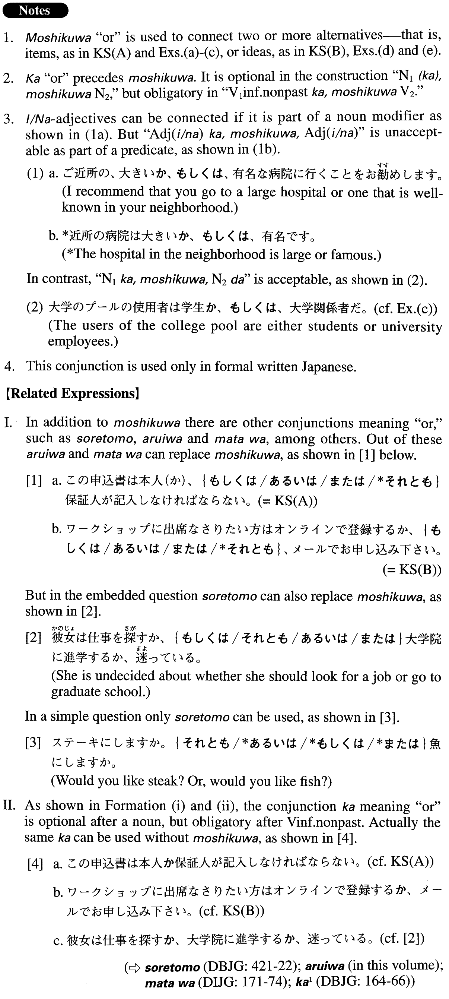

# もしくは

 
 
 
 

## Summary

<table><tr>   <td>Summary</td>   <td>A conjunction to disjunctively connect two items or ideas.</td></tr><tr>   <td>English</td>   <td>or</td></tr><tr>   <td>Part of speech</td>   <td>Conjunction (usually used in formal writing and formal speech)</td></tr><tr>   <td>Related expression</td>   <td>それとも; あるいは; まただ; か; ないし(は)</td></tr></table>

## Formation

<table class="table"><tbody><tr class="tr head"><td class="td">(i) Noun1(か)、</td><td class="td">もしくはNoun2</td><td class="td"></td></tr><tr class="tr"><td class="td"></td><td class="td">電子メール(か)、もしくはファックス</td><td class="td">Email or fax</td></tr><tr class="tr"><td class="td"></td><td class="td">研究(か)、もしくは教育</td><td class="td">Research or education</td></tr><tr class="tr head"><td class="td">(ii) V1 informal nonpastか、</td><td class="td">もしくはV2</td><td class="td"></td></tr><tr class="tr"><td class="td"></td><td class="td">権利を売るか、もしくは譲渡する</td><td class="td">Sell one’s right or transfer it to someone</td></tr></tbody></table>

## Example Sentences

<table><tr>   <td>この申込書は本人（か）、もしくは保証人が記入しなければならない。</td>   <td>This application has to be filled in by the applicant or by his/her guarantor.</td></tr><tr>   <td>ワークショップに出席なさりたい方はオンラインで登録するか、もしくは、メールでお申し込みください。</td>   <td>If you want to participate in the workshop, please register online or apply by e-mail.</td></tr><tr>   <td>基調講演者は日本研究もしくは関連領域の研究について話すことになっている。</td>   <td>The keynote speaker is expected to talk about Japan studies or related areas.</td></tr><tr>   <td>この予算は研究費、もしくは研究補助費にのみ使用できる。</td>   <td>This budget is to be used exclusively for research or research-related expenses.</td></tr><tr>   <td>大学のプールは学生か、もしくは使用料を支払った大学関係者のみ利用できる。</td>   <td>The college pool is open only to students or those affiliated with the college who have paid the fee.</td></tr><tr>   <td>夏季のドライブシーズンを迎える頃には、ガソリンの在庫が昨年とほぼ同水準まで下がるか、もしくはそれ以下に減少する見通しである。</td>   <td>It is predicted that by the time of the summer driving season, the reserves of gasoline will fall approximately to the same level as last year or will go below it.</td></tr><tr>   <td>日本の経済力が弱まってきている現在、日本が世界で生き残る道はテクノロジーで時代の先取りをするか、もしくは、モノとしての日本の文化をより積極的に海外に輸出することであろう。</td>   <td>These days Japan's economic strength has decreased. For Japan to survive in the world, it must either take leadership in the field of technology in the future, or export Japanese culture as a product more aggressively.</td></tr></table>

## Grammar Book Page

