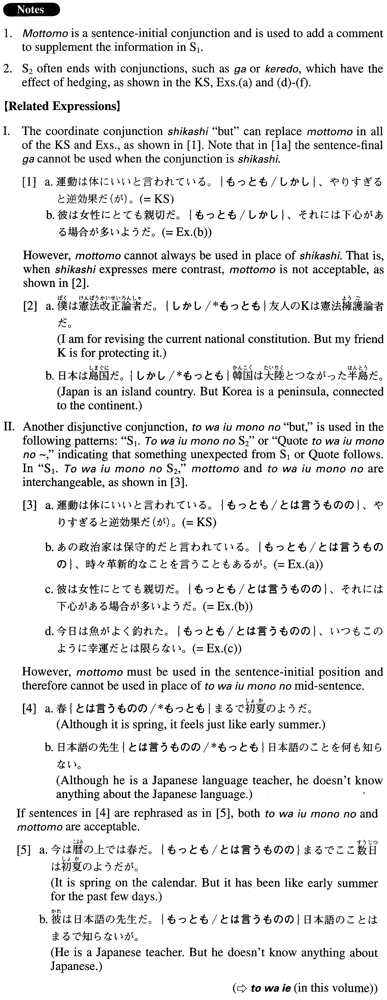

# もっとも

[1. Summary](#summary) 
[2. Formation](#formation) 
[3. Example Sentences](#example-sentences) 
 

## Summary

<table><tr>   <td>Summary</td>   <td>A conjunction used to add a comment indicating that what the speaker/writer has just expressed is not sufficient.</td></tr><tr>   <td>English</td>   <td>Although; though; but; yet; however</td></tr><tr>   <td>Part of speech</td>   <td>Conjunction</td></tr><tr>   <td>Related expression</td>   <td>しかし; とは言うものの; ただ</td></tr></table>

## Formation

<table class="table"><tbody><tr class="tr head"><td class="td">Sentence1。</td><td class="td">もっともSentence2({が/けれども})。</td><td class="td"></td></tr><tr class="tr"><td class="td"></td><td class="td">息子はよく病気をする。もっとも大病をしたことはない({が/けれども})。</td><td class="td">Our son often gets sick, although he has never fallen seriously ill.</td></tr></tbody></table>

## Example Sentences

<table><tr>   <td>運動は体にいいと言われている。もっとも、やりすぎると逆効果だ（が）。</td>   <td>They say that exercise is good for you (literally: your body), but doing too much will bring about the opposite effect.</td></tr><tr>   <td>あの政治家は保守的だと言われている。もっとも、時々革新的なことを言うこともあるが。</td>   <td>That politician is said to be conservative, although he sometimes makes innovative statements.</td></tr><tr>   <td>彼は女性にとても親切だ。もっとも、それには下心がある場合が多いようだ。</td>   <td>He is very kind to ladies. But, apparently, he often has an ulterior motive.</td></tr><tr>   <td>今日は魚がよく釣れた。もっとも、いつもこのように幸運だとは限らない。</td>   <td>I caught (literally: was able to catch) a lot of fish today, although I'm not always this lucky.</td></tr><tr>   <td>このドイツの車の方があの日本の車よりいいんじゃない。もっとも、僕はドイツの車を運転したことはないけどさ。</td>   <td>Don't you think that this German car is better than that Japanese one? I've never driven a German car, though.</td></tr><tr>   <td>顔写真の入った名刺というのも、強い印象を与えるからいいかもしれない。もっとも私はそこまでやりたいとは思わないけれども。</td>   <td>It may be a good idea to make business cards with your picture on them because they would create a stronger impression. But I am kind of reluctant to go that far.</td></tr><tr>   <td>若い頃は漠然としていたものが歳を重ねるごとにハッキリと見えるようになり、目標を見据えてよりポジティブに生きるようにしています。もっとも私はまだ、その途上にありますが。</td>   <td>As I grow older, I begin to see more clearly things that were not clear when I was younger. I'm trying to keep the goal in focus and live more positively. But I haven't gotten there yet.</td></tr></table>

## Grammar Book Page

