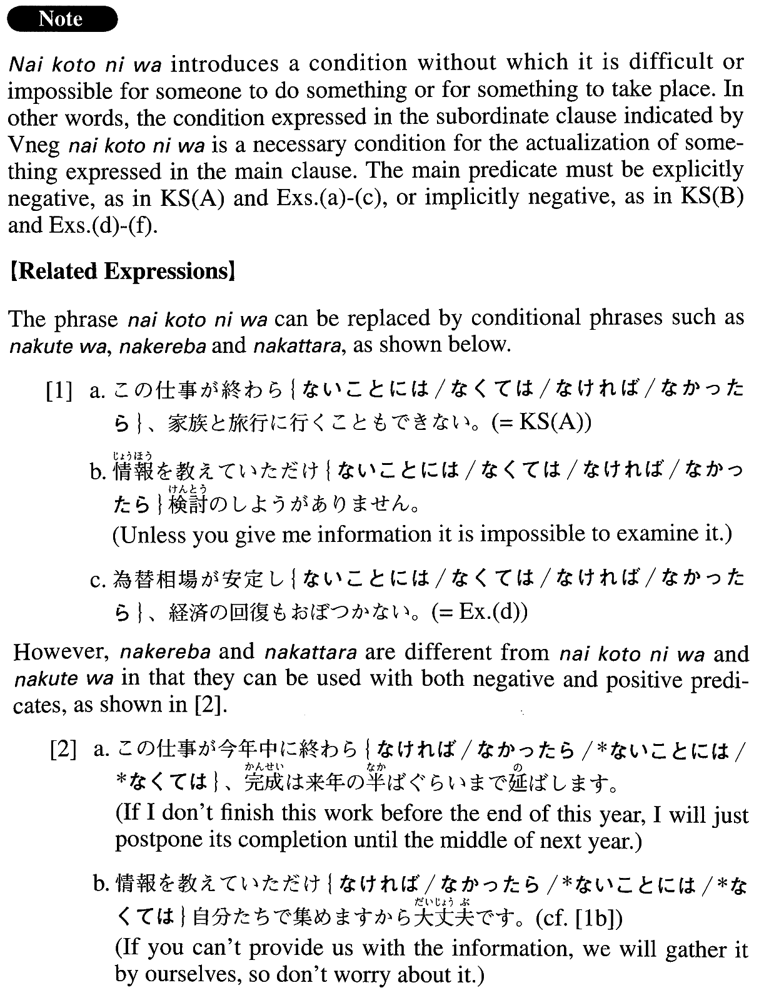

# ないことには

[1. Summary](#summary) 
[2. Formation](#formation) 
[3. Example Sentences](#example-sentences) 
[4. Grammar Book Page](#grammar-book-page) 

## Summary

<table><tr>   <td>Summary</td>   <td>A phrase that means “if something has not taken place, something else won’t/can’t take place”.</td></tr><tr>   <td>Equivalent</td>   <td>If ~ not ~ then; unless</td></tr><tr>   <td>Part of speech</td>   <td>Phrase</td></tr><tr>   <td>Related expression</td>   <td>なくては; なければ; なかったら</td></tr></table>

## Formation

<table class="table"><tbody><tr class="tr head"><td class="td">Vnegative</td><td class="td">ないことには～</td><td class="td"></td></tr><tr class="tr"><td class="td"></td><td class="td">調べないことには分からない。</td><td class="td">Unless we investigate it, we can’t understand</td></tr><tr class="tr"><td class="td"></td><td class="td">話してみないことには了解は不可能だ。</td><td class="td">Unless we talk, understanding is impossible</td></tr><tr class="tr"><td class="td"></td><td class="td">読んでみないことにはコメントできない。</td><td class="td">Unless we read it, comments on it are impossible</td></tr></tbody></table>

## Example Sentences

<table><tr>   <td>この仕事が終わらないことには、家族と旅行に行くこともできない。</td>   <td>If I don't finish this work, I can't go on a trip with my family.</td></tr><tr>   <td>追加予算が下りないことには、このプロジェクトの遂行は無理だ。</td>   <td>Without (money from) an additional budget, it will be impossible to accomplish this project.</td></tr><tr>   <td>書き始めないことには論文ができるはずはない。</td>   <td>Unless you begin writing your thesis, there's no way you'll be able to finish it.</td></tr><tr>   <td>コンピュータが作動しないことには仕事は始まらない。</td>   <td>Unless the computer works, we can't get started on the job.</td></tr><tr>   <td>面接を受けないことには就職はできない。</td>   <td>You can't get a job unless you (first) have an interview.</td></tr><tr>   <td>為替相場が安定しないことには、経済の回復もおぼつかない。</td>   <td>Unless the exchange rate stabilizes, economic recovery will be almost impossible.</td></tr><tr>   <td>日本語学習者は、日本に行かないことには日本語を自然に話せるようになるのは難しいだろう。</td>   <td>If a Japanese language learner doesn't go to Japan, it will be difficult for him or her to learn to speak Japanese naturally.</td></tr><tr>   <td>際立った才能がないことには、一流の音楽大学を出てもソリストになることは夢物語だ。</td>   <td>Without outstanding talent, becoming a soloist, even as a graduate of a top-rated music college, is just a dream.</td></tr></table>

## Grammar Book Page

