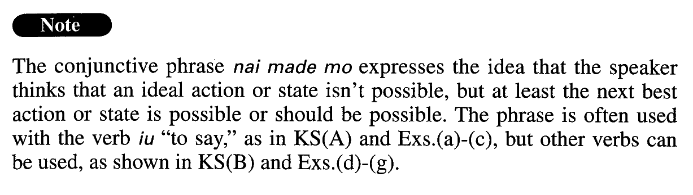

# ないまでも

[1. Summary](#summary) 
[2. Formation](#formation) 
[3. Example Sentences](#example-sentences) 
 

## Summary

<table><tr>   <td>Summary</td>   <td>An adverbial phrase expressing the speaker’s feeling that although an ideal action or state isn’t possible, at least the next best action or state is or should be available.</td></tr><tr>   <td>English</td>   <td>May not ~ but; even though ~ not; although ~ not</td></tr><tr>   <td>Part of speech</td>   <td>Phrase (usually used in formal writing and formal speech)</td></tr></table>

## Formation

<table class="table"><tbody><tr class="tr head"><td class="td">(i) Vnegative</td><td class="td">ないまでも</td><td class="td"></td></tr><tr class="tr"><td class="td"></td><td class="td">行かないまでも</td><td class="td">Someone may not go there, but</td></tr><tr class="tr"><td class="td"></td><td class="td">しないまでも</td><td class="td">Someone may not do something, but</td></tr><tr class="tr head"><td class="td">(ii) Adjectiveいstemく</td><td class="td">ないまでも</td><td class="td"></td></tr><tr class="tr"><td class="td"></td><td class="td">よくないまでも</td><td class="td">Something may not be good, but</td></tr><tr class="tr head"><td class="td">(iii) {Adjectiveなstem/ Noun}</td><td class="td">{では/じゃ}ないまでも</td><td class="td"></td></tr><tr class="tr"><td class="td"></td><td class="td">元気{では/じゃ}ないまでも</td><td class="td">Someone may not be peppy/healthy, but</td></tr><tr class="tr"><td class="td"></td><td class="td">病気{では/じゃ}ないまでも</td><td class="td">Someone may not be ill, but</td></tr></tbody></table>

## Example Sentences

<table><tr>   <td>この公演は大成功とは言えないまでも、それなりの成果をもたらした。</td>   <td>Although you may not be able to call this public performance a great success, it produced results of a sort.</td></tr><tr>   <td>彼の論文は決して多くないまでも、その質は非常に高い。</td>   <td>Although he hasn't published many papers at all, the quality (of those he has published) is extremely high.</td></tr><tr>   <td>「生命とはこういうものです」とは言えないまでも、「少なくともこうではありません」とは言えるようになってくるはずだ。</td>   <td>We may not be able to say, “This is what life is,” but we should come to a point where we can say, “At least this is what it isn't.”</td></tr><tr>   <td>その彫刻は完璧とは言えないまでも、非常に可能性を感じさせる作品だった。</td>   <td>The sculpture may not be called a perfect work, but it is (literally: was) a work that makes you feel unusual potential.</td></tr><tr>   <td>虚偽だとは言わないまでも、かなり紛らわしい表現だ。</td>   <td>I can't go so far as to call this wording deceptive, but it sure is misleading.</td></tr><tr>   <td>中国語は漢字だから、読めないまでも意味はなんとなく分かるのだが、韓国語はまったく見当がつかない。</td>   <td>If it were written in Chinese I could get a sense of what it's saying because of the characters, even though I cannot read it, but I cannot make heads or tails of Korean.</td></tr><tr>   <td>インターネットは完璧ではないまでも、生涯学習もしくは生涯教育のメディアとして、いろいろな可能性をもっています。</td>   <td>The Internet is not perfect, but it does have various possibilities as a medium for lifelong learning and/or teaching.</td></tr><tr>   <td>運命には逆らえないまでも、それを味方にすることはできる。</td>   <td>We may not be able to turn back Fate, but we can make it our friend.</td></tr><tr>   <td>大方の日本人なら、「源氏物語」の原文に目を通したとまではいかないまでも、どんな話なのかは知っているだろう。</td>   <td>I believe most Japanese, even though they may not have read the original Tale of Genji, know the basic plot of the story.</td></tr><tr>   <td>明日は天気がよくないまでも、気温はあまり低くなりません。</td>   <td>Although the weather may not be good, the temperature will not drop much.</td></tr><tr>   <td>彼は正直者じゃないまでも、嘘つきじゃない。</td>   <td>He may not be an honest person, but he isn't a liar.</td></tr></table>

## Grammar Book Page

