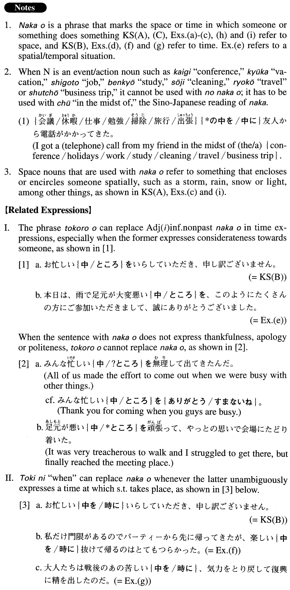

# 中を

[1. Summary](#summary) 
[2. Formation](#formation) 
[3. Example Sentences](#example-sentences) 
[4. Grammar Book Page](#grammar-book-page) 

## Summary

<table><tr>   <td>Summary</td>   <td>A phrase that specifies space or time in/through which someone/something does something.</td></tr><tr>   <td>English</td>   <td>In the midst of; when; while; through; among</td></tr><tr>   <td>Part of speech</td>   <td>Phrase</td></tr><tr>   <td>Related expression</td>   <td>ところを; 時に</td></tr></table>

## Formation

<table class="table"><tbody><tr class="tr head"><td class="td">(i) Vinformal nonpast</td><td class="td">中を</td><td class="td"></td></tr><tr class="tr"><td class="td"></td><td class="td">雨が{降る/降っている}中を</td><td class="td">When it is raining</td></tr><tr class="tr head"><td class="td">(ii) Adjectiveいinformal nonpast</td><td class="td">中を</td><td class="td"></td></tr><tr class="tr"><td class="td"></td><td class="td">忙しい中を</td><td class="td">When someone is busy</td></tr><tr class="tr head"><td class="td">(iii) Adjectiveなstemな</td><td class="td"></td><td class="td"></td></tr><tr class="tr"><td class="td"></td><td class="td">危険な中を</td><td class="td">In the midst of danger</td></tr><tr class="tr head"><td class="td">(iv) Nounの</td><td class="td">中を</td><td class="td"></td></tr><tr class="tr"><td class="td"></td><td class="td">嵐の中を</td><td class="td">In the midst of a storm</td></tr></tbody></table>

## Example Sentences

<table><tr>   <td>冷たい風が｛吹く/吹いている｝中を１０キロも歩いた。</td>   <td>When a cold wind was blowing I walked as much as 10 kilometres.</td></tr><tr>   <td>お忙しい中をいらしていただき、申し訳ございません。</td>   <td>Thank you very much (literally: I'm sorry) for coming when you are (so) busy.</td></tr><tr>   <td>赤十字の人たちがハリケーン被災者たちの中を歩き回って食料を配った。</td>   <td>People from the Red Cross walked among the victims of the hurricane and distributed food.</td></tr><tr>   <td>子供たちが遊んでいる中を子犬がちょろちょろ走り回っていた。</td>   <td>A puppy was darting around among the kids who were playing.</td></tr><tr>   <td>公園では、人が集まっている中を、アイスクリーム屋が歩いていた。</td>   <td>In the park, an ice cream seller was walking through the crowd of people.</td></tr><tr>   <td>雪の降る中を頑張って走っている人を見ていたら、自分が軟弱に思えてきました。</td>   <td>When I watched people out running in the snow, I began to think of myself as fragile and weak.</td></tr><tr>   <td>私たちが呆然として見ている中を、二人は一つの傘の下に入って行ってしまいました。</td>   <td>As we were watching with astonishment, the two walked away under the same umbrella.</td></tr><tr>   <td>本日は、雨で足元が大変悪い中を、このようにたくさんの方にご参加いただきまして、誠にありがとうございました。</td>   <td>Thank you very much for coming to this meeting today; it's nice to see so many of you when it is so treacherous to walk due to the rain.</td></tr><tr>   <td>私だけ門限があるのでパーティーから先に帰ってきたが、楽しい中を抜けて帰るのはとてもつらかった。</td>   <td>I'm the only one with a curfew, so I came home from the party earlier than everyone else. It was hard for me to leave and come home when I was having a good time.</td></tr><tr>   <td>大人たちは戦後のあの苦しい中を、気力をとり戻して復興に精を出したのだ。</td>   <td>Amidst the post war hardship, the adults retained their spirit and worked diligently to reconstruct the country.</td></tr><tr>   <td>我々は地震で道路が崩壊する危険な中を車で１０時間ぐらい走った。</td>   <td>We drove our car for about 10 hours through hazardous roads which were collapsing around us during the earthquake and aftershocks.</td></tr><tr>   <td>飛行機は嵐の中を随分と長い間飛んでいるらしく、雲に突っ込むたびに大きく揺れている。</td>   <td>We seem to have been flying through this storm for a very long time, and each time the plane goes into the clouds it shakes quite a bit.</td></tr></table>

## Grammar Book Page

