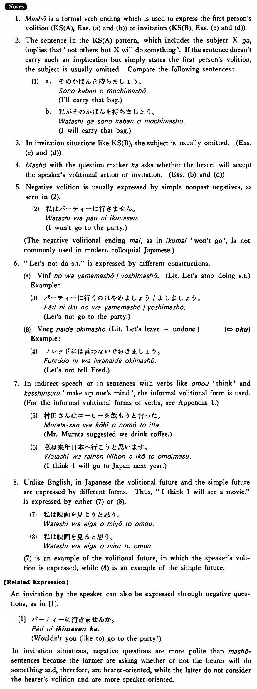

# ましょう

[1. Summary](#summary) 
[2. Formation](#formation) 
[3. Example Sentences](#example-sentences) 
[4. Explanation](#explanation) 
 

## Summary

<table><tr>   <td>Summary</td>   <td>A verb ending which indicates the first person’s volition or invitation in formal speech.</td></tr><tr>   <td>English</td>   <td>I/We will do something; Let’s do something.</td></tr><tr>   <td>Part of speech</td>   <td>Auxiliary</td></tr><tr>   <td>Related expression</td>   <td>ませんか</td></tr></table>

## Formation

<table class="table"><tbody><tr class="tr head"><td class="td">Vます</td><td class="td">ましょう </td><td class="td">&nbsp;</td></tr><tr class="tr"><td class="td">&nbsp;</td><td class="td">話しましょう </td><td class="td">I/we    will talk; let’s talk</td></tr><tr class="tr"><td class="td">&nbsp;</td><td class="td">食べましょう </td><td class="td">I/we    will eat; let’s eat</td></tr></tbody></table>

## Example Sentences

<table><tr>   <td>私が彼に話しましょう。</td>   <td>I will talk to him.</td></tr><tr>   <td>映画に行きましょう。</td>   <td>Let's go to a movie.</td></tr><tr>   <td>私達が手伝いましょう。</td>   <td>We will help you.</td></tr><tr>   <td>私が行きましょうか。</td>   <td>Shall I go there?</td></tr><tr>   <td>ビールを飲みましょう。</td>   <td>Let's drink beer.</td></tr><tr>   <td>車で行きましょうか。</td>   <td>Shall we go by car?</td></tr></table>

## Explanation

1. ましょう is a formal verb ending which is used to express the first person's volition (Key Sentence (A), Examples (a) and (b)) or invitation (Key Sentence (B), Examples (c) and (d)).
  
2. The sentence in the Key Sentence (A) pattern, which includes the subject Xが, implies that 'not others but X will do something'. If the sentence doesn't carry such an implication but simply states the first person's volition, the subject is usually omitted. Compare the following sentences:
  <ul>(1) <li>a. その鞄を持ちましょう。</li> <li>I'll carry that bag.</li> 

 <li>b. 私がその鞄を持ちましょう。</li> <li>I will carry that bag.</li> </ul>  
3. In invitation situations like Key Sentence (B), the subject is usually omitted. (Examples (c) and (d))
  
4. ましょう with the question marker か asks whether the hearer will accept the speaker's volitional action or invitation. (Examples (b) and (d))
  
5. Negative volition is usually expressed by simple nonpast negatives, as seen in (2).
  <ul>(2) <li>私はパーティーに行きません。</li> <li>I won't go to the party.</li> </ul>  
(The negative volitional ending まい, as in 行くまい 'won't go', is not commonly used in modern colloquial Japanese.)
  
6. "Let's not do something" is expressed by different constructions.
  <ul>(A) Verb informalのはやめましょう/よしましょう. (Literally: Let's stop doing something)</ul>  
Example:
  <ul>(3) <li>パ一テイ一に行くのはやめましょう/よしましょう。</li> <li>Let's not go to the party.</li> </ul>  <ul>(B) Verb negativeないでおきましょう Literally: Let's leave ~ undone.)</ul>   
(⇨ <a href="#㊦ おく">おく</a>)
  
Example:
  <ul>(4) <li>フレッドには言わないでおきましょう。</li> <li>Let's not tell Fred.</li> </ul>  
7. In indirect speech or in sentences with verbs like 思う 'think' and 決心する 'make up one's mind', the informal volitional form is used.
  <ul>(5) <li>村田さんはコーヒーを飲もうと言った。</li> <li>Mr. Murata suggested we drink coffee.</li> </ul>  <ul>(6) <li>私は来年日本へ行こうと思います。</li> <li>I think I will go to Japan next year.</li> </ul>  
8. Unlike English, in Japanese the volitional future and the simple future are expressed by different forms. Thus, "I think I will see a movie." is expressed by either (7) or (8).
  <ul>(7) <li>私は映画を見ようと思う。</li> </ul>  <ul>(8) <li>私は映画を見ると思う。</li> </ul>  
(7) is an example of the volitional future, in which the speakers volition is expressed, while (8) is an example of the simple future.
  
【Related Expression】
  
An invitation by the speaker can also be expressed through negative questions，as in [1].
  
[1]
  <ul> <li>パーティーに行きませんか。</li> <li>Wouldn't you (like to) go to the party?</li> </ul>  
In invitation situations, negative questions are more polite than ましょう sentences because the former are asking whether or not the hearer will do something and, therefore, are hearer-oriented, while the latter do not consider the hearer's volition and are more speaker-oriented.

## Grammar Book Page

