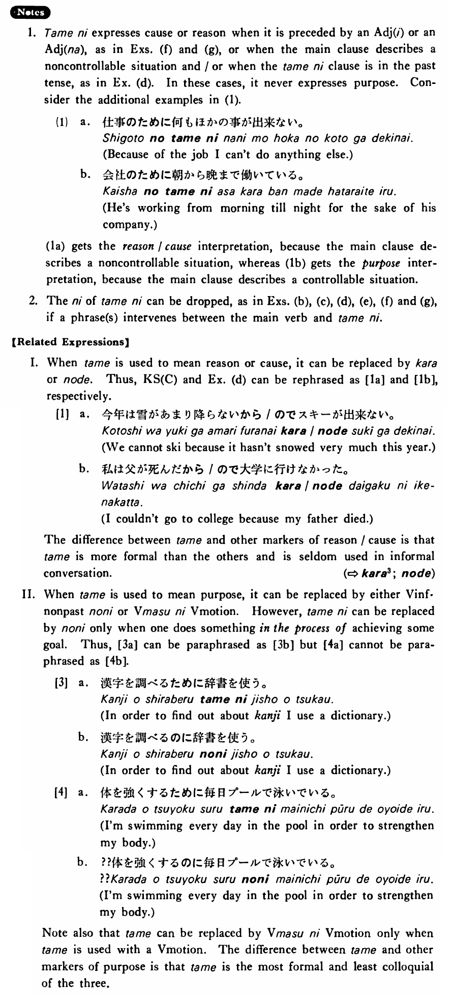

# 為（に）・ため（に）

[1. Summary](#summary) 
[2. Formation](#formation) 
[3. Example Sentences](#example-sentences) 
[4. Explanation](#explanation) 
[5. Grammar Book Page](#grammar-book-page) 

## Summary

<table><tr>   <td>Summary</td>   <td>A noun that indicates a benefit, a purpose, a reason or a cause.</td></tr><tr>   <td>English</td>   <td>On account of ~; for the benefit of ~; for the good of ~; for the sake of ~; on behalf of ~; for the purpose of ~; in order to ~; because of ~; owing to ~</td></tr><tr>   <td>Part of speech</td>   <td>Noun</td></tr><tr>   <td>Related expression</td>   <td>から3; に5; ので; のに2</td></tr></table>

## Formation

<table class="table"> <tbody><tr class="tr head"> <td class="td">(i)  {V/Adjective い}    informal</td> <td class="td">ために </td> <td class="td">&nbsp;</td> </tr> <tr class="tr"> <td class="td">&nbsp;</td> <td class="td">{話す /話した} ために</td> <td class="td">In    order to talk/because someone talks/talked</td> </tr> <tr class="tr"> <td class="td">&nbsp;</td> <td class="td">{食べる /食べた} ために</td> <td class="td">In    order to eat/because someone eats/ate</td> </tr> <tr class="tr"> <td class="td">&nbsp;</td> <td class="td">{高い /高かった} ために</td> <td class="td">Because    something is/was high</td> </tr> <tr class="tr head"> <td class="td">(ii)  Adjective な stem</td> <td class="td">{な/だった} ために</td> <td class="td">&nbsp;</td> </tr> <tr class="tr"> <td class="td">&nbsp;</td> <td class="td">{静かな/静かだった} ために</td> <td class="td">Because    something is/was quiet</td> </tr> <tr class="tr head"> <td class="td">(iii)  Noun</td> <td class="td">{の/だった} ために</td> <td class="td">&nbsp;</td> </tr> <tr class="tr"> <td class="td">&nbsp;</td> <td class="td">{先生の/先生だった} ために</td> <td class="td">For    the sake of the teacher/because of the teacher/because someone is/was a    teacher</td> </tr> <tr class="tr head"> <td class="td">(iv)  Demonstrative Adjective</td> <td class="td">ために </td> <td class="td">&nbsp;</td> </tr> <tr class="tr"> <td class="td">&nbsp;</td> <td class="td">{この /その} ために</td> <td class="td">For    the sake of this/that, because of this/that</td> </tr></tbody></table>

## Example Sentences

<table><tr>   <td>学生は試験のために勉強する・勉強します。</td>   <td>Students study in preparation for exams. / Students study because there are exams.</td></tr><tr>   <td>私は日本のことを知るため（に）日本へ行く・行きます。</td>   <td>I'll go to Japan (in order) to learn about Japan.</td></tr><tr>   <td>今年は雪があまり降らないため（に）スキーが出来ない・出来ません。</td>   <td>Because it doesn't snow very much this year, we can't ski.</td></tr><tr>   <td>外国人のためのいい辞書がない・ありません。</td>   <td>There aren't (any) good dictionaries for foreigners.</td></tr><tr>   <td>日本人は会社のためによく働きます。</td>   <td>The Japanese work hard for the sake of their company.</td></tr><tr>   <td>雪のため（に）学校が休みになった。</td>   <td>The school was closed because of the snow.</td></tr><tr>   <td>ジャクソンさんは研究のため（に）ドイツに行った。</td>   <td>Mr. Jackson went to Germany for the purpose of research.</td></tr><tr>   <td>私は父が死んだため（に）大学に行けなかった。</td>   <td>I couldn't go to college because my father died.</td></tr><tr>   <td>体を強くするため（に）毎日プールで泳いでいる。</td>   <td>I'm swimming every day in the pool in order to strengthen my body.</td></tr><tr>   <td>親が甘かったため（に）子供が駄目になった。</td>   <td>Because the parents were soft, the children got spoiled.</td></tr><tr>   <td>字が下手なため（に）人に笑われた。</td>   <td>I was laughed at because my handwriting is so poor.</td></tr><tr>   <td>フランスに行ったのは香水を買うためだ。</td>   <td>It was for the purpose of buying perfume that I went to France.</td></tr></table>

## Explanation

1. 為に expresses cause or reason when it is preceded by an Adjective い or an Adjective な, as in Examples (f) and (g), or when the main clause describes a noncontrollable situation and/or when the 為に clause is in the past tense, as in Example (d). In these cases, it never expresses purpose. Consider the additional examples in (1).
  <ul>(1) <li>a. 仕事の為に何もほかの事が出来ない。</li> <li>Because of the job I can't do anything else.</li> 

 <li>b. 会社の為に朝から晚まで働いている。</li> <li>He's working from morning till night for the sake of his company.</li> </ul>  
(1a) gets the reason/cause interpretation, because the main clause describes a noncontrollable situation, whereas (1b) gets the purpose interpretation, because the main clause describes a controllable situation.
  
2. The に of 為に can be dropped, as in Examples (b), (c), (d), (e), (f) and (g), if a phrase(s) intervenes between the main verb and 為に.
  
【Related Expressions】
  
I. When 為 is used to mean reason or cause, it can be replaced by から or ので. Thus, Key Sentence (C) and Example (d) can be rephrased as [1a] and [1b], respectively.
  
[1]
  <ul> <li>a. 今年は雪があまり降らないから/のでスキーが出来ない。</li> <li>We cannot ski because it hasn't snowed very much this year.</li> 

 <li>b. 私は父が死んだから/ので大学に行けなかった。</li> <li>I couldn't go to college because my father died.</li> </ul>  
The difference between 為 and other markers of reason/cause is that 為 is more formal than the others and is seldom used in informal conversation.
  
(⇨ <a href="#㊦ から (3)">から3</a>; <a href="#㊦ ので">ので</a>)
  
II. When 為 is used to mean purpose, it can be replaced by either Verb informal nonpastのに or Verbますに Verb of motion. However, 為に can be replaced by のに only when one does something in the process of achieving some goal. Thus, [3a] can be paraphrased as [3b] but [4a] cannot be paraphrased as [4b].
  
[3]
  <ul> <li>a. 漢字を調べるために辞書を使う。</li> <li>In order to find out about kanji I use a dictionary.</li> 

 <li>b. 漢字を調べるのに辞書を使う。</li> <li>In order to find out about kanji I use a dictionary.</li> </ul>  
[4]
  <ul> <li>a. 体を強くするために毎日プールで泳いでいる。</li> <li>I'm swimming every day in the pool in order to strengthen my body.</li> 

 <li>b. ??体を強くするのに毎日プールで泳いでいる。</li> <li>I'm swimming every day in the pool in order to strengthen my body.</li> </ul>  
Note also that 為 can be replaced by Verbますに Verb of motion only when 為 is used with a Verb of motion. The difference between 為 and other markers of purpose is that 為 is the most formal and least colloquial of the three.

## Grammar Book Page

