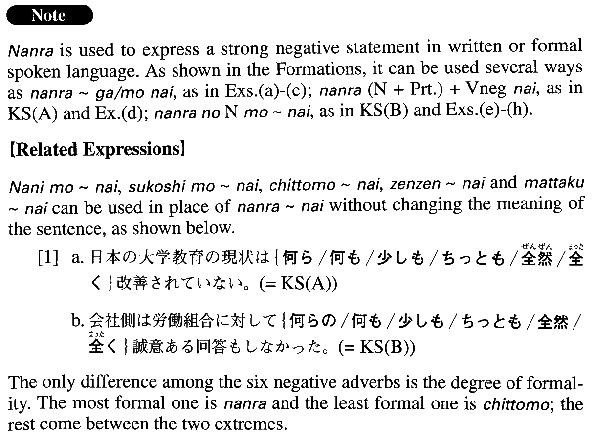

# 何ら～ない

[1. Summary](#summary) 
[2. Formation](#formation) 
[3. Example Sentences](#example-sentences) 
[4. Grammar Book Page](#grammar-book-page) 

## Summary

<table><tr>   <td>Summary</td>   <td>A structure that is used to express a strong negative statement.</td></tr><tr>   <td>Equivalent</td>   <td>Not ~ at all; not any ~; nothing; no ~ whatsoever</td></tr><tr>   <td>Part of speech</td>   <td>Structure (usually used in formal writing and formal speech)</td></tr><tr>   <td>Related expression</td>   <td>何も~ない; 少しも~ない; ちっとも~ない; 全然~ない; 全く~ない</td></tr></table>

## Formation

<table class="table"><tbody><tr class="tr head"><td class="td">(i) 何らNoun</td><td class="td">{が/も}ない</td><td class="td"></td></tr><tr class="tr"><td class="td"></td><td class="td">何ら進歩がない</td><td class="td">There is no progress whatsoever</td></tr><tr class="tr"><td class="td"></td><td class="td">何ら応答もない</td><td class="td">There is no response whatsoever</td></tr><tr class="tr head"><td class="td">(ii) 何ら</td><td class="td">(Noun+Particle) Vnegativeない</td><td class="td"></td></tr><tr class="tr"><td class="td"></td><td class="td">何ら返事が来ない</td><td class="td">No reply came</td></tr><tr class="tr"><td class="td"></td><td class="td">何ら約束をしない</td><td class="td">Someone doesn’t promise at all</td></tr><tr class="tr"><td class="td"></td><td class="td">何ら読んでいない</td><td class="td">Someone hasn’t read it at all</td></tr><tr class="tr head"><td class="td">(iii) 何らのNounも</td><td class="td">{ない/Vnegativeない}</td><td class="td"></td></tr><tr class="tr"><td class="td"></td><td class="td">何らの愛情もない</td><td class="td">Someone doesn’t love someone at all</td></tr><tr class="tr"><td class="td"></td><td class="td">何らの妥協も許さない</td><td class="td">Someone doesn’t accept any compromise</td></tr><tr class="tr"><td class="td"></td><td class="td">何らの返事ももらっていない</td><td class="td">Someone hasn’t received any reply whatsoever</td></tr></tbody></table>

## Example Sentences

<table><tr>   <td>日本の大学教育の現状は何ら改善されていない。</td>   <td>The state of Japanese college education has not improved at all.</td></tr><tr>   <td>会社側は労働組合に対して何らの誠意ある回答もしなかった。</td>   <td>The company (literally: company side) has failed to give any sincere reply to the labour union (whatsoever).</td></tr><tr>   <td>私は彼女とは何ら面識もないので、彼女の能力を知る由もありません。</td>   <td>I am not acquainted with her at all, so I don't have any reason to know her ability.</td></tr><tr>   <td>ソウルの町は、人の話さえ聞かなければ東京にいるのと何ら変わりがありません。</td>   <td>The city of Seoul seems no different than Tokyo, as long as you don't hear someone talk.</td></tr><tr>   <td>このドラマに登場する人物は実在する個人とは何ら関わりがありません。</td>   <td>The characters appearing in this drama have no connection to any real individuals.</td></tr><tr>   <td>１９９０年の入管法の改正で日系人はその在留が合法化され、日本での就労についても何ら制限を受けないことになった。</td>   <td>The 1990 amendment of the immigration law legalized the residence of Japanese descendants from abroad in Japan, and they are now no longer restricted in any way from working in Japan.</td></tr><tr>   <td>当ホテルはホテル内での紛失に関しては何らの責任も負いません。</td>   <td>This hotel takes no responsibility for items lost within the hotel.</td></tr><tr>   <td>彼女は生まれつき楽観的で、自分の将来についても何らの不安も感じていなかった。</td>   <td>She was a born optimist and felt no anxiety whatsoever about her future.</td></tr><tr>   <td>この町は災害に対して何らの備えもない。</td>   <td>This town has made no provision against disaster.</td></tr><tr>   <td>うちの社長は厳しくて、何らの失敗も許してくれない。</td>   <td>Our company president is strict and won't accept any errors.</td></tr></table>

## Grammar Book Page

