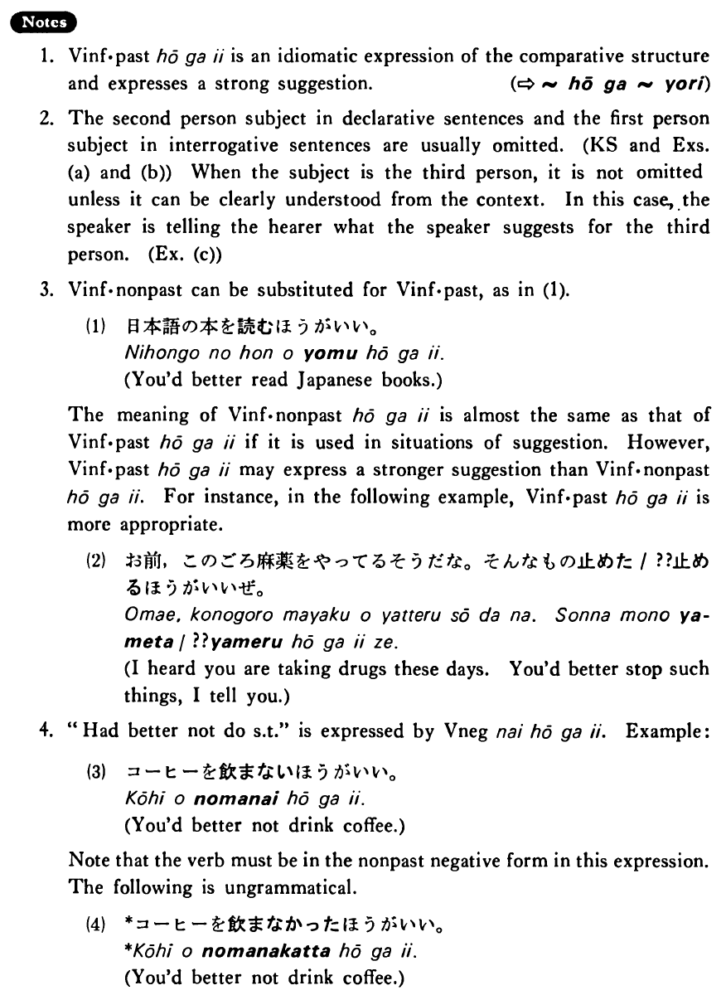

# ほうがいい

[1. Summary](#summary) 
[2. Formation](#formation) 
[3. Example Sentences](#example-sentences) 
[4. Explanation](#explanation) 
[5. Grammar Book Page](#grammar-book-page) 

## Summary

<table><tr>   <td>Summary</td>   <td>It is strongly suggested that someone do something.</td></tr><tr>   <td>Equivalent</td>   <td>Had better do something</td></tr><tr>   <td>Part of speech</td>   <td>Phrase</td></tr><tr>   <td>Related expression</td>   <td>たらどうですか</td></tr></table>

## Formation

<table class="table"> <tbody><tr class="tr head"> <td class="td">Vinformal past</td> <td class="td">ほうがいい </td> <td class="td">&nbsp;</td> </tr> <tr class="tr"> <td class="td">&nbsp;</td> <td class="td">話したほうがいい </td> <td class="td">Had    better talk</td> </tr> <tr class="tr"> <td class="td">&nbsp;</td> <td class="td">食べたほうがいい </td> <td class="td">Had    better eat</td> </tr> </tbody></table>

## Example Sentences

<table><tr>   <td>日本語の本を読んだほうがいい・いいです。</td>   <td>You'd better read Japanese books.</td></tr><tr>   <td>野菜も食べたほうがいいよ。</td>   <td>You'd better eat vegetables, too.</td></tr><tr>   <td>もう帰ったほうがいいですか。</td>   <td>Had I better go home now?</td></tr><tr>   <td>和子はもっと英語を勉強したほうがいいね。</td>   <td>Kazuko had better study English harder.</td></tr></table>

## Explanation

1. Verb informal past ほうがいい is an idiomatic expression of the comparative structure and expresses a strong suggestion.
  
(⇨ <a href="#㊦ ほうが~より">ほうが~より</a>)
  
2. The second person subject in declarative sentences and the first person subject in interrogative sentences are usually omitted. (Key Sentence and Examples (a) and (b)) When the subject is the third person, it is not omitted unless it can be clearly understood from the context. In this case, the speaker is telling the hearer what the speaker suggests for the third person. (Example (c))
  
3. Verb informal nonpast can be substituted for Verb informal past, as in (1).
  <ul>(1) <li>日本語の本を読むほうがいい。</li> <li>You'd better read Japanese books.</li> </ul>  
The meaning of Verb informal nonpast ほうがいい is almost the same as that of Verb informal past ほうがいい if it is used in situations of suggestion. However, Verb informal past ほうがいい may express a stronger suggestion than Verb informal nonpast ほうがいい. For instance, in the following example, Verb informal past ほうがいい is more appropriate.
  <ul>(2) <li>お前、このごろ麻薬をやってるそうだな。そんなもの止めた/??止めるほうがいいぜ。</li> <li>I heard you are taking drugs these days. You'd better stop such things, I tell you.</li> </ul>  
4. "Had better not do something" is expressed by Verb negative ないほうがいい. Example:
  <ul>(3) <li>コーヒーを飲まないほうがいい。</li> <li>You'd better not drink coffee.</li> </ul>  
Note that the verb must be in the nonpast negative form in this expression. The following is ungrammatical.
  <ul>(4) <li>*コーヒーを飲まなかったほうがいい。</li> <li>You'd better not drink coffee.</li> </ul>

## Grammar Book Page

