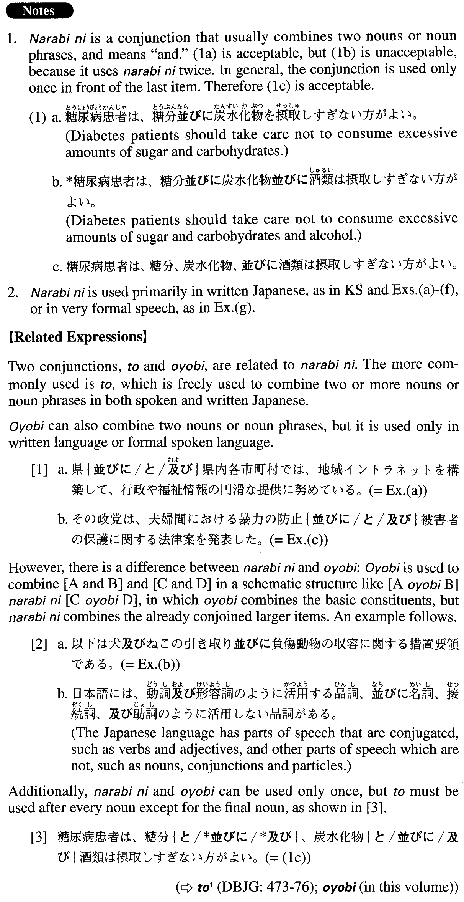

# 並びに

 
 
 
 

## Summary

<table><tr>   <td>Summary</td>   <td>A conjunction used to combine two nouns or noun phrases.</td></tr><tr>   <td>English</td>   <td>And; both ~ and ~; as well as</td></tr><tr>   <td>Part of speech</td>   <td>Conjunction (usually used in formal writing and formal speech)</td></tr><tr>   <td>Related expression</td>   <td>と; 及び</td></tr></table>

## Formation

<table class="table"><tbody><tr class="tr head"><td class="td">Noun1</td><td class="td">並びにNoun2</td><td class="td"></td></tr><tr class="tr"><td class="td"></td><td class="td">学長並びに副学長</td><td class="td">The university president and the vice president</td></tr></tbody></table>

## Example Sentences

<table><tr>   <td>国連総会には首相並びに外務大臣が出席した。</td>   <td>The prime minister and the foreign minister attended the U.N. General Assembly.</td></tr><tr>   <td>県並びに県内各市町村では、地域イントラネット構築して、行政や福祉情報の円滑な提供に努めている。</td>   <td>The prefecture and its municipalities have constructed local intranets, and are working to provide administrative and welfare information smoothly to their residents.</td></tr><tr>   <td>以下は犬及びねこの引き取り並びに負傷動物の収容に関する措置要領である。</td>   <td>What follows is an outline of procedures for caring for dogs and cats, and admitting injured animals.</td></tr><tr>   <td>その政党は、夫婦間における暴力の防止並びに被害者の保護に関する法律案を発表した。</td>   <td>The political party announced laws for the prevention of spousal violence as well as the protection of the victims.</td></tr><tr>   <td>今日は、大気や河川の汚染並びに酸性雨が環境に及ぼす影響についてお話しいたします。</td>   <td>Today I am going to talk about the contamination of our air and rivers as well as acid rain's effect on them.</td></tr><tr>   <td>このホームページ並びにメールマガジンのスタッフをご紹介します。</td>   <td>Let me introduce you to the staff of our website and mail magazine.</td></tr><tr>   <td>本学学長の選挙資格者は、選挙公示の日における学長並びに専任の教授、准教授及び講師とする。</td>   <td>Those who are qualified to be a candidate for president of this college are those who are full-time professors, associate professors and lecturers as well as the president at the time the election is announced.</td></tr><tr>   <td>本日ここに、大統領、並びに国務長官ほか、御一行の歓迎の宴を開くことができましたことは、私の最も欣快とするところであります。</td>   <td>It is my great pleasure that today we welcome the President, the Secretary of State and other honourable visitors to this reception.</td></tr></table>

## Grammar Book Page

