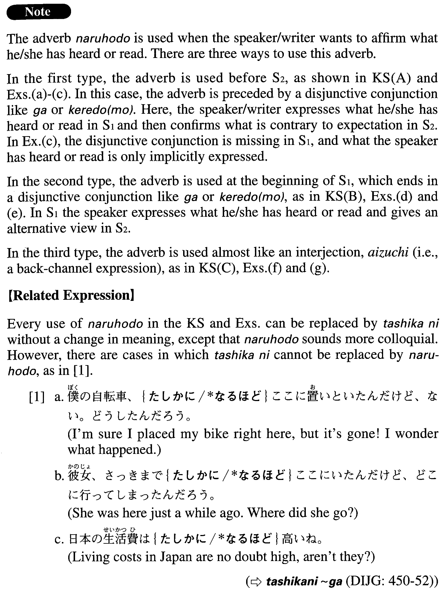

# なるほど

[1. Summary](#summary) 
[2. Formation](#formation) 
[3. Example Sentences](#example-sentences) 
[4. Grammar Book Page](#grammar-book-page) 

## Summary

<table><tr>   <td>Summary</td>   <td>An adverb indicating that the speaker/writer affirms the correctness of something he/she has heard/read/observed.</td></tr><tr>   <td>English</td>   <td>Indeed; it is true ~ (but); really; I see</td></tr><tr>   <td>Part of speech</td>   <td>Adverb</td></tr><tr>   <td>Related expression</td>   <td>確かに</td></tr></table>

## Formation

<table class="table"><tbody><tr class="tr head"><td class="td">(i) Sentence1{が/けれど}、</td><td class="td">なるほどSentence2。</td><td class="td"></td></tr><tr class="tr"><td class="td"></td><td class="td">若い{が/けれど}、なるほど、才能が豊かだ。</td><td class="td">Someone is young, but is richly talented indeed</td></tr><tr class="tr head"><td class="td">(ii) なるほど、</td><td class="td">Sentence1{が/けれど}、Sentence2。</td><td class="td"></td></tr><tr class="tr"><td class="td"></td><td class="td">なるほど、一見くだらない{が/けれど}、研究の価値がある。</td><td class="td">It looks worthless at first sight, but it is worth researching</td></tr><tr class="tr head"><td class="td">(iii) なるほど</td><td class="td">(ね)。</td><td class="td">I see/Indeed/It makes sense</td></tr></tbody></table>

## Example Sentences

<table><tr>   <td>パリはきれいだと聞いていたが、なるほどその芸術性には舌を巻いた。</td>   <td>I had heard that Paris was a beautiful city, and (literally: but) indeed I was astounded by its artistry.</td></tr><tr>   <td>なるほど、日本の官僚はいろいろと批判されているが、戦後の日本の復興は彼らに負うところが多い。</td>   <td>It is true that Japanese bureaucrats are criticized in various ways, but we owe them for much of Japan's post-war recovery.</td></tr><tr>   <td>A:文化って、宗教のように倫理的な決まりが多いですね。B:なるほどね。</td>   <td>A: Culture, like religion, has a lot of ethical rules. / B: I see.</td></tr><tr>   <td>この大学のことは大学案内で読んではいたが、実際に来てみると、なるほど、学生たちはずばらしい教育を受けているようだ。</td>   <td>I had read about this college in a college guide, but by actually coming here myself I can see the students really seem to be getting a great education.</td></tr><tr>   <td>この辺りでは菜の花畑が4月中旬ごろ特にきれいだと聞いていたが、なるほど見事である。</td>   <td>I had heard that the fields of rape blossoms around here are particularly beautiful around mid-April, and now that I've seen them myself, I have to say that they are indeed impressive.</td></tr><tr>   <td>本日、川上弘美『椰子・椰子』を読了。なるほど面白い本だ。</td>   <td>Today I finished reading Hiromi Kawakami's \"Yashi, Yashi (Palm, Palm).\" It's indeed an interesting book.</td></tr><tr>   <td>なるほど、これだけの規模のテロが起きると人々は恐怖に捕われるけれど、自分でコントロールできないことをくよくよ心配しても仕方がないだろう。</td>   <td>It's true people are caught by fear when terrorism of this magnitude occurs, but it is no use worrying too much about what you cannot control.</td></tr><tr>   <td>なるほど日本の文化とドイツの文化は違っている点があるが、実は共通点の方が多いようだ。</td>   <td>Indeed there are differences between Japanese culture and German culture, but actually it seems they have more similarities than differences.</td></tr><tr>   <td>A:実は僕には好きな人がいるんですが、勇気がなくて告白できないんです。　B:なるほど。でも、それは自分に対する自信が足りないからじゃないの？</td>   <td>A: To tell you the truth, there's someone I love, but I don't have the courage to tell her. B: I see exactly what you mean. It's because you don't have enough self-confidence.</td></tr><tr>   <td>A:この使い捨てカメラって、写真を撮りたい時簡単に買えて、撮ったらそのままカメラ屋に現像に出せるのが魅力なんだ。面倒なフィルムの出し入れもないし。B:なるほど。</td>   <td>A: The attractive feature of this disposable camera is that you can buy one whenever you want to take a picture, and when you are done you can take it as is to a camera shop for developing. You don't need to bother putting film in and taking it out. B: Oh, I see.</td></tr></table>

## Grammar Book Page

