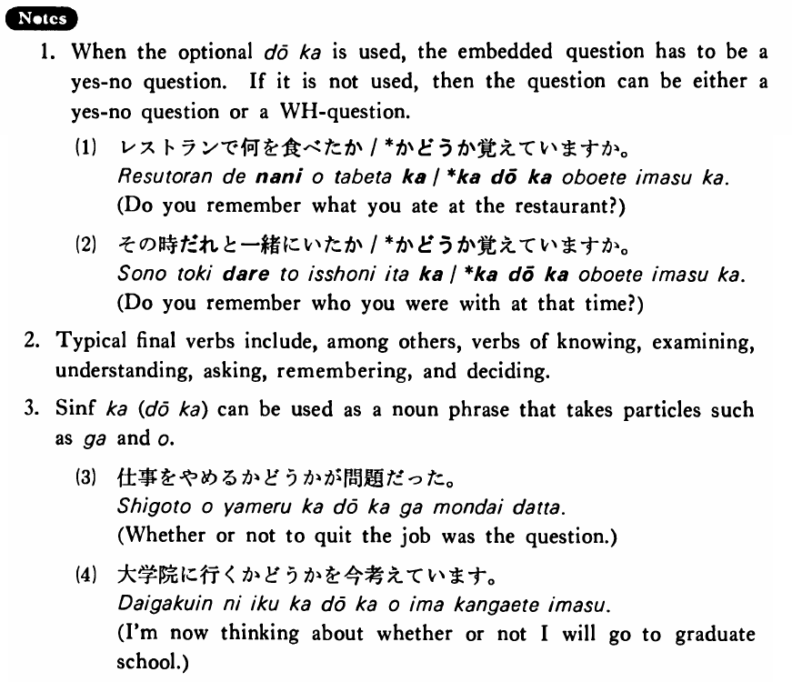

# か(どうか)

 
 
 
 
 

## Summary

<table><tr>   <td>Summary</td>   <td>A marker for an embedded yes-no question.</td></tr><tr>   <td>English</td>   <td>Whether or not; if (~ or not)</td></tr><tr>   <td>Part of speech</td>   <td>Particle</td></tr></table>

## Formation

<table class="table"><tbody><tr class="tr head"><td class="td">(i)  {V/Adjective い}    informal</td> <td class="td">か(どうか)</td> <td class="td">&nbsp;</td> </tr> <tr class="tr"> <td class="td">&nbsp;</td> <td class="td">{話す /話した} か(どうか)</td> <td class="td">Whether    or not someone talks/talked</td> </tr> <tr class="tr"> <td class="td">&nbsp;</td> <td class="td">{高い /高かった} か(どうか)</td> <td class="td">Whether    or not something is/was expensive</td> </tr> <tr class="tr head"> <td class="td">(ii)  {Adjective な stem/   N}</td> <td class="td">{Ø/だった} か(どうか)</td> <td class="td">&nbsp;</td> </tr> <tr class="tr"> <td class="td">&nbsp;</td> <td class="td">{静か /静かだった} か(どうか)</td> <td class="td">Whether    or not something is/was quiet</td> </tr> <tr class="tr"> <td class="td">&nbsp;</td> <td class="td">{先生 /先生だった} か(どうか)</td> <td class="td">Whether    or not someone is/was a teacher</td> </tr></tbody></table>

## Example Sentences

<table><tr>   <td>鈴木さんが大学に入ったか(どうか)(は)知らない・知りません。</td>   <td>I don't know whether or not Mr. Suzuki entered college.</td></tr><tr>   <td>小川さんが結婚しているかどうか知っていますか。</td>   <td>Do you know if Mr. Ogawa is married or not?</td></tr><tr>   <td>フォークナーの小説が面白いかどうか知らない。</td>   <td>I don't know if Faulkner's novels are interesting.</td></tr><tr>   <td>山口先生がお元気かどうか存じません。</td>   <td>I don't know if Professor Yamaguchi is healthy.</td></tr></table>

## Explanation

1. When the optional どうか is used, the embedded question has to be a yes-no question. If it is not used，then the question can be either a yes-no question or an interrogative word question.
  <ul>(1) <li>レストランで何を食べたか/*かどうか覚えていますか。</li> <li>Do you remember what you ate at the restaurant?</li> </ul>  <ul>(2) <li>その時だれと一緒にいたか/*かどうか覚えていますか。</li> <li>Do you remember who you were with at that time?</li> </ul>  
2. Typical final verbs include, among others, verbs of knowing, examining, understanding, asking, remembering, and deciding.
  
3. Sentnece informal か(どうか) can be used as a noun phrase that takes particles such as が and を.
  <ul>(3) <li>仕事をやめるかどうかが問題だった。</li> <li>Whether or not to quit the job was the question.</li> </ul>  <ul>(4) <li>大学院に行くかどうかを今考えています。</li> <li>I'm now thinking about whether or not I will go to graduate school.</li> </ul>

## Grammar Book Page

