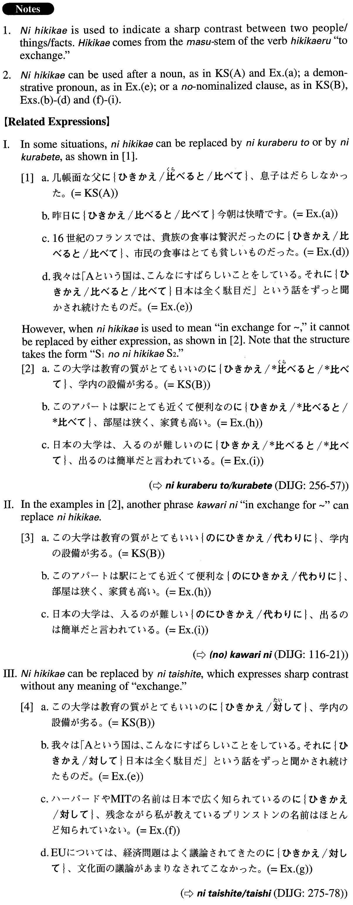

# にひきかえ

[1. Summary](#summary) 
[2. Formation](#formation) 
[3. Example Sentences](#example-sentences) 
[4. Grammar Book Page](#grammar-book-page) 

## Summary

<table><tr>   <td>Summary</td>   <td>A phrase that indicates a sharp contrast.</td></tr><tr>   <td>English</td>   <td>In contrast to ~; while; whereas</td></tr><tr>   <td>Part of speech</td>   <td>Phrase</td></tr><tr>   <td>Related expression</td>   <td>に比べると/比べて; 代わりに; に対して</td></tr></table>

## Formation

<table class="table"><tbody><tr class="tr head"><td class="td">(i) {Noun/Demonstrative pronoun}</td><td class="td">にひきかえ</td><td class="td"></td></tr><tr class="tr"><td class="td"></td><td class="td">健康な母にひきかえ</td><td class="td">In contrast to my healthy mother</td></tr><tr class="tr"><td class="td"></td><td class="td">{これ/それ}にひきかえ</td><td class="td">In contrast to this/that</td></tr><tr class="tr head"><td class="td">(ii) {V/Adjectiveい} informal</td><td class="td">のにひきかえ</td><td class="td"></td></tr><tr class="tr"><td class="td"></td><td class="td">勉強がよくできるのにひきかえ</td><td class="td">Someone is academically gifted, while ~</td></tr><tr class="tr"><td class="td"></td><td class="td">部屋が広いのにひきかえ</td><td class="td">The room is spacious, while ~</td></tr><tr class="tr head"><td class="td">(iii) {Adjectiveなstem/ Noun}</td><td class="td">{な/だった}のにひきかえ</td><td class="td"></td></tr><tr class="tr"><td class="td"></td><td class="td">便利なのにひきかえ</td><td class="td">Something is convenient, while ~</td></tr><tr class="tr"><td class="td"></td><td class="td">父は大学教授だったのにひきかえ</td><td class="td">My father was a college professor, while ~</td></tr></tbody></table>

## Example Sentences

<table><tr>   <td>几帳面な父にひきかえ、息子はだらしなかった。</td>   <td>The son, in contrast to his meticulous father, was slovenly.</td></tr><tr>   <td>この大学は教育の質がとてもいいのにひきかえ、学内の設備が劣る。</td>   <td>While the quality of education at this college is excellent, the quality of the campus facilities is inferior.</td></tr><tr>   <td>昨日にひきかえ今朝は快晴です。</td>   <td>In contrast to yesterday, this morning is perfectly clear.</td></tr><tr>   <td>姉は何事にも堅実なタイプなのにひきかえ、妹は奔放なタイプだ。</td>   <td>My older sister is the type who's steady in any situation, while my younger sister is the free-wheeling type.</td></tr><tr>   <td>昨年が楽しい年だったのにひきかえ、今年は色々な意味で試練の年だった。</td>   <td>The last year was an enjoyable year, whereas this year has been a year of trials for all sorts of reasons.</td></tr><tr>   <td>16世紀のフランスでは、貴族の食事は贅沢だったのにひきかえ、市民の食事はとても貧しいものだった。</td>   <td>In France in the 16th century, the nobility ate extravagantly while the common people ate very poorly.</td></tr><tr>   <td>我々は「Aという国は、こんなにすばらしいことをしている。それにひきかえ日本は全く駄目だ」という話をずっと聞かされ続けたものだ。</td>   <td>“Country A is doing this really fabulous thing. In contrast, Japan is completely useless.” We have been hearing this kind of statement (continuously) for a long time.</td></tr><tr>   <td>ハーバードやMITの名前は日本で広く知られているのにひきかえ、残念ながら私が教えているプリンストンの名前はほとんど知られていない。</td>   <td>Names such as Harvard and MIT are well-known in Japan while, regrettably, the name (of the school) where I am teaching, Princeton, is hardly known.</td></tr><tr>   <td>EUについては、経済問題はよく議論されてきたのにひきかえ、文化面の議論があまりなされてこなかった。</td>   <td>Although the EU's economic problems have been frequently debated, its cultural issues have hardly been discussed.</td></tr><tr>   <td>このアパートは駅にとても近くて便利なのにひきかえ、部屋は狭く、家賃も高い。</td>   <td>While this apartment is very close to the station and convenient, the room is small and the rent is high.</td></tr><tr>   <td>日本の大学は、入るのが難しいのにひきかえ、出るのは簡単だと言われている。</td>   <td>They say that while it is difficult to enter a Japanese university, it is easy to graduate.</td></tr></table>

## Grammar Book Page

