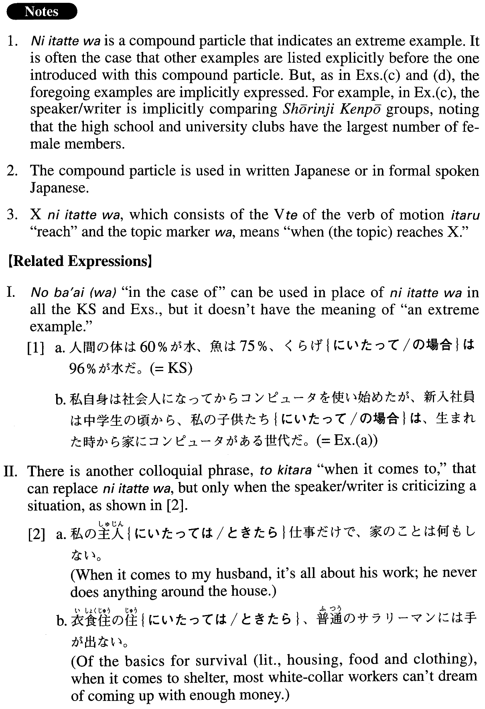

# にいたっては

 
 
 
 

## Summary

<table><tr>   <td>Summary</td>   <td>A compound particle that indicates an extreme example.</td></tr><tr>   <td>English</td>   <td>When it comes to ~; as for; for example</td></tr><tr>   <td>Part of speech</td>   <td>Compound Particle (usually used in formal writing and formal speech)</td></tr><tr>   <td>Related expression</td>   <td>の場合(は); ときたら</td></tr></table>

## Formation

<table class="table"><tbody><tr class="tr head"><td class="td">Noun</td><td class="td">にいたっては</td><td class="td"></td></tr><tr class="tr"><td class="td"></td><td class="td">学生にいたっては</td><td class="td">When it comes to students</td></tr></tbody></table>

## Example Sentences

<table><tr>   <td>人間の体は60%が水、魚は75%、くらげにいたっては96%が水だ。</td>   <td>Human bodies are 60 percent water, while fish are 75 percent water. As for jellyfish, the figure is 96 percent.</td></tr><tr>   <td>私自身は社会人になってからコンピュータを使い始めたが、新入社員は中学生の頃から、私の子供たちにいたっては、生まれた時から家にコンピュータがある世代だ。</td>   <td>I myself started to use a computer after I graduated and got a job, but the new hires got started on computers when they were still junior high school students. As for my children, they belong to the generation for whom a computer is available at home from the time of their birth.</td></tr><tr>   <td>一年間に日本中の廃棄物は5、１６０万トン、しかまこれは家庭や飲食店などから出る一般廃棄物で、産業廃棄物にいたってはその8倍近くの4億8百万トンも出ているのです。</td>   <td>In a year, 51,600,000 tons of waste is produced across Japan. And, this is just general waste from homes and eating places. When it comes to industrial waste, as much as 408,000,000 tons of waste, or nearly eight times as much as general waste, is produced.</td></tr><tr>   <td>少林寺拳法では女性拳士の数が増加傾向にあり、高校や大学の部活動にいたっては、部員の半数近くが女性だ。</td>   <td>In the case of Shourinji Kenpou, the number of female practitioners is increasing; in clubs at high schools and colleges, for example, almost half of the members are girls.</td></tr><tr>   <td>今私たちの生活には多くの椅子が使われている。ダイニングにいたっては、ダイニングテーブルと椅子は、もはや一般的である。</td>   <td>Today we use many chairs in our daily life. As for the dining room, a (set of) dining table and chairs is the standard.</td></tr><tr>   <td>日本には、一般紙やスポーツ紙、専門的な業界紙など様々な新聞があるが、雑誌にいたっては、どんな分野のものでもある。</td>   <td>In Japan there are various newspapers, such as general papers, sports newspapers, or papers that specialize in certain industries, but as for magazines, they cover all fields.</td></tr><tr>   <td>アジア太平洋地域以外にも、旅行者の注目を集めている地域がある。中央アメリカは昨年、旅行者数が23%増、中東も17.5％増となった。スペインも９％増加したし、モロッコにいたっては、２２％も増えた。</td>   <td>Areas outside the Asia Pacific region have been drawing the attention of travellers as well. Last year Central America saw a 23 percent increase in travellers; in the Middle East, it was 17.5 percent. Spain saw 9 percent more travellers, and travel (literally: travellers) to Morocco, of all places, grew 22 percent.</td></tr></table>

## Grammar Book Page

