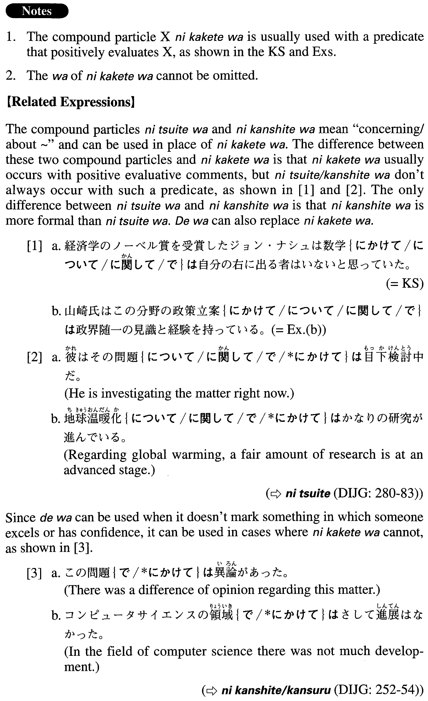

# にかけては

[1. Summary](#summary) 
[2. Formation](#formation) 
[3. Example Sentences](#example-sentences) 
[4. Grammar Book Page](#grammar-book-page) 

## Summary

<table><tr>   <td>Summary</td>   <td>A compound particle that marks something in which someone excels or has confidence.</td></tr><tr>   <td>Equivalent</td>   <td>When it comes to ~; as for; in point of; in terms of; about; regarding</td></tr><tr>   <td>Part of speech</td>   <td>Compound Particle</td></tr><tr>   <td>Related expression</td>   <td>については; に関しては; では</td></tr></table>

## Formation

<table class="table"><tbody><tr class="tr head"><td class="td">Noun</td><td class="td">にかけては</td><td class="td"></td></tr><tr class="tr"><td class="td"></td><td class="td">音楽にかけては</td><td class="td">When it comes to music</td></tr></tbody></table>

## Example Sentences

<table><tr>   <td>経済学のノーベル賞を受賞したジョン・ナシュは数学にかけては自分の右に出る者はいないと思っていた。</td>   <td>John Nash, who received a Nobel Prize in economics, thought that when it came to math, nobody was better than he was.</td></tr><tr>   <td>ジャッキー・チェンは、アクションにかけては右に出る者がいない俳優である。</td>   <td>Jackie Chan is an actor with whom none can compete when it comes to action films.</td></tr><tr>   <td>山崎氏はこの分野の政策立案にかけては政界随一の見識と経験を持っている。</td>   <td>For policy making in this field, Mr. Yamazaki has the best insight and experience in the political world.</td></tr><tr>   <td>写真というものは絵画に比べて、その客観的再現力にかけては圧倒的にまさっている。</td>   <td>Photography overwhelmingly surpasses paintings in terms of objective reproduction.</td></tr><tr>   <td>このユースホステルは年齢を問わず誰でも利用でき、快適さにかけては世界中でも最高クラスだ。</td>   <td>One of the special features of this youth hostel is that people of any age can stay here (literally: use it), and when it comes to comfort, it is among the top-rated (hostels) in the world.</td></tr><tr>   <td>この工場は特殊鋼の製造にかけては世界屈指の技術を有している。</td>   <td>When it comes to the production of special steels, this factory has the world's best technology.</td></tr></table>

## Grammar Book Page

