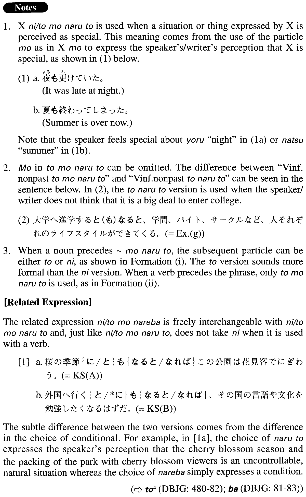

# に/ともなると

 
 
 
 

## Summary

<table><tr>   <td>Summary</td>   <td>A phrase that is used when something or some situation is perceived to be special.</td></tr><tr>   <td>English</td>   <td>When; if; as</td></tr><tr>   <td>Part of speech</td>   <td>Phrase</td></tr><tr>   <td>Related expression</td>   <td>に/ともなれば</td></tr></table>

## Formation

<table class="table"><tbody><tr class="tr head"><td class="td">(i) Noun</td><td class="td">{に/と}もなると</td><td class="td"></td></tr><tr class="tr"><td class="td"></td><td class="td">五月{に/と}もなると</td><td class="td">Literally: when it becomes May; in May</td></tr><tr class="tr head"><td class="td">(ii) Vinformal nonpast</td><td class="td">ともなると</td><td class="td"></td></tr><tr class="tr"><td class="td"></td><td class="td">退職するともなると</td><td class="td">When someone retires</td></tr></tbody></table>

## Example Sentences

<table><tr>   <td>桜の季節｛に/と｝もなるとこの公園は花見客でにぎわう。</td>   <td>In the cherry blossom season (literally: When it becomes the cherry blossom season), this park is packed with cherry blossom viewers.</td></tr><tr>   <td>外国へ行くともなると、その国の言語や文化を勉強したくなるはずだ。</td>   <td>When you go abroad, most likely you will want to study that country's language and culture.</td></tr><tr>   <td>正月ともなると、友人同士、お互いの家を行き来して、正月酒を楽しむ。</td>   <td>On New Year's Day my friends and I go to each other's houses and enjoy New Year's Day sake.</td></tr><tr>   <td>ここは紅葉が始まると訪れる人が増え始め、11月半ばともなると大勢の人でごったがえす。</td>   <td>When the leaves begin turning red, the number of visitors starts to increase, and in mid-November, this place is packed with people.</td></tr><tr>   <td>社会人にもなると、先輩や友人の結婚式に招かれる機会が出てきます。</td>   <td>Once you (graduate and) get out in the real world, you will start getting invited to the weddings of your elders and friends.</td></tr><tr>   <td>高校生にもなると、自分のお小遣いくらいは、バイトして稼ぐようになる。</td>   <td>When you become a high school student, you get a part-time job and start earning your own pocket money.</td></tr><tr>   <td>大きなホテルともなると、一日に数千人もの利用者が集まってくる。</td>   <td>At a big hotel, thousands of people come through daily.</td></tr><tr>   <td>『美人と野獣』ともなると人気の作品だから、当日券なんてなかなか買えない。</td>   <td>“Beauty and the Beast” is a popular show, so it's hard to find same day tickets.</td></tr><tr>   <td>大学へ進学するともなると、学問、バイト、サークルなど、人それぞれのライフスタイルができてくる。</td>   <td>When you enter college, each of you will develop your own lifestyle, with studies, work and club activities.</td></tr><tr>   <td>今年から修学旅行先が北海道になり、飛行機で行くともなると、胸を躍らさずにはいられなかった。</td>   <td>Starting this year, we're going to Hokkaido for our school trip, and the thought of flying there has made us so excited we can hardly stand it.</td></tr></table>

## Grammar Book Page

