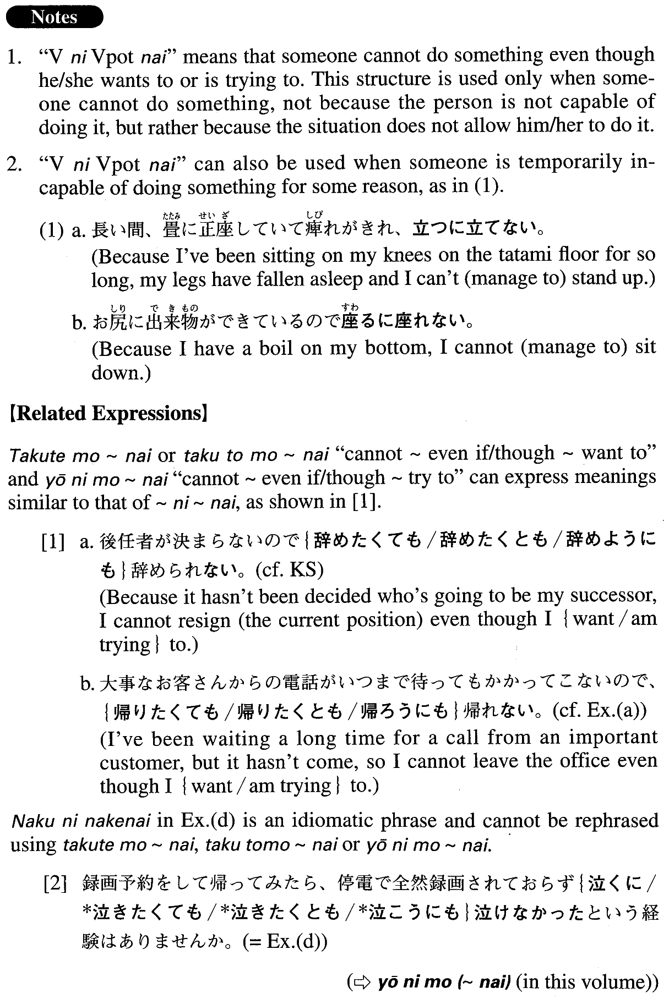

# ～に～ない

[1. Summary](#summary) 
[2. Formation](#formation) 
[3. Example Sentences](#example-sentences) 
[4. Grammar Book Page](#grammar-book-page) 

## Summary

<table><tr>   <td>Summary</td>   <td>A sentence structure meaning “someone cannot manage to do something”</td></tr><tr>   <td>Equivalent</td>   <td>Cannot manage to; just cannot; cannot ~ even though ~ want to; cannot ~ despite the fact that ~ want to</td></tr><tr>   <td>Part of speech</td>   <td>Structure</td></tr><tr>   <td>Related expression</td>   <td>たくても~ない; たくとも~ない; ようにも~ない</td></tr></table>

## Formation

<table class="table"><tbody><tr class="tr head"><td class="td">V1informal nonpast</td><td class="td">にV2potential negative</td><td class="td">Where V1=V2</td></tr><tr class="tr"><td class="td"></td><td class="td">出るに出られない</td><td class="td">Someone cannot manage to get out</td></tr></tbody></table>

## Example Sentences

<table><tr>   <td>後任者が決まらないので、辞めるに辞められない。</td>   <td>Because my successor hasn't been chosen yet, I haven't been able to resign (my current position).</td></tr><tr>   <td>大事なお客さんからの電話がいつまで待ってもかかってこないので、帰るに帰れない。</td>   <td>I've been waiting a long time for a call from an important customer, but it hasn't come, so I cannot leave the office.</td></tr><tr>   <td>みんなの前で大見えを切ってできると言ってしまったので引くに引けない。</td>   <td>Because I boasted to everyone that I could do it, I cannot pull out now even though I want to.</td></tr><tr>   <td>同窓会などで会った旧友が、何かの団体に入っていたり、何かの商品を売っていたりして、勧誘を断るに断れないケースがよくある。</td>   <td>When you go to school reunions or other events, often you cannot say no to an old friend who has joined a group (and asks you to join) or is selling some product (and asks you to buy it).</td></tr><tr>   <td>録画予約をして帰ってみたら、停電で全然録画されておらず泣くに泣けなかったという経験はありませんか。</td>   <td>Have you ever had the experience of setting a programmed recording, only to come home and find that the power went out and you didn't record a thing? It makes you want to cry.</td></tr><tr>   <td>急に今日中に終わらせなければならない仕事が入った。今日は子供の誕生日で早く帰ると約束したのに、周りの同僚も自分の仕事に必死で、頼むに頼めない。</td>   <td>Unexpectedly, I got work that I have to finish today. It's my child's birthday, and I promised to come home early, but my colleagues (around me) are desperately trying to finish their own work, so I cannot (manage to) ask them to do mine for me.</td></tr><tr>   <td>通訳の失敗談は、話として聞いている分にはおかしいものが多いが、中には深刻すぎて笑うに笑えないものもある。</td>   <td>Tales of blunders by interpreters are mostly laughable incidents when heard as anecdotes, but some of them are too serious to be considered laughing matters.</td></tr></table>

## Grammar Book Page

