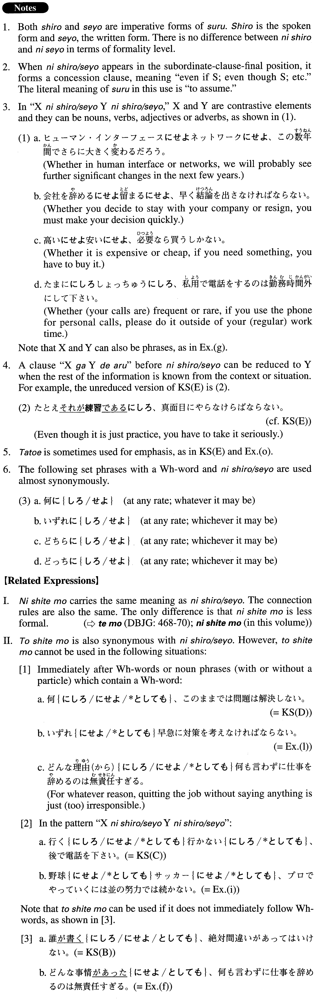

# にしろ・せよ

 
 
 
 

## Summary

<table><tr>   <td>Summary</td>   <td>A conjunctive phrase that carries the meaning of concession.</td></tr><tr>   <td>English</td>   <td>Even though (it is/was the case that); even if (it is true that); although (it is/was the case that); whatever/whoever/etc.; no matter what/who/how/etc.; whether X or Y</td></tr><tr>   <td>Part of speech</td>   <td>Phrase</td></tr><tr>   <td>Related expression</td>   <td>にしても; としても</td></tr></table>

## Formation

<table class="table"><tbody><tr class="tr head"><td class="td">(i) Vinformal</td><td class="td">に{しろ/せよ}</td><td class="td"></td></tr><tr class="tr"><td class="td"></td><td class="td">{行く/行った}に{しろ/せよ}</td><td class="td">Even though someone goes/went</td></tr><tr class="tr head"><td class="td">(ii) Adjectiveいinformal</td><td class="td">に{しろ/せよ}</td><td class="td"></td></tr><tr class="tr"><td class="td"></td><td class="td">{高い/高かった}に{しろ/せよ}</td><td class="td">Even though something is/was expensive</td></tr><tr class="tr head"><td class="td">(iii) Adjectiveなstem</td><td class="td">{∅/である/だった/であった}に{しろ/せよ}</td><td class="td"></td></tr><tr class="tr"><td class="td"></td><td class="td">不十分{∅/である/だった/であった}に{しろ/せよ}</td><td class="td">Even though something is/was insufficient</td></tr><tr class="tr head"><td class="td">(iv) Noun</td><td class="td">{∅/である/だった/であった}に{しろ/せよ}</td><td class="td"></td></tr><tr class="tr"><td class="td"></td><td class="td">子供{∅/である/だった/であった}に{しろ/せよ}</td><td class="td">Even though it is/was a child</td></tr><tr class="tr"><td class="td"></td><td class="td">誰{∅/である/だった/であった}に{しろ/せよ}</td><td class="td">Whoever it may be/have been</td></tr><tr class="tr"><td class="td"></td><td class="td">いずれに{しろ/せよ}</td><td class="td">Whichever it may be; at any rate</td></tr><tr class="tr head"><td class="td">(v) Adverb</td><td class="td">に{しろ/せよ}</td><td class="td"></td></tr><tr class="tr"><td class="td"></td><td class="td">ゆっくりに{しろ/せよ}</td><td class="td">Even though something happens slowly</td></tr></tbody></table>

## Example Sentences

<table><tr>   <td>時間があまりなかったに｛しろ/せよ｝、この仕事はひどすぎる。</td>   <td>Even though he didn't have much time, this work is too sloppy.</td></tr><tr>   <td>誰が書くに｛しろ/せよ｝、絶対間違いがあってはいけない。</td>   <td>No matter who writes it, there can be absolutely no mistakes.</td></tr><tr>   <td>行くに｛しろ/せよ｝、行かないに｛しろ/せよ｝、後で電話を下さい。</td>   <td>Whether you go or not, please give me a call later.</td></tr><tr>   <td>何に｛しろ/せよ｝、このままでは問題は解決しない。</td>   <td>At any rate (literally: whatever it is), leaving the situation as it is won't solve the problem.</td></tr><tr>   <td>たとえ練習に｛しろ/せよ｝、真面目にやらなければならない。</td>   <td>Even though it is just practice, you have to take it seriously.</td></tr><tr>   <td>程度の差はあるにせよ、性差別のない国はないだろう。</td>   <td>Although the degree may differ from country to country (literally: there may be differences in degree), there is no country without gender discrimination.</td></tr><tr>   <td>薬を飲むことですべての問題が解決はしないにしろ、あなたの場合は薬で症状を軽減させることが先決です。</td>   <td>Even if (it's true that) taking the drug will not solve all your problems, in your case, you have to alleviate the symptoms first (by taking it).</td></tr><tr>   <td>誰かに書いてもらうにしろ、内容は我々が考えなければならない。</td>   <td>Even if we ask someone to write it for us, we will have to think of what to say (literally: the content) ourselves.</td></tr><tr>   <td>どのソフトを使うにしろ、早く使い方に慣れてもらわないといけない。</td>   <td>Whichever software application you use, you must quickly get comfortable using it (literally: get used to how to use it).</td></tr><tr>   <td>誰がそれを説明するにせよ、相手の気持ちを傷つけないように細心の注意が必要だ。</td>   <td>Whoever explains it (to him) must be very careful not to hurt his feelings.</td></tr><tr>   <td>どんな事情があったにせよ、何も言わずに仕事を辞めるのは無責任すぎる。</td>   <td>No matter what the circumstances were, quitting the job without saying anything is just (too) irresponsible.</td></tr><tr>   <td>ホームページの制作に関する書籍は書店の棚にあふれている状態で、自分が読むにせよ、他人に勧めるにせよ、大いに迷う。</td>   <td>Books on Web page design are spilling off of bookstore shelves, and whether we want to read them ourselves or recommend them to someone else, it is hard to know what to choose.</td></tr><tr>   <td>現政権を支持するにせよ批判するにせよ、まずはじめに問題に対する正確な理解と冷静な分析が不可欠である。</td>   <td>First of all, whether you support the current administration or criticize it, an accurate understanding and a cool analysis of the problems are indispensable.</td></tr><tr>   <td>野球にせよサッカーにせよ、プロでやっていくには並の努力では続かない。</td>   <td>Whether it be baseball or soccer, you cannot stay as a professional player just with an ordinary effort.</td></tr><tr>   <td>普通の人は、意識的にせよ無意識的にせよ、不快なことを避けようとする。</td>   <td>Whether they do it consciously or unconsciously, ordinary people try to avoid unpleasant things.</td></tr><tr>   <td>一旦ネットに発信してしまった情報は、それが真実にせよそうでないにせよ、取り消しができない。</td>   <td>Whether it is true or not, once you send out information on the Internet, you can't take it back.</td></tr></table>

## Grammar Book Page

