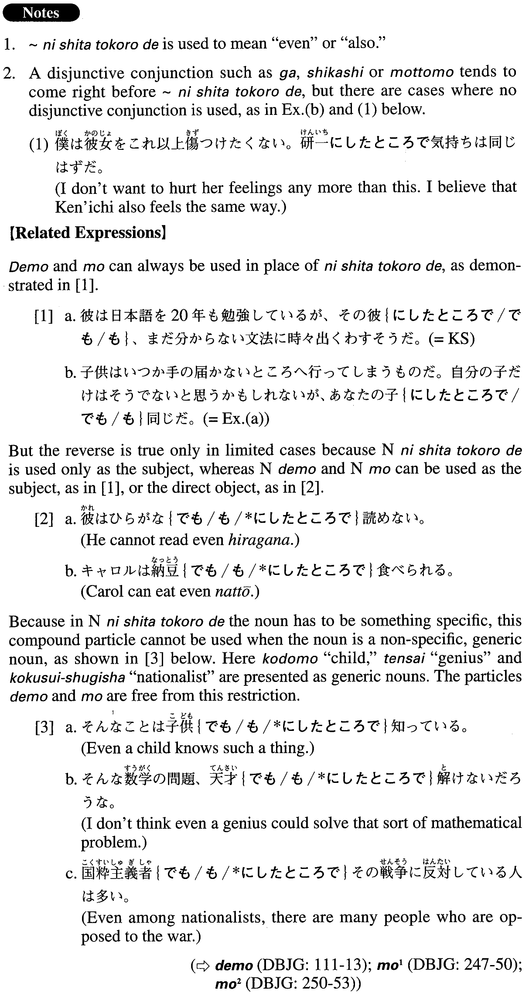

# にしたところで

[1. Summary](#summary) 
[2. Formation](#formation) 
[3. Example Sentences](#example-sentences) 
 

## Summary

<table><tr>   <td>Summary</td>   <td>A compound particle that means “even” or “also”.</td></tr><tr>   <td>English</td>   <td>Also; (even) for ~</td></tr><tr>   <td>Part of speech</td>   <td>Compound Particle</td></tr><tr>   <td>Related expression</td>   <td>でも; も; にしてからが</td></tr></table>

## Formation

<table class="table"><tbody><tr class="tr head"><td class="td">Noun</td><td class="td">にしたところで</td><td class="td"></td></tr><tr class="tr"><td class="td"></td><td class="td">その教授にしたところで</td><td class="td">The professor is also ~/even the professor</td></tr></tbody></table>

## Example Sentences

<table><tr>   <td>彼は日本語を20年も勉強しているが、その彼にしたところで、まだ分からない文法に時々出くわすそうだ。</td>   <td>He has studied Japanese for 20 years, but he told me that even he still encounters grammar he doesn't understand.</td></tr><tr>   <td>子供はいつか手の届かないところへ行ってしまうものだ。自分の子だけはそうでないと思うかもしれないが、あなたの子にしたところで同じだ。</td>   <td>Children go (places) beyond their parents' reach sooner or later. You may think that your own children will be different, but they, too, will be the same.</td></tr><tr>   <td>昔の浮気が発覚した夫は「10年たってるんだからもう時効だ」と開き直りの態度です。私にしたところで二人の子供のことを考えると離婚にはなかなか踏み切れません。</td>   <td>My husband, whose past affair was discovered, turned defiant, saying, \"It was 10 years ago, so it's too late (to do anything)\" I, too, couldn't bear to go forward with a divorce when I thought about our two children.</td></tr><tr>   <td>最近は万年筆で字を書く人というのを、ほとんど見なくなって残念だ。もっとも、そういう私にしたところで、普段使っているのはボールペンだ。</td>   <td>Lately, you seldom see people writing with a fountain pen, and that makes me feel terribly disappointed. But even I usually use a ball-point pen.</td></tr><tr>   <td>三島由紀夫は産湯に浸かった記憶があると書いているが、彼にしたところで、死ぬまでのすべての記憶があるわけではない。</td>   <td>Yukio Mishima wrote that he remembered (literally: had a memory of) taking his first bath as a baby, but there's no way even he remembered everything he did from birth until death (literally: until he died).</td></tr></table>

## Grammar Book Page

