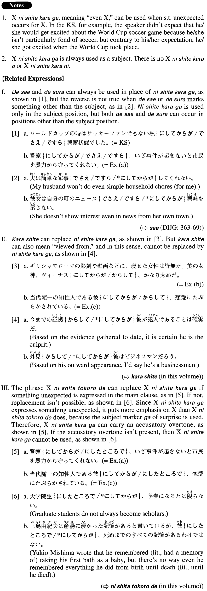

# にしてからが

 
 
 
 

## Summary

<table><tr>   <td>Summary</td>   <td>A compound particle indicating that something unexpected occurs.</td></tr><tr>   <td>English</td>   <td>even</td></tr><tr>   <td>Part of speech</td>   <td>Compound Particle</td></tr><tr>   <td>Related expression</td>   <td>でさえ; ですら; からして; にしたところで</td></tr></table>

## Formation

<table class="table"><tbody><tr class="tr head"><td class="td">Noun</td><td class="td">にしてからが</td><td class="td"></td></tr><tr class="tr"><td class="td"></td><td class="td">首相にしてからが</td><td class="td">Even the prime minister</td></tr></tbody></table>

## Example Sentences

<table><tr>   <td>ワールドカップの時はサッカーファンでもない私にしてからが興奮状態でした。</td>   <td>I am not a soccer fan, but during the World Cup, even I got excited.</td></tr><tr>   <td>警察にしてからが、いざ事件が起きないと市民を暴力から守ってくれない。</td>   <td>Even the police don't protect citizens from violence unless an incident actually occurs.</td></tr><tr>   <td>ギリシャやローマの彫刻や壁画などに、痩せた女性は皆無だ。美の女神、ヴィーナスにしてからが、かなり太めだ。</td>   <td>In Greek or Roman sculptures and mural paintings there are no emaciated-looking women. Even Venus, the Goddess of Beauty, is quite full-figured.</td></tr><tr>   <td>当代随一の知性人である彼にしてからが、恋愛にたぶらかされている。</td>   <td>Even he, the greatest intellectual of the day, was deceived by love.</td></tr><tr>   <td>息子は父から受け継いだ作風で作品を描いていたが、すでにその父にしてからが、古くさいと言われていた。</td>   <td>He produced paintings in the mode he inherited from his father, but that style was already considered outdated in his father's time.</td></tr><tr>   <td>首相の構造改革案にしてからが、官僚の強い抵抗にあっている。</td>   <td>Even the prime minister's plan for structural reform met with strong resistance from bureaucrats.</td></tr></table>

## Grammar Book Page

