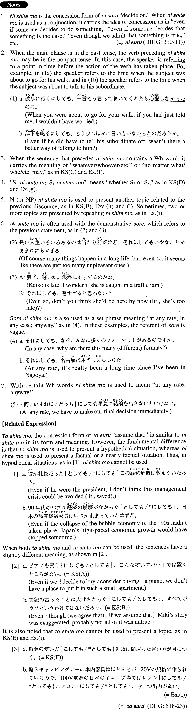

# にしても

[1. Summary](#summary) 
[2. Formation](#formation) 
[3. Example Sentences](#example-sentences) 
[4. Grammar Book Page](#grammar-book-page) 

## Summary

<table><tr>   <td>Summary</td>   <td>A conjunction that represents the idea of “even if someone decides to do something,” or “even if/though someone decides that something is true/the case”.</td></tr><tr>   <td>English</td>   <td>Even if (someone decides to/it is true that); although/even though (it is true that/it is the case that/we admit that/we agree that/etc.); whatever/whoever/etc.; no matter what/who/how/etc.; whether X or Y; as for ~, too; even (so)</td></tr><tr>   <td>Part of speech</td>   <td>Conjunction</td></tr><tr>   <td>Related expression</td>   <td>としても; にしろ/せよ</td></tr></table>

## Formation

<table class="table"><tbody><tr class="tr head"><td class="td">(i) Sinformal</td><td class="td">にしても</td><td class="td">だ after Adjectiveなstem and Noun is omitted</td></tr><tr class="tr"><td class="td"></td><td class="td">{行く/行った}にしても</td><td class="td">Even if someone decides to go/even though (it is the case that) someone went</td></tr><tr class="tr"><td class="td"></td><td class="td">{高い/高かった}にしても</td><td class="td">Even if (it is true that) something is expensive/even though (it is true that) something was expensive</td></tr><tr class="tr"><td class="td"></td><td class="td">便利{∅/である/ だった/であった}にしても</td><td class="td">Even if (it is true that) something is convenient/even though (it is true that) something was convenient</td></tr><tr class="tr"><td class="td"></td><td class="td">学生{∅/である/ だった/であった}にしても</td><td class="td">Even if (it is true that) someone is a student/even though (it is true that) someone was a student</td></tr><tr class="tr head"><td class="td">(ii) NP</td><td class="td">にしても</td><td class="td"></td></tr><tr class="tr"><td class="td"></td><td class="td">この国の文化にしても</td><td class="td">This country’s culture, too</td></tr></tbody></table>

## Example Sentences

<table><tr>   <td>ピアノを買うにしても、こんな狭いアパートでは置くところがない。</td>   <td>Even if we decide to buy a piano, we won't have a place to put it in such a small apartment.</td></tr><tr>   <td>美紀の言ったことは大げさだったにしても、すべてがウソというわけではないだろう。</td>   <td>Even though (we agree that) Miki's story was exaggerated, probably not all of it was untrue.</td></tr><tr>   <td>誰がこの仕事をやるにしても失敗は許されない。</td>   <td>No matter who is going to do this job, we have no room for mistakes.</td></tr><tr>   <td>君が行くにしても他の誰かが行くにしても今回の会議はかなりの準備が必要だ。</td>   <td>Whether you go or someone else does, this meeting will take a lot of preparation.</td></tr><tr>   <td>敬語の使い方にしても近頃は間違った言い方が目につく。</td>   <td>With honorific language, too, we often notice incorrect usage these days.</td></tr><tr>   <td>今すぐ帰るにしても、飛行機の切符が取れるだろうか。</td>   <td>Even if we (decide to) go home right now, I wonder if we will be able to get plane tickets.</td></tr><tr>   <td>京都は見るところがたくさんあるので、市内だけ回るにしても3日くらいとっておいた方がいいでしょう。</td>   <td>Kyoto has so many places to see, so even if you (decide to) stay within the city, you should plan on spending about three days.</td></tr><tr>   <td>この作品は中国大陸の影響が濃厚であるにしても、日本の画工の高い水準を示している。</td>   <td>Even taking the strong influence from China into account, this work demonstrates the high quality craftsmanship of Japanese painters.</td></tr><tr>   <td>今度の台風では最悪の事態は避けられたにしても、被害は甚大だ。</td>   <td>Even though (it is true that) we could avoid a worst-case scenario, the damage from this typhoon is (still) enormous.</td></tr><tr>   <td>ニューヨークほどではないにしても、この市でもかなり質の高い音楽が聴けます。</td>   <td>Even though it's not what you get in New York, you can listen to fairly high-quality music in this city, too.</td></tr><tr>   <td>何をするにしても英語はしっかり勉強しておいた方がいい。</td>   <td>Whatever you may do (in the future), you'd do well to study English hard.</td></tr><tr>   <td>行くにしてもやめるにしても早く決めてもらえませんか。</td>   <td>Whether you decide to go or not, could you make up your mind soon?</td></tr><tr>   <td>達也にしても悪気があってあんなことを言ったわけじゃない。</td>   <td>When he said that, Tatsuya didn't intend to be mean-spirited, either.</td></tr><tr>   <td>輸入キャンピングカー車内器具はほとんどが１２０Vの規格で作られているので、１００V電源の日本のキャンプ場ではレンジにしてもエアコンにしても、今一つ出力が弱い。</td>   <td>Because most of the appliances in imported campers are designed for the 120-volt standard, stoves and air-conditioners, for example, do not have enough output at campsites in Japan, where 100 volts is the standard.</td></tr></table>

## Grammar Book Page

