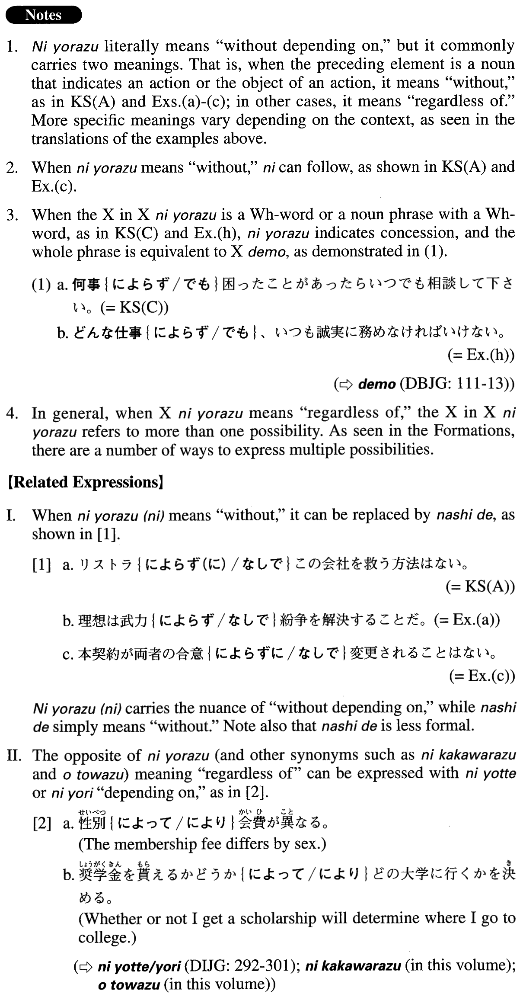

# によらず

 
 
 
 

## Summary

<table><tr>   <td>Summary</td>   <td>A compound particle that means “without depending on”.</td></tr><tr>   <td>English</td>   <td>Without; without ~ing; regardless of; independently of; without reference to; whether X or Y; whether X or not; whatever/whoever/etc.; no matter what/who/how/etc.</td></tr><tr>   <td>Part of speech</td>   <td>Compound Particle</td></tr><tr>   <td>Related expression</td>   <td>なしで; によって/より; を問わず</td></tr></table>

## Formation

<table class="table"><tbody><tr class="tr head"><td class="td">(i) Noun</td><td class="td">によらず</td><td class="td"></td></tr><tr class="tr"><td class="td"></td><td class="td">紹介によらず</td><td class="td">Without introduction</td></tr><tr class="tr"><td class="td"></td><td class="td">学生数によらず</td><td class="td">Regardless of the number of students</td></tr><tr class="tr head"><td class="td">(ii) Wh-word (Noun/NP) </td><td class="td">によらず</td><td class="td"></td></tr><tr class="tr"><td class="td"></td><td class="td">誰によらず</td><td class="td">Whoever it may be (literally: regardless of who it is) </td></tr><tr class="tr"><td class="td"></td><td class="td">どんな仕事によらず</td><td class="td">Whatever work it may be (literally: regardless of what kind of work it is) </td></tr><tr class="tr head"><td class="td">(iii) XかYか</td><td class="td">によらず</td><td class="td">Where X, Y=contrastive words; usually nonpast forms</td></tr><tr class="tr"><td class="td">Noun1かNoun2</td><td class="td">英語か日本語かによらず</td><td class="td">Regardless of whether something is English or Japanese</td></tr><tr class="tr"><td class="td">V1informalかV2informalか</td><td class="td">勝つか負けるによらず</td><td class="td">Regardless of whether someone wins or loses</td></tr><tr class="tr"><td class="td">Adjectiveい1informalかAdjectiveい2informal</td><td class="td">高いか安いかによらず</td><td class="td">Regardless of whether something is expensive or cheap</td></tr><tr class="tr"><td class="td">Adjectiveな1stemかAdjectiveな2stem</td><td class="td">偶然か意図的かによらず</td><td class="td">Regardless of whether something is accidental or intentional</td></tr><tr class="tr head"><td class="td">(iv) Xか{どう/ 否}か</td><td class="td">によらず</td><td class="td"></td></tr><tr class="tr"><td class="td"></td><td class="td">存在するか{どう/否}かによらず</td><td class="td">Regardless of whether something exists or not</td></tr><tr class="tr"><td class="td"></td><td class="td">高いか{どう/否}かによらず</td><td class="td">Regardless of whether something is expensive or not</td></tr><tr class="tr"><td class="td"></td><td class="td">偶然か{どう/否}かによらず</td><td class="td">Regardless of whether something is coincidental or not</td></tr><tr class="tr"><td class="td"></td><td class="td">学生か{どう/否}かによらず</td><td class="td">Regardless of whether someone is a student or not</td></tr><tr class="tr head"><td class="td">(v) X(affirmative)かX(negative)か</td><td class="td">によらず</td><td class="td"></td></tr><tr class="tr"><td class="td"></td><td class="td">行くか行かないかによらず</td><td class="td">Regardless of whether someone goes or not</td></tr><tr class="tr"><td class="td"></td><td class="td">高いか高くないかによらず</td><td class="td">Regardless of whether something is expensive or not</td></tr><tr class="tr"><td class="td"></td><td class="td">偶然(である)か偶然でないによらず</td><td class="td">Regardless of whether something is coincidental or not</td></tr><tr class="tr"><td class="td"></td><td class="td">英語(である)か英語でないによらず</td><td class="td">Regardless of whether something is English or not</td></tr><tr class="tr head"><td class="td">(vi) X(affirmative)+X(negative)か</td><td class="td">によらず</td><td class="td">Where X={V/Adjectiveい}informal; usually nonpast forms</td></tr><tr class="tr"><td class="td"></td><td class="td">行く行かないによらず</td><td class="td">Regardless of whether someone goes or not</td></tr><tr class="tr"><td class="td"></td><td class="td">うまいうまくないによらず</td><td class="td">Regardless of whether something is good or poor (at going something) </td></tr><tr class="tr head"><td class="td">(vii) X+Y</td><td class="td">によらず</td><td class="td">Where X, Y=Adjectiveいinformal nonpast/Adjectiveなstem; Y=X’s antonym</td></tr><tr class="tr"><td class="td"></td><td class="td">上手下手によらず</td><td class="td">Regardless of whether someone is skillful or unskillful</td></tr><tr class="tr"><td class="td"></td><td class="td">うまい下手によらず</td><td class="td">Regardless of whether someone is good or poor (at    going something) </td></tr><tr class="tr head"><td class="td">(viii) {Noun/Adjectiveなstem}</td><td class="td">であるなしによらず</td><td class="td"></td></tr><tr class="tr"><td class="td"></td><td class="td">会員であるなしによらず</td><td class="td">Regardless of whether someone is a member or not</td></tr><tr class="tr"><td class="td"></td><td class="td">経済的であるなしによらず</td><td class="td">Regardless of whether something is economical nor    not</td></tr><tr class="tr head"><td class="td">(ix) Nounのあるなし</td><td class="td">によらず</td><td class="td"></td></tr><tr class="tr"><td class="td"></td><td class="td">学位のあるなしによらず</td><td class="td">Regardless of whether someone has a degree or not</td></tr><tr class="tr head"><td class="td">(x) Nounのいかん</td><td class="td">によらず</td><td class="td"></td></tr><tr class="tr"><td class="td"></td><td class="td">方法のいかんによらず</td><td class="td">Regardless of the method (literally: regardless of what the method is) </td></tr></tbody></table>

## Example Sentences

<table><tr>   <td>リストラによらず(に)この会社を救う方法はない。</td>   <td>There is no way to save this company without restructuring it.</td></tr><tr>   <td>この会社では学歴によらず、実力があればどんどん大きい仕事をまかされる。</td>   <td>At this company, if you are capable, you will be given big assignments one after another, regardless of your educational qualifications.</td></tr><tr>   <td>何事によらず困ったことがあったらいつでも相談して下さい。</td>   <td>Whatever it may be, if you have trouble, please consult me anytime.</td></tr><tr>   <td>国産(である)か輸入(である)かによらず牛肉は食べないことにしている。</td>   <td>(Regardless of) Whether it is domestically produced or imported, as a rule I do not eat beef.</td></tr><tr>   <td>この会社は経験のあるなしによらず面接してくれる。</td>   <td>This company will interview you regardless of your experience (literally: whether or not you have experience.)</td></tr><tr>   <td>天候のいかんによらず試合は予定通り行われます。</td>   <td>No matter what the weather (literally: whatever the weather is like), the game will be held as scheduled.</td></tr><tr>   <td>誰がそのプロジェクトを担当するかによらず担当者には特別手当が支給される。</td>   <td>Regardless of who it is (literally: who takes the project), the project manager will be given special compensation.</td></tr><tr>   <td>理想は武力によらず紛争を解決することだ。</td>   <td>The ideal is to resolve disputes without using armed force.</td></tr><tr>   <td>吉川さんは勤務先の斡旋によらず別の会社に再就職した。</td>   <td>Mr. Yoshikawa was employed by another company without his former employer's help (literally: good offices).</td></tr><tr>   <td>本契約が両者の合意によらずに変更されることはない。</td>   <td>This contract may not be altered without the agreement of both parties.</td></tr><tr>   <td>当ダンス教室は、いつからでも始められ、経験によらずどなたでもご参加いただけます。</td>   <td>In this dance studio, students can begin at any time and anyone, regardless of experience, can join.</td></tr><tr>   <td>当社のセールスマンの給与は勤務年数や年齢によらず、常に販売実績を基に決定される。</td>   <td>The salaries of this company's sales representatives are not dependent on their length of employment or age; they are always based on sales performance.</td></tr><tr>   <td>QRの長さはPの位置によらず常に一定である。</td>   <td>The distance between Q and R is always the same, regardless of where P is.</td></tr><tr>   <td>この標準テストは在籍する大学や学部によらず、また大学生であるか社会人であるかによらず、誰でも受けられます。</td>   <td>Anyone can take this standardized test, regardless of what university or school you attend or whether you are a university student or a professional.</td></tr><tr>   <td>どんな仕事によらず、いつも誠実に務めなければいけない。</td>   <td>No matter what job you have, you should always do the work sincerely.</td></tr><tr>   <td>持ち物が多いか少ないかによらず、きちんと整理ができている部屋は気持ちいい。</td>   <td>Whether you own a few things or many, a well-organized space makes you feel good.</td></tr></table>

## Grammar Book Page

