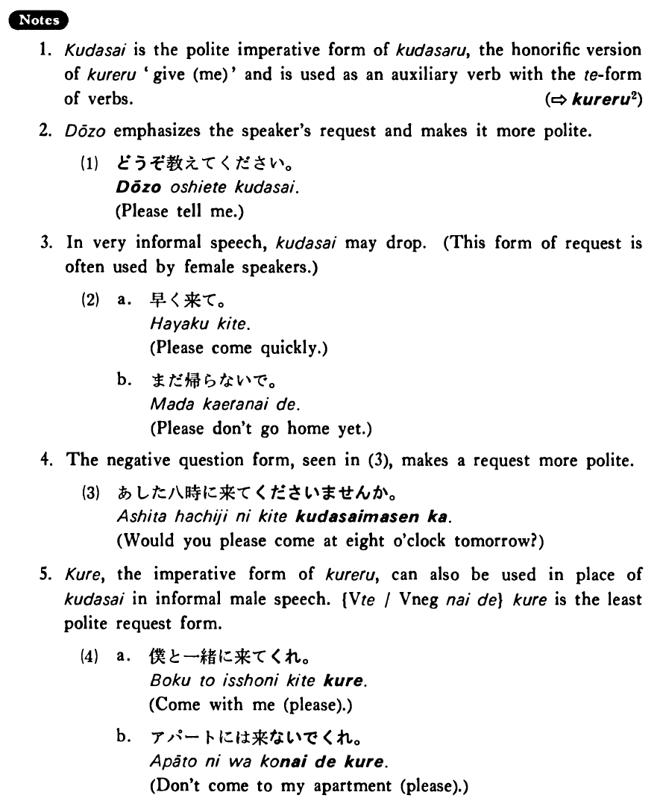

# 下さい・ください

[1. Summary](#summary) 
[2. Formation](#formation) 
[3. Example Sentences](#example-sentences) 
[4. Explanation](#explanation) 
 

## Summary

<table><tr>   <td>Summary</td>   <td>An auxiliary verb which indicates a polite request.</td></tr><tr>   <td>English</td>   <td>Please do something</td></tr><tr>   <td>Part of speech</td>   <td>Auxiliary Verb (Imperative Form)</td></tr></table>

## Formation

<table class="table"> <tbody><tr class="tr head"> <td class="td">(i)  Vて</td> <td class="td">下さい </td> <td class="td">&nbsp;</td> </tr> <tr class="tr"> <td class="td">&nbsp;</td> <td class="td">話して下さい </td> <td class="td">Please talk</td> </tr> <tr class="tr"> <td class="td">&nbsp;</td> <td class="td">食べて下さい </td> <td class="td">Please eat</td> </tr> <tr class="tr head"> <td class="td">(ii)  Vnegative</td> <td class="td">ないで下さい </td> <td class="td">&nbsp;</td> </tr> <tr class="tr"> <td class="td">&nbsp;</td> <td class="td">話さないで下さい </td> <td class="td">Please don’t talk</td> </tr> <tr class="tr"> <td class="td">&nbsp;</td> <td class="td">食べないで下さい </td> <td class="td">Please don’t eat</td> </tr></tbody></table>

## Example Sentences

<table><tr>   <td>日本語で書いて下さい。</td>   <td>Please write in Japanese.</td></tr><tr>   <td>英語を使わないで下さい。</td>   <td>Please don't use English.</td></tr><tr>   <td>この言葉の意味を教えて下さい。</td>   <td>Please tell me the meaning of this word.</td></tr><tr>   <td>夜遅く電話しないで下さい。</td>   <td>Please don't call me late at night.</td></tr></table>

## Explanation

1. ください is the polite imperative form of くださる, the honorific version of くれる 'give (me)' and is used as an auxiliary verb with the て form of verbs.
  
(⇨ <a href="#㊦ 呉れる・くれる (2)">くれる2</a>)
  
2. どうぞ emphasizes the speaker's request and makes it more polite.
  <ul>(1) <li>どうぞ教えてください。</li> <li>Please tell me.</li> </ul>  
3. In very informal speech, ください may drop. (This form of request is often used by female speakers.)
  <ul>(2) <li>a. 早く来て。</li> <li>Please come quickly.</li> 

 <li>b. まだ帰らないで。</li> <li>Please don't go home yet.</li> </ul>  
4. The negative question form, seen in (3), makes a request more polite.
  <ul>(3) <li>あした八時に来てくださいませんか。</li> <li>Would you please come at eight o'clock tomorrow?</li> </ul>  
5. くれ, the imperative form of くれる, can also be used in place of ください in informal male speech. {Verbて/Verb negative ないで}くれ is the least polite request form.
  <ul>(4) <li>a. 僕と一緒に来てくれ。</li> <li>Come with me (please).</li> 

 <li>b. アパートには来ないでくれ。</li> <li>Don't come to my apartment (please).</li> </ul>

## Grammar Book Page

