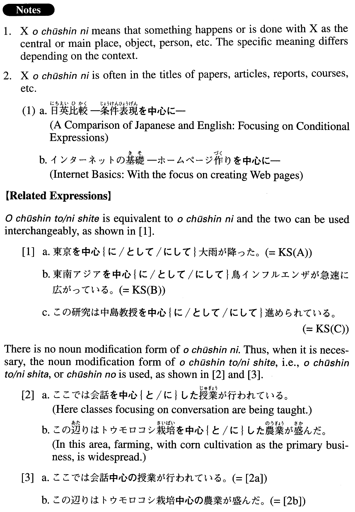

# を中心に

[1. Summary](#summary) 
[2. Formation](#formation) 
[3. Example Sentences](#example-sentences) 
 

## Summary

<table><tr>   <td>Summary</td>   <td>A phrase that means “with something/someone at the centre”.</td></tr><tr>   <td>English</td>   <td>Centering around; around; focusing on; mainly; primarily; with ~ as the center; with ~ as the leader; with ~ as the primary ~; take the lead</td></tr><tr>   <td>Part of speech</td>   <td>Phrase (usually used in formal writing and formal speech)</td></tr><tr>   <td>Related expression</td>   <td>を中心と/にして</td></tr></table>

## Formation

<table class="table"><tbody><tr class="tr head"><td class="td">Noun</td><td class="td">を中心に</td><td class="td"></td></tr><tr class="tr"><td class="td"></td><td class="td">日本を中心に</td><td class="td">Centering around Japan</td></tr></tbody></table>

## Example Sentences

<table><tr>   <td>東京を中心に大雨が降った。</td>   <td>There was heavy rain, mostly in and around Tokyo.</td></tr><tr>   <td>東南アジアを中心に鳥インフルエンザが急速に広がっている。</td>   <td>Bird flu is spreading rapidly, primarily in Southeast Asia.</td></tr><tr>   <td>この研究は中島教授を中心に進められている。</td>   <td>This research is progressing, with Professor Nakajima taking the lead.</td></tr><tr>   <td>最近は小説よりもビジネス書を中心に読んでいる。</td>   <td>These days I mainly read business books, rather than novels.</td></tr><tr>   <td>ファーストフードのR社は近々神戸を中心に新たに25店舗を開く予定だ。</td>   <td>Company R, a fast food company, plans to open 25 new stores in Kobe and neighbouring cities before long.</td></tr><tr>   <td>現在、文部科学省を中心に、義務教育改革に向けた検討が進められている。</td>   <td>The Ministry of Education, Culture, Sports, Science and Technology is taking the lead in investigating compulsory education reform.</td></tr><tr>   <td>最近の調査で、アメリカでのオンラインビデオの視聴が若い層を中心に伸びていることが分かった。</td>   <td>It has become clear from a recent survey that the viewing of online videos is increasing in America- most notably among young people.</td></tr><tr>   <td>コンピュータメーカーのP社はデスクトップモデルを中心に２０％以上の大幅値下げを行うと発表した。</td>   <td>The computer manufacturer P announced that it would give a large price reduction of 20 percent or more for their computers, with desktop models as the primary target.</td></tr><tr>   <td>このサイトは熊本のニュースを中心に、温泉やグルメ、イベント情報などもご紹介します。</td>   <td>This website highlights Kumamoto news as well as information on hot springs, gourmet foods, events, etc.</td></tr><tr>   <td>本プロジェクトでは、言語による情報伝達と、韻律や動作、表情など、言語以外の要素との関係を中心に研究を行った。</td>   <td>In this project we examined primarily the interrelationship between language-based communication and non-linguistic factors, such as meter, motions, facial expressions, etc.</td></tr><tr>   <td>この展示会はある著名な日本の建築家の作品を中心に、東京に建てられたモダンな建築について紹介している。</td>   <td>This exhibition, focusing mainly on works by an eminent Japanese architect, introduces modern architecture in Tokyo.</td></tr></table>

## Grammar Book Page

